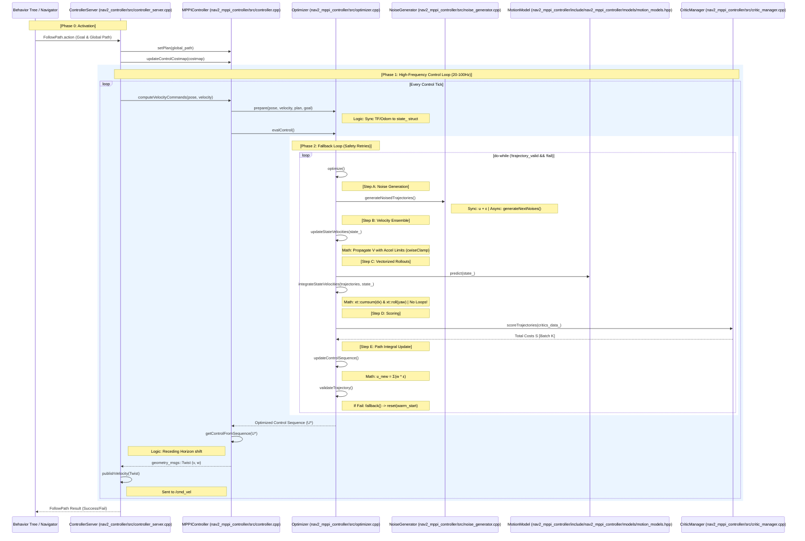

MPPI

```mermaid
sequenceDiagram
    participant BT as Behavior Tree / Navigator
    participant CS as ControllerServer (nav2_controller/src/controller_server.cpp)
    participant Plugin as MPPIController (nav2_mppi_controller/src/controller.cpp)
    participant Opt2 as Optimizer (nav2_mppi_controller/src/optimizer.cpp)
    participant NoiseGen as NoiseGenerator (nav2_mppi_controller/src/noise_generator.cpp)
    participant Model as MotionModel (nav2_mppi_controller/include/nav2_mppi_controller/models/motion_models.hpp)
    participant Critics as CriticManager (nav2_mppi_controller/src/critic_manager.cpp)

    Note over BT, CS: [Phase 0: Activation]
    BT->>CS: FollowPath.action (Goal & Global Path)
    CS->>Plugin: setPlan(global_path)
    CS->>Plugin: updateControlCostmap(costmap)

    rect rgb(235, 245, 255)
    Note over CS, Critics: [Phase 1: High-Frequency Control Loop (20-100Hz)]
    loop Every Control Tick
        CS->>Plugin: computeVelocityCommands(pose, velocity)
        
        Plugin->>Opt2: prepare(pose, velocity, plan, goal)
        Note right of Opt2: Logic: Sync TF/Odom to state_ struct
        
        Plugin->>Opt2: evalControl()

        rect rgb(255, 255, 255)
        Note over Opt2: [Phase 2: Fallback Loop (Safety Retries)]
        loop do-while (!trajectory_valid && !fail)
            Opt2->>Opt2: optimize()

            Note right of Opt2: [Step A: Noise Generation]
            Opt2->>NoiseGen: generateNoisedTrajectories()
            Note right of NoiseGen: Sync: u + ε | Async: generateNextNoises()

            Note right of Opt2: [Step B: Velocity Ensemble]
            Opt2->>Opt2: updateStateVelocities(state_)
            Note right of Opt2: Math: Propagate V with Accel Limits (cwiseClamp)

            Note right of Opt2: [Step C: Vectorized Rollouts]
            Opt2->>Model: predict(state_) 
            Opt2->>Opt2: integrateStateVelocities(trajectories, state_)
            Note right of Opt2: Math: xt::cumsum(dx) & xt::roll(yaw) | No Loops!

            Note right of Opt2: [Step D: Scoring]
            Opt2->>Critics: scoreTrajectories(critics_data_)
            Critics-->>Opt2: Total Costs S [Batch K]

            Note right of Opt2: [Step E: Path Integral Update]
            Opt2->>Opt2: updateControlSequence()
            Note right of Opt2: Math: u_new = Σ(w * ε)

            Opt2->>Opt2: validateTrajectory()
            Note right of Opt2: If Fail: fallback() -> reset(warm_start)
        end
        end

        Opt2-->>Plugin: Optimized Control Sequence (U*)
        Plugin->>Plugin: getControlFromSequence(U*)
        Note left of Plugin: Logic: Receding Horizon shift
        Plugin-->>CS: geometry_msgs::Twist (v, w)
        
        CS->>CS: publishVelocity(Twist)
        Note right of CS: Sent to /cmd_vel
    end
    end

    CS-->>BT: FollowPath Result (Success/Fail)

```