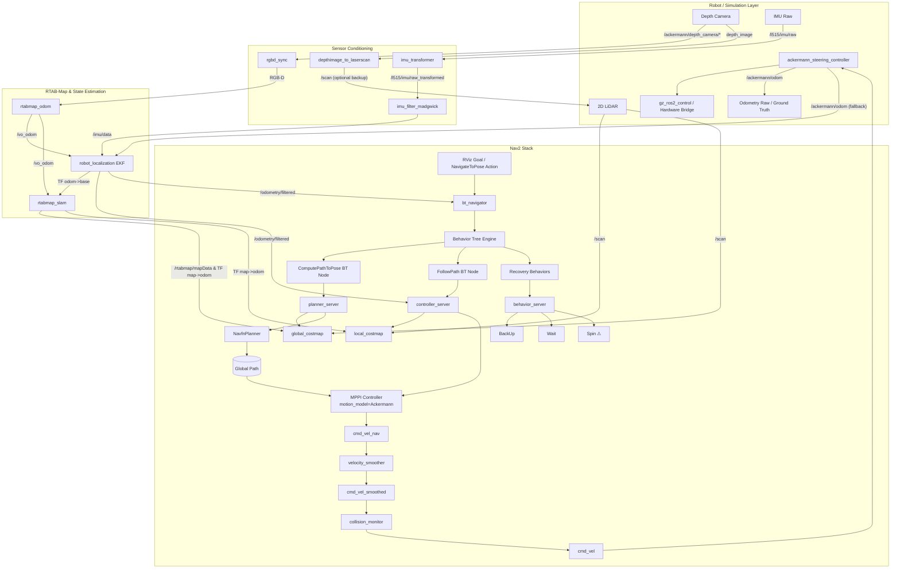

## Mission Profile

Autonomous Ackermann rover with UAV-grade autonomy stack. Primary workflow:

1. **Simulation-first**: `robot_bringup.launch.py` boots Gazebo via `description_robot` and keeps ROS ↔ Gazebo resources discoverable through `GZ_SIM_RESOURCE_PATH`. The ros_gz parameter bridge exports depth camera, IMU, LiDAR, odometry, and `/clock` directly into ROS 2 topics the rest of the stack consumes.
2. **Perception & Localization**: `rtabmap_bringup` orchestrates RGB-D synchronization, IMU preprocessing, VIO/ICP odometry, robot_localization fusion, and RTAB-Map SLAM or localization-only mode. Outputs include TF (`map`→`odom`→`ackermann/base_link`), `/rtabmap/odom`, `/odometry/filtered`, and map data for Nav2.
3. **Planning & Control**: Nav2 planners consume RTAB-Map localization and costmaps to generate `/cmd_vel_nav`. This is smoothed and collision-checked to produce the final `/cmd_vel`. The `ackermann_steering_controller` directly consumes `/cmd_vel` to command the `gz_ros2_control` hardware interface.
4. **Vehicle Interface**: Gazebo runs the Ackermann hardware through `gz_ros2_control`; when real hardware arrives the same ros2_control interface will connect to the vehicle CAN/drive stack.

## Core Subsystems

| Layer                      | Responsibilities                                                    | Key Nodes/Tools                                                                                     |
| -------------------------- | ------------------------------------------------------------------- | --------------------------------------------------------------------------------------------------- |
| Simulation & Bridge        | Gazebo physics, sensor plugins, ros_gz parameter bridge, TF priming | `gazebo_bringup.launch.py`, ros_gz_sim, ros_gz_bridge, joint_state_publisher, robot_state_publisher |
| Sensor Conditioning        | Sync RGB-D, convert depth→scan, align IMU frames, filter IMU        | `rgbd_sync`, `depthimage_to_laserscan`, `imu_transformer`, `imu_filter_madgwick`                    |
| Localization & Mapping     | VIO/ICP odom, EKF fusion, loop-closure SLAM, TF publishing          | `rtabmap_odom`, `robot_localization`, `rtabmap_slam`, `rtabmap_viz`                                 |
| Navigation & Control       | Global + local planners, Ackermann conversion                       | Nav2 stack, `ackermann_control` package                                                             |
| Safety & Vehicle Interface | Command gating, emergency stop hooks, future hardware drivers       | Safety watchdog (planned), ros2_control hardware adapters                                           |

## Data Flow Summary

- ros_gz parameter bridge exports `/ackermann/depth_camera/image`, `/ackermann/depth_camera/depth_image`, `/ackermann/depth_camera/camera_info`, `/l515/imu/raw`, `/rplidar/scan`, `/ackermann/odom`, and `/clock` into ROS 2.
- `rgbd_sync` aligns the RGB-D stream in the camera optical frame so RGB and depth arrive time-synchronized; `depthimage_to_laserscan` produces `/scan` so RTAB-Map can switch between vision or ICP pipelines.
- Raw IMU data arrives in the RealSense optical IMU frame (e.g. `*_optical_imu_frame`). `imu_transformer` provides the required static/dynamic transform from the rover base frame (`ackermann/base_link`) into this IMU frame so all inertial data share a common base frame for fusion. `imu_filter_madgwick` then filters this transformed IMU stream to produce a smooth `/imu/data` signal suitable for EKF and VIO.
- `rtabmap_odom` runs vision odometry on the synchronized RGB-D stream. For loose coupling, this VO output is fused with filtered IMU data in `robot_localization` to produce `/odometry/filtered`. RTAB-Map SLAM/localization then operates directly on this `/vo_odom` output (plus images) to estimate `map` with loop-closure detection, while exposing `/rtabmap/odom`, `/rtabmap/mapData`, and the TF (`map→odom→base`) chain.
- Nav2 consumes `/tf`, `/odometry/filtered`, and the map topics to produce `/cmd_vel_nav`.
- This velocity command routes through a velocity smoother and collision monitor to emerge as `/cmd_vel`.
- `ackermann_steering_controller` maps `/cmd_vel` to the `gz_ros2_control` interface which actuates the simulated rover; future hardware will expose the same contract.
- Safety watchdog hooks are being designed to watch `/odometry/filtered`, controller diagnostics, and future hardware health topics (no PX4 dependency in the current stack).

## Simulation → Hardware Parity

- **Sensors**: Gazebo depth camera + IMU + LiDAR topics mirror hardware drivers. Swapping to real sensors preserves the `/ackermann/*`, `/l515/imu/raw`, and `/scan` contracts so RTAB-Map continues to function.
- **Localization**: `rtabmap_bringup` exposes parameters for localization-only vs SLAM mode, RGB-D vs ICP odometry, and EKF tuning. Field deployments reuse the same launch with overrides for camera intrinsics, IMU bias, and scan settings.
- **Vehicle Interface**: `gz_ros2_control` drives the simulated joints today. When hardware shows up, the same ros2_control interface will bridge to the physical actuators without changing controller topics.
- **Safety**: A ROS-native watchdog (planned) will monitor EKF/RTAB-Map diagnostics and controller health to assert `/safety/fault`, which `ackermann_control` can use to halt motion.

## Gazebo ↔ RTAB-Map Integration

- `robot_bringup.launch.py` composes `gazebo_bringup` and `rtabmap_slam.launch.py`, ensuring shared launch arguments (`use_sim_time`, pose, namespace) stay consistent across subsystems.
- The ros_gz parameter bridge topics feed directly into the remaps defined inside `rtabmap_bringup`, so no intermediate republishers are required. Topic names intentionally follow the `ackermann/*` prefix to minimize collisions in multi-robot scenarios.
- State estimation runs in three tiers: raw VIO/ICP odom, EKF-smoothed `/odometry/filtered`, and RTAB-Map's global map frame. Nav2 and downstream planners consume `/odometry/filtered` plus the RTAB-Map map server outputs.
- Interfaces to Nav2, safety watchdog, and ros2_control are now centralized in documentation tables below to keep integrators aligned when topics or QoS policies change.

This overview drives the detailed node graph, interface contracts, and failure mode definitions in the following documents.

## Coordinate Frame Conversions (ROS 2 / Gazebo ↔ PX4)

Reference implementation: `PX4-Autopilot/src/modules/simulation/gz_bridge/GZBridge.cpp`

### Frame Conventions

| Context | ROS 2 / Gazebo | PX4 |
|---|---|---|
| **World frame** | ENU (East-North-Up) | NED (North-East-Down) |
| **Body frame** | FLU (Forward-Left-Up) | FRD (Forward-Right-Down) |

### `nav_msgs/Odometry` Two-Frame Structure

A ROS `nav_msgs/Odometry` message contains two distinct reference frames:

| Field | Frame | Purpose |
|---|---|---|
| `header.frame_id` | World frame (e.g. `odom`) | Reference frame for `pose` — the vehicle's position and orientation in the world |
| `child_frame_id` | Body frame (e.g. `base_footprint`) | Reference frame for `twist` — the vehicle's linear and angular velocity |

This means:
- **`pose.pose.position`** and **`pose.pose.orientation`** are expressed in the **world frame** (ENU for ROS).
- **`twist.twist.linear`** and **`twist.twist.angular`** are expressed in the **body frame** (FLU for ROS).

This is why position and velocity require **different** conversions when bridging to PX4:
- Position/orientation: world ENU → world NED (swap axes: `y, x, -z`)
- Velocity: body FLU → body FRD (negate Y and Z: `x, -y, -z`)

PX4's `VehicleOdometry` mirrors this design with two separate frame fields:
- `pose_frame` → set to `POSE_FRAME_NED` (position and quaternion in NED world)
- `velocity_frame` → set to `VELOCITY_FRAME_BODY_FRD` (velocity in body FRD)

> ⚠ A common mistake is treating twist as world-frame data and applying the ENU→NED `(y, x, -z)` swap to velocities. This is wrong — twist is body-frame and needs the FLU→FRD `(x, -y, -z)` conversion instead.

### Position (world frame): ENU → NED

```
x_ned =  y_enu   (North ← North)
y_ned =  x_enu   (East  ← East)
z_ned = -z_enu   (Down  ← -Up)
```

### Orientation (quaternion): FLU→ENU to FRD→NED

Full quaternion rotation composition (not a simple component swap):

```
q_FRD→NED = q_ENU→NED · q_FLU→ENU · inv(q_FLU→FRD)
```

Where (w, x, y, z):
- `q_FLU→FRD = (0, 1, 0, 0)` — 180° about X-axis
- `q_ENU→NED = (0, √2/2, √2/2, 0)` — symmetric (also NED→ENU)

Expanded closed-form (given input `w, x, y, z` in ROS `geometry_msgs/Quaternion`):

```
w_ned = √2/2 · (w + z)
x_ned = √2/2 · (x + y)
y_ned = √2/2 · (x - y)
z_ned = √2/2 · (w - z)
```

> ⚠ A naive component swap `(w, y, x, -z)` is **incorrect** and introduces a 90° heading error.

### Linear Velocity (body frame): FLU → FRD

`nav_msgs/Odometry.twist` is in the **child (body) frame**, not the world frame.

```
vx_frd =  vx_flu   (forward unchanged)
vy_frd = -vy_flu   (left → -right)
vz_frd = -vz_flu   (up   → -down)
```

PX4 `VehicleOdometry.velocity_frame` must be set to `VELOCITY_FRAME_BODY_FRD`.

### Angular Velocity (body frame): FLU → FRD

```
ωx_frd =  ωx_flu   (roll rate unchanged)
ωy_frd = -ωy_flu   (pitch rate negated)
ωz_frd = -ωz_flu   (yaw rate negated)
```

### cmd_vel (Nav2 → PX4 TrajectorySetpoint)

`cmd_vel` (body FLU) is transformed to world NED for `TrajectorySetpoint.velocity`:

1. Rotate body velocity into world ENU using TF2 (`base_footprint` → `odom`)
2. Swap ENU → NED: `(y, x, -z)`
3. Negate yaw rate for axis flip: `yawspeed = -angular.z`

### Summary Table

| Data | Source Frame | Target Frame | Conversion |
|---|---|---|---|
| World position | ENU `(x,y,z)` | NED | `(y, x, -z)` |
| Orientation quat | FLU→ENU `(w,x,y,z)` | FRD→NED | `q_ENU→NED · q · inv(q_FLU→FRD)` |
| Body linear vel | FLU `(x,y,z)` | FRD | `(x, -y, -z)` |
| Body angular vel | FLU `(x,y,z)` | FRD | `(x, -y, -z)` |
| cmd_vel to setpoint | body FLU | world NED | TF rotate to ENU, then `(y, x, -z)` |

## PX4 Bridge & Custom Modes (`px4_bringup`)

The `px4_bringup` package bridges the ROS 2 navigation stack with PX4 autopilot via DDS. It uses the [`px4_ros2_interface_lib`](https://github.com/Auterion/px4-ros2-interface-lib) (git submodule under `src/px4-ros2-interface-lib`) to register custom flight modes that appear natively in QGC and integrate with PX4's failsafe state machine.

### Custom Modes vs Offboard

Custom registered modes (`px4_ros2::ModeBase`) differ from traditional offboard control:

| Aspect | Offboard Mode | Custom Registered Mode |
|---|---|---|
| `nav_state` | `NAVIGATION_STATE_OFFBOARD` | `NAVIGATION_STATE_EXTERNAL1+` |
| Heartbeat | Manual `OffboardControlMode` at ≥2 Hz | Automatic (library handles it) |
| GCS display | "Offboard" | Custom name (e.g. "Rover Speed Steering") |
| Setpoint types | `TrajectorySetpoint` only (translated internally) | Any — including rover-specific setpoints |
| Failsafe | Basic offboard timeout | Full failsafe state machine integration |
| Coexistence | One controller | Multiple modes selectable via RC/QGC |

### Three Implemented Modes

All modes subscribe to `/cmd_vel` (`geometry_msgs/Twist`) and are implemented as header-only C++ classes under `src/px4_bringup/include/px4_bringup/`.

#### 1. Offboard Trajectory Mode (`offboard_trajectory_mode`)

- **Setpoint type**: `TrajectorySetpointType` (velocity in NED)
- **Conversion**: `/cmd_vel` body FLU → TF2 rotate to odom ENU → swap to NED `(y, x, -z)` + negate yaw rate
- **Parameters**: `base_frame` (default: `ackermann/base_link`), `odom_frame` (default: `odom`)
- **Use case**: Generic offboard velocity control; equivalent to the legacy Python bridge

#### 2. Rover Speed Steering Mode (`rover_speed_steering_mode`) — Recommended

- **Setpoint type**: `RoverSpeedSteeringSetpointType`
- **Conversion**: `linear.x` → `speed_body_x` [m/s], `angular.z` → normalized steering [-1 (left), 1 (right)]
- **Normalization**: `-angular.z / max_steering_rate`, clamped to [-1, 1]. Sign negated because ROS uses CCW+ while PX4 steering uses right-positive.
- **Parameters**: `max_steering_rate` (default: `1.0` rad/s, should match PX4 `RA_MAX_STR_ANG`)
- **PX4 controller chain**: Velocity → Control Allocation (bypasses attitude/rate controllers)
- **Use case**: Most natural mapping for Ackermann rovers driven by Nav2 MPPI controller

#### 3. Rover Speed Attitude Mode (`rover_speed_attitude_mode`)

- **Setpoint type**: `RoverSpeedAttitudeSetpointType`
- **Conversion**: `linear.x` → `speed_body_x` [m/s], `angular.z` → integrated into NED yaw heading setpoint
- **Heading initialization**: Seeds from `OdometryLocalPosition::heading()` on mode activation
- **Yaw integration**: Each cycle: `yaw += -angular.z * dt`, wrapped to [-π, π]
- **PX4 controller chain**: Velocity → Attitude → Rate → Control Allocation
- **Use case**: Heading-hold driving; PX4 handles heading → steering conversion

### Odometry Bridge (`px4_odometry_node.py`)

Converts `nav_msgs/Odometry` (ENU/FLU) → PX4 `VehicleOdometry` (NED/FRD):
- Position: ENU `(y, x, -z)` → NED (`pose_frame = POSE_FRAME_NED`)
- Quaternion: `q_ENU→NED · q_FLU→ENU · inv(q_FLU→FRD)` (Hamilton product, not a component swap)
- Velocity: body FLU `(x, -y, -z)` → body FRD (`velocity_frame = VELOCITY_FRAME_BODY_FRD`)
- Angular velocity: body FLU `(x, -y, -z)` → body FRD

### Legacy Python Bridge (`px4_bridge_node.py`)

Still available via `use_legacy_bridge:=true`. Manually publishes `OffboardControlMode` heartbeat + `TrajectorySetpoint` + `VehicleCommand` for arm/disarm/offboard. Provides ROS services `/px4/arm` and `/px4/set_offboard`.

### Launch

```bash
ros2 launch px4_bringup px4_bridge.launch.py                              # speed_steering (default)
ros2 launch px4_bringup px4_bridge.launch.py mode_type:=trajectory         # offboard trajectory
ros2 launch px4_bringup px4_bridge.launch.py mode_type:=speed_attitude     # heading-hold
ros2 launch px4_bringup px4_bridge.launch.py use_legacy_bridge:=true       # Python fallback
```

### File Structure

```
src/px4_bringup/
├── include/px4_bringup/
│   ├── offboard_trajectory_mode.hpp
│   ├── rover_speed_steering_mode.hpp
│   └── rover_speed_attitude_mode.hpp
├── src/
│   ├── offboard_trajectory_main.cpp
│   ├── rover_speed_steering_main.cpp
│   └── rover_speed_attitude_main.cpp
├── scripts/
│   ├── px4_bridge_node.py          # Legacy Python offboard bridge
│   └── px4_odometry_node.py        # Odometry ENU/FLU → NED/FRD
├── launch/
│   └── px4_bridge.launch.py
├── config/
│   └── px4_bridge.yaml
├── CMakeLists.txt
└── package.xml
```

## Software Architecture Diagram


