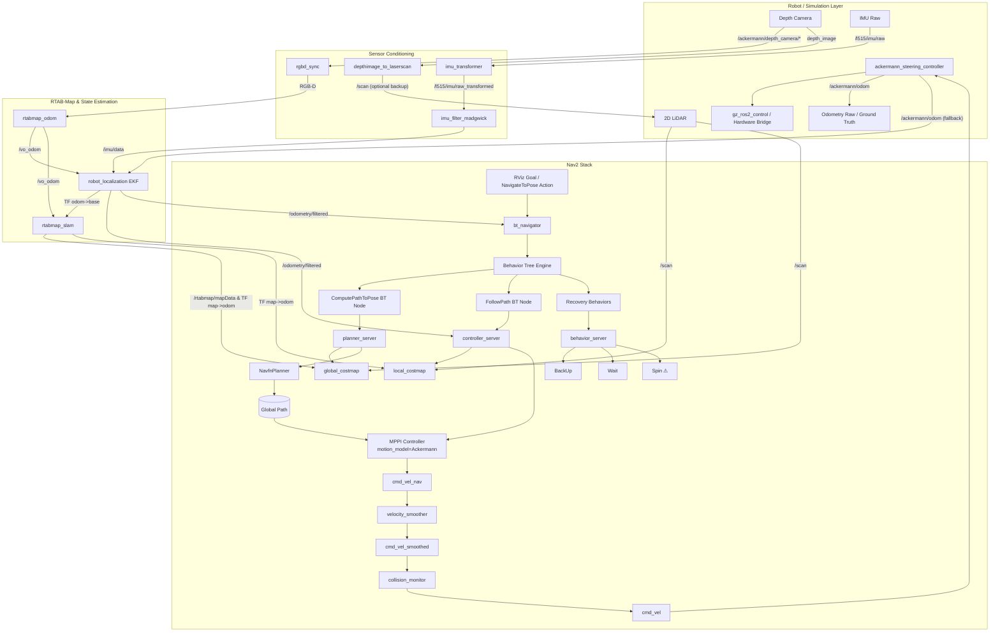

## Mission Profile

Autonomous Ackermann rover with UAV-grade autonomy stack. Primary workflow:

1. **Simulation-first**: `robot_bringup.launch.py` boots Gazebo via `description_robot` and keeps ROS ↔ Gazebo resources discoverable through `GZ_SIM_RESOURCE_PATH`. The ros_gz parameter bridge exports depth camera, IMU, LiDAR, odometry, and `/clock` directly into ROS 2 topics the rest of the stack consumes.
2. **Perception & Localization**: `rtabmap_bringup` orchestrates RGB-D synchronization, IMU preprocessing, VIO/ICP odometry, robot_localization fusion, and RTAB-Map SLAM or localization-only mode. Outputs include TF (`map`→`odom`→`ackermann/base_link`), `/rtabmap/odom`, `/odometry/filtered`, and map data for Nav2.
3. **Planning & Control**: Nav2 planners consume RTAB-Map localization and costmaps to generate `/cmd_vel_nav`. This is smoothed and collision-checked to produce the final `/cmd_vel`. The `ackermann_steering_controller` directly consumes `/cmd_vel` to command the `gz_ros2_control` hardware interface.
4. **Vehicle Interface**: Gazebo runs the Ackermann hardware through `gz_ros2_control`; when real hardware arrives the same ros2_control interface will connect to the vehicle CAN/drive stack.

## Core Subsystems

| Layer                      | Responsibilities                                                    | Key Nodes/Tools                                                                                     |
| -------------------------- | ------------------------------------------------------------------- | --------------------------------------------------------------------------------------------------- |
| Simulation & Bridge        | Gazebo physics, sensor plugins, ros_gz parameter bridge, TF priming | `gazebo_bringup.launch.py`, ros_gz_sim, ros_gz_bridge, joint_state_publisher, robot_state_publisher |
| Sensor Conditioning        | Sync RGB-D, convert depth→scan, align IMU frames, filter IMU        | `rgbd_sync`, `depthimage_to_laserscan`, `imu_transformer`, `imu_filter_madgwick`                    |
| Localization & Mapping     | VIO/ICP odom, EKF fusion, loop-closure SLAM, TF publishing          | `rtabmap_odom`, `robot_localization`, `rtabmap_slam`, `rtabmap_viz`                                 |
| Navigation & Control       | Global + local planners, Ackermann conversion                       | Nav2 stack, `ackermann_control` package                                                             |
| Safety & Vehicle Interface | Command gating, emergency stop hooks, future hardware drivers       | Safety watchdog (planned), ros2_control hardware adapters                                           |

## Data Flow Summary

- ros_gz parameter bridge exports `/ackermann/depth_camera/image`, `/ackermann/depth_camera/depth_image`, `/ackermann/depth_camera/camera_info`, `/l515/imu/raw`, `/rplidar/scan`, `/ackermann/odom`, and `/clock` into ROS 2.
- `rgbd_sync` aligns the RGB-D stream in the camera optical frame so RGB and depth arrive time-synchronized; `depthimage_to_laserscan` produces `/scan` so RTAB-Map can switch between vision or ICP pipelines.
- Raw IMU data arrives in the RealSense optical IMU frame (e.g. `*_optical_imu_frame`). `imu_transformer` provides the required static/dynamic transform from the rover base frame (`ackermann/base_link`) into this IMU frame so all inertial data share a common base frame for fusion. `imu_filter_madgwick` then filters this transformed IMU stream to produce a smooth `/imu/data` signal suitable for EKF and VIO.
- `rtabmap_odom` runs vision odometry on the synchronized RGB-D stream. For loose coupling, this VO output is fused with filtered IMU data in `robot_localization` to produce `/odometry/filtered`. RTAB-Map SLAM/localization then operates directly on this `/vo_odom` output (plus images) to estimate `map` with loop-closure detection, while exposing `/rtabmap/odom`, `/rtabmap/mapData`, and the TF (`map→odom→base`) chain.
- Nav2 consumes `/tf`, `/odometry/filtered`, and the map topics to produce `/cmd_vel_nav`.
- This velocity command routes through a velocity smoother and collision monitor to emerge as `/cmd_vel`.
- `ackermann_steering_controller` maps `/cmd_vel` to the `gz_ros2_control` interface which actuates the simulated rover; future hardware will expose the same contract.
- Safety watchdog hooks are being designed to watch `/odometry/filtered`, controller diagnostics, and future hardware health topics (no PX4 dependency in the current stack).

## Simulation → Hardware Parity

- **Sensors**: Gazebo depth camera + IMU + LiDAR topics mirror hardware drivers. Swapping to real sensors preserves the `/ackermann/*`, `/l515/imu/raw`, and `/scan` contracts so RTAB-Map continues to function.
- **Localization**: `rtabmap_bringup` exposes parameters for localization-only vs SLAM mode, RGB-D vs ICP odometry, and EKF tuning. Field deployments reuse the same launch with overrides for camera intrinsics, IMU bias, and scan settings.
- **Vehicle Interface**: `gz_ros2_control` drives the simulated joints today. When hardware shows up, the same ros2_control interface will bridge to the physical actuators without changing controller topics.
- **Safety**: A ROS-native watchdog (planned) will monitor EKF/RTAB-Map diagnostics and controller health to assert `/safety/fault`, which `ackermann_control` can use to halt motion.

## Gazebo ↔ RTAB-Map Integration

- `robot_bringup.launch.py` composes `gazebo_bringup` and `rtabmap_slam.launch.py`, ensuring shared launch arguments (`use_sim_time`, pose, namespace) stay consistent across subsystems.
- The ros_gz parameter bridge topics feed directly into the remaps defined inside `rtabmap_bringup`, so no intermediate republishers are required. Topic names intentionally follow the `ackermann/*` prefix to minimize collisions in multi-robot scenarios.
- State estimation runs in three tiers: raw VIO/ICP odom, EKF-smoothed `/odometry/filtered`, and RTAB-Map's global map frame. Nav2 and downstream planners consume `/odometry/filtered` plus the RTAB-Map map server outputs.
- Interfaces to Nav2, safety watchdog, and ros2_control are now centralized in documentation tables below to keep integrators aligned when topics or QoS policies change.

This overview drives the detailed node graph, interface contracts, and failure mode definitions in the following documents.

## Coordinate Frame Conversions (ROS 2 / Gazebo ↔ PX4)

Reference implementation: `PX4-Autopilot/src/modules/simulation/gz_bridge/GZBridge.cpp`

### Frame Conventions

| Context         | ROS 2 / Gazebo        | PX4                      |
| --------------- | --------------------- | ------------------------ |
| **World frame** | ENU (East-North-Up)   | NED (North-East-Down)    |
| **Body frame**  | FLU (Forward-Left-Up) | FRD (Forward-Right-Down) |

### `nav_msgs/Odometry` Two-Frame Structure

A ROS `nav_msgs/Odometry` message contains two distinct reference frames:

| Field             | Frame                              | Purpose                                                                          |
| ----------------- | ---------------------------------- | -------------------------------------------------------------------------------- |
| `header.frame_id` | World frame (e.g. `odom`)          | Reference frame for `pose` — the vehicle's position and orientation in the world |
| `child_frame_id`  | Body frame (e.g. `base_footprint`) | Reference frame for `twist` — the vehicle's linear and angular velocity          |

This means:
- **`pose.pose.position`** and **`pose.pose.orientation`** are expressed in the **world frame** (ENU for ROS).
- **`twist.twist.linear`** and **`twist.twist.angular`** are expressed in the **body frame** (FLU for ROS).

This is why position and velocity require **different** conversions when bridging to PX4:
- Position/orientation: world ENU → world NED (swap axes: `y, x, -z`)
- Velocity: body FLU → body FRD (negate Y and Z: `x, -y, -z`)

PX4's `VehicleOdometry` mirrors this design with two separate frame fields:
- `pose_frame` → set to `POSE_FRAME_NED` (position and quaternion in NED world)
- `velocity_frame` → set to `VELOCITY_FRAME_BODY_FRD` (velocity in body FRD)

> ⚠ A common mistake is treating twist as world-frame data and applying the ENU→NED `(y, x, -z)` swap to velocities. This is wrong — twist is body-frame and needs the FLU→FRD `(x, -y, -z)` conversion instead.

### Position (world frame): ENU → NED

```
x_ned =  y_enu   (North ← North)
y_ned =  x_enu   (East  ← East)
z_ned = -z_enu   (Down  ← -Up)
```

### Orientation (quaternion): FLU→ENU to FRD→NED

Full quaternion rotation composition (not a simple component swap):

```
q_FRD→NED = q_ENU→NED · q_FLU→ENU · inv(q_FLU→FRD)
```

Where (w, x, y, z):
- `q_FLU→FRD = (0, 1, 0, 0)` — 180° about X-axis
- `q_ENU→NED = (0, √2/2, √2/2, 0)` — symmetric (also NED→ENU)

Expanded closed-form (given input `w, x, y, z` in ROS `geometry_msgs/Quaternion`):

```
w_ned = √2/2 · (w + z)
x_ned = √2/2 · (x + y)
y_ned = √2/2 · (x - y)
z_ned = √2/2 · (w - z)
```

> ⚠ A naive component swap `(w, y, x, -z)` is **incorrect** and introduces a 90° heading error.

### Linear Velocity (body frame): FLU → FRD

`nav_msgs/Odometry.twist` is in the **child (body) frame**, not the world frame.

```
vx_frd =  vx_flu   (forward unchanged)
vy_frd = -vy_flu   (left → -right)
vz_frd = -vz_flu   (up   → -down)
```

PX4 `VehicleOdometry.velocity_frame` must be set to `VELOCITY_FRAME_BODY_FRD`.

### Angular Velocity (body frame): FLU → FRD

```
ωx_frd =  ωx_flu   (roll rate unchanged)
ωy_frd = -ωy_flu   (pitch rate negated)
ωz_frd = -ωz_flu   (yaw rate negated)
```

### cmd_vel (Nav2 → PX4 TrajectorySetpoint)

`cmd_vel` (body FLU) is transformed to world NED for `TrajectorySetpoint.velocity`:

1. Rotate body velocity into world ENU using TF2 (`base_footprint` → `odom`)
2. Swap ENU → NED: `(y, x, -z)`
3. Negate yaw rate for axis flip: `yawspeed = -angular.z`

### Summary Table

| Data                | Source Frame        | Target Frame | Conversion                          |
| ------------------- | ------------------- | ------------ | ----------------------------------- |
| World position      | ENU `(x,y,z)`       | NED          | `(y, x, -z)`                        |
| Orientation quat    | FLU→ENU `(w,x,y,z)` | FRD→NED      | `q_ENU→NED · q · inv(q_FLU→FRD)`    |
| Body linear vel     | FLU `(x,y,z)`       | FRD          | `(x, -y, -z)`                       |
| Body angular vel    | FLU `(x,y,z)`       | FRD          | `(x, -y, -z)`                       |
| cmd_vel to setpoint | body FLU            | world NED    | TF rotate to ENU, then `(y, x, -z)` |

## PX4 Bridge & Custom Modes (`px4_bringup`)

The `px4_bringup` package bridges the ROS 2 navigation stack with PX4 autopilot via DDS. It uses the [`px4_ros2_interface_lib`](https://github.com/Auterion/px4-ros2-interface-lib) (git submodule under `src/px4-ros2-interface-lib`) to register custom flight modes that appear natively in QGC and integrate with PX4's failsafe state machine.

### Custom Modes vs Offboard

Custom registered modes (`px4_ros2::ModeBase`) differ from traditional offboard control:

| Aspect         | Offboard Mode                                     | Custom Registered Mode                    |
| -------------- | ------------------------------------------------- | ----------------------------------------- |
| `nav_state`    | `NAVIGATION_STATE_OFFBOARD`                       | `NAVIGATION_STATE_EXTERNAL1+`             |
| Heartbeat      | Manual `OffboardControlMode` at ≥2 Hz             | Automatic (library handles it)            |
| GCS display    | "Offboard"                                        | Custom name (e.g. "Rover Speed Steering") |
| Setpoint types | `TrajectorySetpoint` only (translated internally) | Any — including rover-specific setpoints  |
| Failsafe       | Basic offboard timeout                            | Full failsafe state machine integration   |
| Coexistence    | One controller                                    | Multiple modes selectable via RC/QGC      |

### Three Implemented Modes

All modes subscribe to `/cmd_vel` (`geometry_msgs/Twist`) and are implemented as header-only C++ classes under `src/px4_bringup/include/px4_bringup/`.

#### 1. Offboard Trajectory Mode (`offboard_trajectory_mode`)

- **Setpoint type**: `TrajectorySetpointType` (velocity in NED)
- **Conversion**: `/cmd_vel` body FLU → TF2 rotate to odom ENU → swap to NED `(y, x, -z)` + negate yaw rate
- **Parameters**: `base_frame` (default: `ackermann/base_link`), `odom_frame` (default: `odom`)
- **Use case**: Generic offboard velocity control; equivalent to the legacy Python bridge

#### 2. Rover Speed Steering Mode (`rover_speed_steering_mode`) — Recommended

- **Setpoint type**: `RoverSpeedSteeringSetpointType`
- **Conversion**: `linear.x` → `speed_body_x` [m/s], `angular.z` → normalized steering [-1 (left), 1 (right)]
- **Normalization**: `-angular.z / max_steering_rate`, clamped to [-1, 1]. Sign negated because ROS uses CCW+ while PX4 steering uses right-positive.
- **Parameters**: `max_steering_rate` (default: `1.0` rad/s, should match PX4 `RA_MAX_STR_ANG`)
- **PX4 controller chain**: Velocity → Control Allocation (bypasses attitude/rate controllers)
- **Use case**: Most natural mapping for Ackermann rovers driven by Nav2 MPPI controller

#### 3. Rover Speed Attitude Mode (`rover_speed_attitude_mode`)

- **Setpoint type**: `RoverSpeedAttitudeSetpointType`
- **Conversion**: `linear.x` → `speed_body_x` [m/s], `angular.z` → integrated into NED yaw heading setpoint
- **Heading initialization**: Seeds from `OdometryLocalPosition::heading()` on mode activation
- **Yaw integration**: Each cycle: `yaw += -angular.z * dt`, wrapped to [-π, π]
- **PX4 controller chain**: Velocity → Attitude → Rate → Control Allocation
- **Use case**: Heading-hold driving; PX4 handles heading → steering conversion

### Odometry Bridge (`px4_odometry_node.py`)

Converts `nav_msgs/Odometry` (ENU/FLU) → PX4 `VehicleOdometry` (NED/FRD):
- Position: ENU `(y, x, -z)` → NED (`pose_frame = POSE_FRAME_NED`)
- Quaternion: `q_ENU→NED · q_FLU→ENU · inv(q_FLU→FRD)` (Hamilton product, not a component swap)
- Velocity: body FLU `(x, -y, -z)` → body FRD (`velocity_frame = VELOCITY_FRAME_BODY_FRD`)
- Angular velocity: body FLU `(x, -y, -z)` → body FRD

### Legacy Python Bridge (`px4_bridge_node.py`)

Still available via `use_legacy_bridge:=true`. Manually publishes `OffboardControlMode` heartbeat + `TrajectorySetpoint` + `VehicleCommand` for arm/disarm/offboard. Provides ROS services `/px4/arm` and `/px4/set_offboard`.

### Launch

```bash
ros2 launch px4_bringup px4_bridge.launch.py                              # speed_steering (default)
ros2 launch px4_bringup px4_bridge.launch.py mode_type:=trajectory         # offboard trajectory
ros2 launch px4_bringup px4_bridge.launch.py mode_type:=speed_attitude     # heading-hold
ros2 launch px4_bringup px4_bridge.launch.py use_legacy_bridge:=true       # Python fallback
```

### File Structure

```
src/px4_bringup/
├── include/px4_bringup/
│   ├── offboard_trajectory_mode.hpp
│   ├── rover_speed_steering_mode.hpp
│   └── rover_speed_attitude_mode.hpp
├── src/
│   ├── offboard_trajectory_main.cpp
│   ├── rover_speed_steering_main.cpp
│   └── rover_speed_attitude_main.cpp
├── scripts/
│   ├── px4_bridge_node.py          # Legacy Python offboard bridge
│   └── px4_odometry_node.py        # Odometry ENU/FLU → NED/FRD
├── launch/
│   └── px4_bridge.launch.py
├── config/
│   └── px4_bridge.yaml
├── CMakeLists.txt
└── package.xml
```

## PX4 SITL Co-Simulation

PX4 Software-In-The-Loop (SITL) runs alongside Gazebo Harmonic inside the same Docker container. PX4's built-in `gz_bridge` module connects directly to the Gazebo simulation over gz-transport — no ROS bridge is needed for the PX4 ↔ Gazebo link. The ROS 2 side communicates with PX4 via the Micro-XRCE-DDS bridge (`MicroXRCEAgent` + PX4's built-in `uxrce_dds_client`).

### Prerequisites

- PX4 v1.16+ compiled **inside Docker** with `GZ_DISTRO=harmonic` so the `gz_bridge` module links against the container's gz-harmonic libraries.
- Airframe **51000** (`gz_rover_ackermann`).
- `warehouse.sdf` must contain `<spherical_coordinates>` for GPS/magnetometer reference.

### Launch

#### Gazebo + PX4 SITL (no Nav2, no RTAB-Map)

```bash
# Start the Docker container
docker-compose -f docker/docker-compose.yml up -d ackermann_slam
docker-compose -f docker/docker-compose.yml exec ackermann_slam bash

# Inside Docker: launch Gazebo with PX4-compatible sensors
source /opt/ros/$ROS_DISTRO/setup.bash && source /workspace/install/setup.bash
ros2 launch robot_bringup robot_bringup.launch.py enable_px4_sitl:=true rtabmap:=false nav2:=false

# In a second Docker shell: start MicroXRCEAgent (must start BEFORE PX4)
bash /workspace/scripts/start_microxrce_agent.sh

# In a third Docker shell: start PX4 SITL (attaches to running Gazebo)
bash /workspace/scripts/start_px4_sitl.sh

# In a fourth Docker shell: launch the ROS 2 ↔ PX4 bridge node
source /opt/ros/$ROS_DISTRO/setup.bash && source /workspace/install/setup.bash
ros2 launch px4_bringup px4_bridge.launch.py mode_type:=speed_steering
```

> **Startup order matters:** MicroXRCEAgent must be running **before** PX4 starts.
> PX4's `uxrce_dds_client` connects on startup and does not reliably reconnect.
> The `px4_bridge` node must start **after** PX4 so it can register with the FMU.

#### Full Stack (Gazebo + PX4 + RTAB-Map + Nav2)

```bash
ros2 launch robot_bringup robot_bringup.launch.py enable_px4_sitl:=true rtabmap:=true nav2:=true
# In a second shell:
bash /workspace/scripts/start_microxrce_agent.sh
# In a third shell:
bash /workspace/scripts/start_px4_sitl.sh
# In a fourth shell:
ros2 launch px4_bringup px4_bridge.launch.py mode_type:=speed_steering
```

### How It Works

When `enable_px4_sitl:=true`:

1. **Sensors**: `cubepilot.urdf.xacro` creates a non-namespaced `base_link` with PX4-compatible sensor names (`imu_sensor`, `air_pressure_sensor`, `magnetometer_sensor`, `navsat_sensor`) and no explicit `<topic>` overrides, so Gazebo publishes on path-based topic names that PX4's `gz_bridge` expects:
   ```
   /world/warehouse/model/ackermann/link/base_link/sensor/imu_sensor/imu
   /world/warehouse/model/ackermann/link/base_link/sensor/air_pressure_sensor/air_pressure
   /world/warehouse/model/ackermann/link/base_link/sensor/magnetometer_sensor/magnetometer
   /world/warehouse/model/ackermann/link/base_link/sensor/navsat_sensor/navsat
   ```

2. **Actuators**: PX4 airframe 51000 maps:
   - `SIM_GZ_WH_FUNC1=101` → `/model/ackermann/command/motor_speed` (wheel motor)
   - `SIM_GZ_SV_FUNC1=201` → `/model/ackermann/servo_0` (steering servo)

3. **DDS Bridge**: PX4's built-in `uxrce_dds_client` module connects to `MicroXRCEAgent` on UDP port 8888 (localhost). Once connected, all PX4 uORB topics are bridged to ROS 2 as `/fmu/in/*` (subscriptions) and `/fmu/out/*` (publications).

4. **ros2_control**: `gazebo_bringup.launch.py` skips the `ros2_control` controller spawner when PX4 mode is active, since PX4 directly commands the Gazebo joints.

### Verification Commands

All commands run **inside the Docker container** after PX4 SITL is running.

#### Check Sensor Data Flow

```bash
# IMU data from Gazebo
gz topic -e -t /world/warehouse/model/ackermann/link/base_link/sensor/imu_sensor/imu -n 1

# Verify PX4 receives accelerometer (z should be ≈ -9.81)
cd /px4/build/px4_sitl_default/bin && timeout 5 ./px4-listener sensor_accel -n 1
```

#### Check EKF2 Convergence

```bash
cd /px4/build/px4_sitl_default/bin && timeout 5 ./px4-listener vehicle_local_position -n 1
# Verify: ref_lat/ref_lon match spherical_coordinates, heading is stable, eph/epv < 1.0
```

#### Preflight & Arming

> **Note:** The `start_px4_sitl.sh` helper script already sets `COM_RC_IN_MODE=4`
> (disable manual RC requirement) and switches to Hold mode (`auto:loiter`) on
> startup. These are required for SITL without a joystick/RC transmitter.

```bash
cd /px4/build/px4_sitl_default/bin

# Preflight check
timeout 5 ./px4-commander check       # Should print "Preflight check: OK"

# Arm (no stdout output — verify with status command)
timeout 5 ./px4-commander arm

# Verify armed status
timeout 5 ./px4-commander status      # Should show "Armed", Hold mode, no failsafe

# Clean disarm
timeout 5 ./px4-commander disarm
```

> `heading_good_for_control: False` in `vehicle_local_position` is **expected** for
> ground rovers — PX4's EKF2 requires in-flight magnetometer alignment which is
> impossible for a rover. This does not block arming in Hold mode.

#### Test Actuator Flow

Use PX4's built-in `actuator_test` to drive actuators through the full PX4 →
gz_bridge → Gazebo pipeline.

> **Important:** The rover **must be disarmed** for `actuator_test` to work.
> When armed in Hold mode, PX4's rover controller actively sends zero commands
> that override the test output. Direct `gz topic -p` commands also **will not
> work** because PX4's gz_bridge continuously overwrites them.

```bash
cd /px4/build/px4_sitl_default/bin

# Disarm first (if armed)
./px4-commander disarm

# Motor: run wheel motor at 50% for 3 seconds
./px4-actuator_test set -m 1 -v 0.5 -t 3
# The rover should physically move forward in Gazebo.

# Steering: deflect steering servo to 50% for 3 seconds
./px4-actuator_test set -s 1 -v 0.5 -t 3
# Steering joints should deflect visibly in Gazebo.

# Iterate all motors (cycles through each at 15%)
./px4-actuator_test iterate-motors

# Iterate all servos
./px4-actuator_test iterate-servos
```

Verify the gz-transport side receives the commands:

```bash
# In a second shell, while actuator_test is running:
gz topic -e -t /model/ackermann/command/motor_speed -n 3   # Should show non-zero velocity
gz topic -e -t /model/ackermann/servo_0 -n 3               # Should show non-zero data
```

Check rover position changed (confirms physical movement in Gazebo):

```bash
gz topic -e -t /model/ackermann/odometry_with_covariance -n 1 | grep -A3 'position {'
```

#### Check DDS Bridge (PX4 ↔ ROS 2)

```bash
# Verify MicroXRCEAgent is running and PX4 client is connected
ps aux | grep MicroXRCE

# List PX4 topics in ROS 2 (should show 67+ /fmu/* topics)
ros2 topic list | grep fmu | wc -l

# Read live attitude data
ros2 topic echo /fmu/out/vehicle_attitude --once

# Read vehicle status
ros2 topic echo /fmu/out/vehicle_status --once
```

#### Drive the Robot

**ros2_control mode** (`enable_px4_sitl:=false`, the default):

```bash
ros2 topic pub -r 1 /ackermann/cmd_vel geometry_msgs/msg/TwistStamped \
  "{header: {frame_id: 'ackermann/base_link'}, twist: {linear: {x: 1.0}, angular: {z: 0.5}}}"
```

**PX4 mode** (`enable_px4_sitl:=true`): Requires 4 shells (Gazebo → Agent → PX4 → px4_bridge).

```bash
# Shell 4: Launch the ROS 2 ↔ PX4 bridge node (AFTER PX4 is running)
ros2 launch px4_bringup px4_bridge.launch.py mode_type:=speed_steering
```

Then arm and activate the external mode:

```bash
cd /px4/build/px4_sitl_default/bin
./px4-commander arm

# Switch to the registered external mode (nav_state 23)
ros2 topic pub --once /fmu/in/vehicle_command px4_msgs/msg/VehicleCommand \
  '{command: 100001, param1: 23.0, target_system: 1, target_component: 1, source_system: 255, source_component: 0, from_external: true}'
```

Now send velocity commands:

```bash
ros2 topic pub -r 10 /cmd_vel geometry_msgs/msg/Twist \
  '{linear: {x: 1.0}, angular: {z: 0.0}}'
```

### Shutdown

```bash
# Kill all ROS/Gazebo/PX4 processes inside Docker
docker-compose -f docker/docker-compose.yml exec ackermann_slam bash -c "pkill -9 -f 'ros2|rviz2|gz|ruby|px4|MicroXRCE'"
```

### Key Files

| File                               | Role                                        |
| ---------------------------------- | ------------------------------------------- |
| `docker/Dockerfile`                | PX4 build dependencies layer                |
| `docker/docker-compose.yml`        | PX4 volume mount (read-write)               |
| `docker/px4_requirements.txt`      | Python deps for PX4 build                   |
| `cubepilot/cubepilot.urdf.xacro`   | Dual-mode sensors (`enable_px4_sitl`)       |
| `ackermann_rover.urdf`             | Passes `enable_px4_sitl` to cubepilot macro |
| `worlds/warehouse.sdf`             | Spherical coordinates for GPS reference     |
| `gazebo_bringup.launch.py`         | Conditional ros2_control skip               |
| `robot_bringup.launch.py`          | `enable_px4_sitl` and `px4_mode_type` args  |
| `scripts/start_px4_sitl.sh`        | PX4 SITL launcher (airframe 51000)          |
| `scripts/start_microxrce_agent.sh` | MicroXRCEAgent launcher (UDP port 8888)     |
| `scripts/stop_all.sh`              | Process cleanup script                      |

## Software Architecture Diagram


