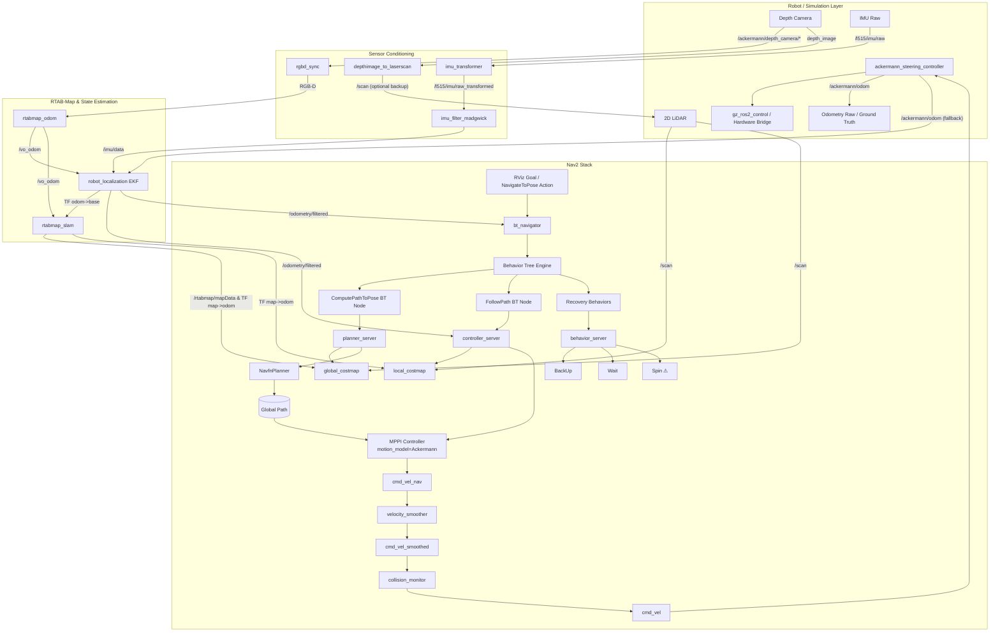

## Mission Profile

Autonomous Ackermann rover with UAV-grade autonomy stack. Primary workflow:

1. **Simulation-first**: `robot_bringup.launch.py` boots Gazebo via `description_robot` and keeps ROS ↔ Gazebo resources discoverable through `GZ_SIM_RESOURCE_PATH`. The ros_gz parameter bridge exports depth camera, IMU, LiDAR, odometry, and `/clock` directly into ROS 2 topics the rest of the stack consumes.
2. **Perception & Localization**: `rtabmap_bringup` orchestrates RGB-D synchronization, IMU preprocessing, VIO/ICP odometry, robot_localization fusion, and RTAB-Map SLAM or localization-only mode. Outputs include TF (`map`→`odom`→`ackermann/base_link`), `/rtabmap/odom`, `/odometry/filtered`, and map data for Nav2.
3. **Planning & Control**: Nav2 planners consume RTAB-Map localization and costmaps to generate `/cmd_vel_nav`. This is smoothed and collision-checked to produce the final `/cmd_vel`. The `ackermann_steering_controller` directly consumes `/cmd_vel` to command the `gz_ros2_control` hardware interface.
4. **Vehicle Interface**: Gazebo runs the Ackermann hardware through `gz_ros2_control`; when real hardware arrives the same ros2_control interface will connect to the vehicle CAN/drive stack.

## Core Subsystems

| Layer                      | Responsibilities                                                    | Key Nodes/Tools                                                                                     |
| -------------------------- | ------------------------------------------------------------------- | --------------------------------------------------------------------------------------------------- |
| Simulation & Bridge        | Gazebo physics, sensor plugins, ros_gz parameter bridge, TF priming | `gazebo_bringup.launch.py`, ros_gz_sim, ros_gz_bridge, joint_state_publisher, robot_state_publisher |
| Sensor Conditioning        | Sync RGB-D, convert depth→scan, align IMU frames, filter IMU        | `rgbd_sync`, `depthimage_to_laserscan`, `imu_transformer`, `imu_filter_madgwick`                    |
| Localization & Mapping     | VIO/ICP odom, EKF fusion, loop-closure SLAM, TF publishing          | `rtabmap_odom`, `robot_localization`, `rtabmap_slam`, `rtabmap_viz`                                 |
| Navigation & Control       | Global + local planners, Ackermann conversion                       | Nav2 stack, `ackermann_control` package                                                             |
| Safety & Vehicle Interface | Command gating, emergency stop hooks, future hardware drivers       | Safety watchdog (planned), ros2_control hardware adapters                                           |

## Data Flow Summary

- ros_gz parameter bridge exports `/ackermann/depth_camera/image`, `/ackermann/depth_camera/depth_image`, `/ackermann/depth_camera/camera_info`, `/l515/imu/raw`, `/rplidar/scan`, `/ackermann/odom`, and `/clock` into ROS 2.
- `rgbd_sync` aligns the RGB-D stream in the camera optical frame so RGB and depth arrive time-synchronized; `depthimage_to_laserscan` produces `/scan` so RTAB-Map can switch between vision or ICP pipelines.
- Raw IMU data arrives in the RealSense optical IMU frame (e.g. `*_optical_imu_frame`). `imu_transformer` provides the required static/dynamic transform from the rover base frame (`ackermann/base_link`) into this IMU frame so all inertial data share a common base frame for fusion. `imu_filter_madgwick` then filters this transformed IMU stream to produce a smooth `/imu/data` signal suitable for EKF and VIO.
- `rtabmap_odom` runs vision odometry on the synchronized RGB-D stream. For loose coupling, this VO output is fused with filtered IMU data in `robot_localization` to produce `/odometry/filtered`. RTAB-Map SLAM/localization then operates directly on this `/vo_odom` output (plus images) to estimate `map` with loop-closure detection, while exposing `/rtabmap/odom`, `/rtabmap/mapData`, and the TF (`map→odom→base`) chain.
- Nav2 consumes `/tf`, `/odometry/filtered`, and the map topics to produce `/cmd_vel_nav`.
- This velocity command routes through a velocity smoother and collision monitor to emerge as `/cmd_vel`.
- `ackermann_steering_controller` maps `/cmd_vel` to the `gz_ros2_control` interface which actuates the simulated rover; future hardware will expose the same contract.
- Safety watchdog hooks are being designed to watch `/odometry/filtered`, controller diagnostics, and future hardware health topics (no PX4 dependency in the current stack).

## Simulation → Hardware Parity

- **Sensors**: Gazebo depth camera + IMU + LiDAR topics mirror hardware drivers. Swapping to real sensors preserves the `/ackermann/*`, `/l515/imu/raw`, and `/scan` contracts so RTAB-Map continues to function.
- **Localization**: `rtabmap_bringup` exposes parameters for localization-only vs SLAM mode, RGB-D vs ICP odometry, and EKF tuning. Field deployments reuse the same launch with overrides for camera intrinsics, IMU bias, and scan settings.
- **Vehicle Interface**: `gz_ros2_control` drives the simulated joints today. When hardware shows up, the same ros2_control interface will bridge to the physical actuators without changing controller topics.
- **Safety**: A ROS-native watchdog (planned) will monitor EKF/RTAB-Map diagnostics and controller health to assert `/safety/fault`, which `ackermann_control` can use to halt motion.

## Gazebo ↔ RTAB-Map Integration

- `robot_bringup.launch.py` composes `gazebo_bringup` and `rtabmap_slam.launch.py`, ensuring shared launch arguments (`use_sim_time`, pose, namespace) stay consistent across subsystems.
- The ros_gz parameter bridge topics feed directly into the remaps defined inside `rtabmap_bringup`, so no intermediate republishers are required. Topic names intentionally follow the `ackermann/*` prefix to minimize collisions in multi-robot scenarios.
- State estimation runs in three tiers: raw VIO/ICP odom, EKF-smoothed `/odometry/filtered`, and RTAB-Map's global map frame. Nav2 and downstream planners consume `/odometry/filtered` plus the RTAB-Map map server outputs.
- Interfaces to Nav2, safety watchdog, and ros2_control are now centralized in documentation tables below to keep integrators aligned when topics or QoS policies change.

This overview drives the detailed node graph, interface contracts, and failure mode definitions in the following documents.

## Coordinate Frame Conversions (ROS 2 / Gazebo ↔ PX4)

Reference implementation: `PX4-Autopilot/src/modules/simulation/gz_bridge/GZBridge.cpp`

### Frame Conventions

| Context         | ROS 2 / Gazebo        | PX4                      |
| --------------- | --------------------- | ------------------------ |
| **World frame** | ENU (East-North-Up)   | NED (North-East-Down)    |
| **Body frame**  | FLU (Forward-Left-Up) | FRD (Forward-Right-Down) |

### `nav_msgs/Odometry` Two-Frame Structure

A ROS `nav_msgs/Odometry` message contains two distinct reference frames:

| Field             | Frame                              | Purpose                                                                          |
| ----------------- | ---------------------------------- | -------------------------------------------------------------------------------- |
| `header.frame_id` | World frame (e.g. `odom`)          | Reference frame for `pose` — the vehicle's position and orientation in the world |
| `child_frame_id`  | Body frame (e.g. `base_footprint`) | Reference frame for `twist` — the vehicle's linear and angular velocity          |

This means:
- **`pose.pose.position`** and **`pose.pose.orientation`** are expressed in the **world frame** (ENU for ROS).
- **`twist.twist.linear`** and **`twist.twist.angular`** are expressed in the **body frame** (FLU for ROS).

This is why position and velocity require **different** conversions when bridging to PX4:
- Position/orientation: world ENU → world NED (swap axes: `y, x, -z`)
- Velocity: body FLU → body FRD (negate Y and Z: `x, -y, -z`)

PX4's `VehicleOdometry` mirrors this design with two separate frame fields:
- `pose_frame` → set to `POSE_FRAME_NED` (position and quaternion in NED world)
- `velocity_frame` → set to `VELOCITY_FRAME_BODY_FRD` (velocity in body FRD)

> ⚠ A common mistake is treating twist as world-frame data and applying the ENU→NED `(y, x, -z)` swap to velocities. This is wrong — twist is body-frame and needs the FLU→FRD `(x, -y, -z)` conversion instead.

### Position (world frame): ENU → NED

```
x_ned =  y_enu   (North ← North)
y_ned =  x_enu   (East  ← East)
z_ned = -z_enu   (Down  ← -Up)
```

### Orientation (quaternion): FLU→ENU to FRD→NED

Full quaternion rotation composition (not a simple component swap):

```
q_FRD→NED = q_ENU→NED · q_FLU→ENU · inv(q_FLU→FRD)
```

Where (w, x, y, z):
- `q_FLU→FRD = (0, 1, 0, 0)` — 180° about X-axis
- `q_ENU→NED = (0, √2/2, √2/2, 0)` — symmetric (also NED→ENU)

Expanded closed-form (given input `w, x, y, z` in ROS `geometry_msgs/Quaternion`):

```
w_ned = √2/2 · (w + z)
x_ned = √2/2 · (x + y)
y_ned = √2/2 · (x - y)
z_ned = √2/2 · (w - z)
```

> ⚠ A naive component swap `(w, y, x, -z)` is **incorrect** and introduces a 90° heading error.

### Linear Velocity (body frame): FLU → FRD

`nav_msgs/Odometry.twist` is in the **child (body) frame**, not the world frame.

```
vx_frd =  vx_flu   (forward unchanged)
vy_frd = -vy_flu   (left → -right)
vz_frd = -vz_flu   (up   → -down)
```

PX4 `VehicleOdometry.velocity_frame` must be set to `VELOCITY_FRAME_BODY_FRD`.

### Angular Velocity (body frame): FLU → FRD

```
ωx_frd =  ωx_flu   (roll rate unchanged)
ωy_frd = -ωy_flu   (pitch rate negated)
ωz_frd = -ωz_flu   (yaw rate negated)
```

### cmd_vel (Nav2 → PX4 TrajectorySetpoint)

`cmd_vel` (body FLU) is transformed to world NED for `TrajectorySetpoint.velocity`:

1. Rotate body velocity into world ENU using TF2 (`base_footprint` → `odom`)
2. Swap ENU → NED: `(y, x, -z)`
3. Negate yaw rate for axis flip: `yawspeed = -angular.z`

### Summary Table

| Data                | Source Frame        | Target Frame | Conversion                          |
| ------------------- | ------------------- | ------------ | ----------------------------------- |
| World position      | ENU `(x,y,z)`       | NED          | `(y, x, -z)`                        |
| Orientation quat    | FLU→ENU `(w,x,y,z)` | FRD→NED      | `q_ENU→NED · q · inv(q_FLU→FRD)`    |
| Body linear vel     | FLU `(x,y,z)`       | FRD          | `(x, -y, -z)`                       |
| Body angular vel    | FLU `(x,y,z)`       | FRD          | `(x, -y, -z)`                       |
| cmd_vel to setpoint | body FLU            | world NED    | TF rotate to ENU, then `(y, x, -z)` |

## PX4 Bridge & Custom Modes (`px4_bringup`)

The `px4_bringup` package bridges the ROS 2 navigation stack with PX4 autopilot via DDS. It uses the [`px4_ros2_interface_lib`](https://github.com/Auterion/px4-ros2-interface-lib) (git submodule under `src/px4-ros2-interface-lib`) to register custom flight modes that appear natively in QGC and integrate with PX4's failsafe state machine.

### Custom Modes vs Offboard

Custom registered modes (`px4_ros2::ModeBase`) differ from traditional offboard control:

| Aspect         | Offboard Mode                                     | Custom Registered Mode                    |
| -------------- | ------------------------------------------------- | ----------------------------------------- |
| `nav_state`    | `NAVIGATION_STATE_OFFBOARD`                       | `NAVIGATION_STATE_EXTERNAL1+`             |
| Heartbeat      | Manual `OffboardControlMode` at ≥2 Hz             | Automatic (library handles it)            |
| GCS display    | "Offboard"                                        | Custom name (e.g. "Rover Speed Steering") |
| Setpoint types | `TrajectorySetpoint` only (translated internally) | Any — including rover-specific setpoints  |
| Failsafe       | Basic offboard timeout                            | Full failsafe state machine integration   |
| Coexistence    | One controller                                    | Multiple modes selectable via RC/QGC      |

### Four Implemented Modes

All modes subscribe to `/cmd_vel` (`geometry_msgs/Twist`) and are implemented as header-only C++ classes under `src/px4_bringup/include/px4_bringup/`.

#### 1. Offboard Trajectory Mode (`offboard_trajectory_mode`)

- **Setpoint type**: `TrajectorySetpointType` (velocity in NED)
- **Conversion**: `/cmd_vel` body FLU → TF2 rotate to odom ENU → swap to NED `(y, x, -z)` + negate yaw rate
- **Parameters**: `base_frame` (default: `ackermann/base_link`), `odom_frame` (default: `odom`)
- **Use case**: Generic offboard velocity control

#### 2. Rover Speed Steering Mode (`rover_speed_steering_mode`) — Recommended

- **Setpoint type**: `RoverSpeedSteeringSetpointType`
- **Conversion**: `linear.x` → `speed_body_x` [m/s], `angular.z` → normalized steering [-1 (left), 1 (right)]
- **Normalization**: `-angular.z / max_steering_rate`, clamped to [-1, 1]. Sign negated because ROS uses CCW+ while PX4 steering uses right-positive.
- **Parameters**: `max_steering_rate` (default: `1.0` rad/s, should match PX4 `RA_MAX_STR_ANG`)
- **PX4 controller chain**: Velocity → Control Allocation (bypasses attitude/rate controllers)
- **Use case**: Most natural mapping for Ackermann rovers driven by Nav2 MPPI controller

#### 3. Rover Speed Attitude Mode (`rover_speed_attitude_mode`)

- **Setpoint type**: `RoverSpeedAttitudeSetpointType`
- **Conversion**: `linear.x` → `speed_body_x` [m/s], `angular.z` → integrated into NED yaw heading setpoint
- **Heading initialization**: Seeds from `OdometryLocalPosition::heading()` on mode activation
- **Yaw integration**: Each cycle: `yaw += -angular.z * dt`, wrapped to [-π, π]
- **PX4 controller chain**: Velocity → Attitude → Rate → Control Allocation
- **Use case**: Heading-hold driving; PX4 handles heading → steering conversion

#### 4. Rover Manual Mode (`rover_manual_mode`)

- **Setpoint type**: `RoverManualSetpointType`
- **Behavior**: Pass-through open-loop throttle and steering commands from `/cmd_vel` directly to PX4 without higher-level heading integration. Useful for manual teleoperation or baseline hardware testing where the autopilot should not perform trajectory or heading control.
- **Conversion**: `linear.x` → throttle command (mapped to forward/backward RPM or velocity proxy), `angular.z` → steering command (mapped to steering angle or normalized steering input). Values are clamped to safety limits defined in PX4 parameters.
- **Use case**: Direct teleoperation and low-level hardware characterization; not recommended for autonomous planning loops where heading stabilization is desired.

### Odometry Bridge (XRCE)

Two Python bridge nodes are launched together by `--vo-bridge`:

- **`px4_vision_odom.py`** — converts `nav_msgs/Odometry` (ENU/FLU) from `odom_topic` to `VehicleOdometry` (NED/FRD) and publishes to `/fmu/in/vehicle_visual_odometry` via Micro-XRCE-DDS. Coordinate conversion:
  - Position: ENU `(y, x, -z)` → NED (`pose_frame = POSE_FRAME_NED`)
  - Quaternion: `q_ENU→NED · q_FLU→ENU · inv(q_FLU→FRD)` (Hamilton product)
  - Velocity: body FLU `(x, -y, -z)` → body FRD (`velocity_frame = VELOCITY_FRAME_BODY_FRD`)
  - Angular velocity: body FLU `(x, -y, -z)` → body FRD

- **`px4_vehicle_odometry.py`** — subscribes to `/fmu/out/vehicle_odometry` (NED/FRD from PX4 EKF2) and converts back to ENU/FLU for ROS 2, publishing on `/px4_vehicle_odom` (`frame_id: vehicle_odom`, `child_frame_id: cubepilot_link`) and `/px4_vehicle_odom_base` (re-expressed to `odom → ackermann/base_link` for direct comparison with the EKF odometry).

The `odom_topic` argument applies only to `px4_vision_odom.py` (the input source for the visual odometry feed). `px4_vehicle_odometry.py` always reads from `/fmu/out/vehicle_odometry`.

### Launch

```bash
# Inside Docker:
ros2 launch px4_bringup px4_bringup.launch.py                                                     # manual mode only (default)
ros2 launch px4_bringup px4_bringup.launch.py mode_type:=trajectory                              # offboard trajectory
ros2 launch px4_bringup px4_bringup.launch.py mode_type:=speed_attitude                          # heading-hold
ros2 launch px4_bringup px4_bringup.launch.py mode_type:=speed_steering                          # speed + steering
ros2 launch px4_bringup px4_bringup.launch.py enable_mode_node:=false enable_vo_bridge:=true     # VO bridge only (no mode node)
ros2 launch px4_bringup px4_bringup.launch.py enable_vo_bridge:=true odom_topic:=/odometry/filtered  # mode + VO bridge

# From host (parameterized helper):
./scripts/start_px4_bringup_vo.sh --bridge                                                        # mode node only (manual)
./scripts/start_px4_bringup_vo.sh --bridge --mode-type speed_steering                             # speed_steering mode only
./scripts/start_px4_bringup_vo.sh --vo-bridge                                                     # VO bridge only (vision odom + vehicle odom)
./scripts/start_px4_bringup_vo.sh --bridge --vo-bridge                                            # mode + VO bridge (manual mode)
./scripts/start_px4_bringup_vo.sh --bridge --mode-type speed_steering --vo-bridge                 # speed_steering mode + VO
./scripts/start_px4_bringup_vo.sh --bridge --vo-bridge --odom-topic /rtabmap/odom                 # mode + VO, custom odom topic
```

## PX4 SITL Co-Simulation

PX4 Software-In-The-Loop (SITL) runs alongside Gazebo Harmonic inside the same Docker container. PX4's built-in `gz_bridge` module connects directly to the Gazebo simulation over gz-transport — no ROS bridge is needed for the PX4 ↔ Gazebo link. The ROS 2 side communicates with PX4 via the Micro-XRCE-DDS bridge (`MicroXRCEAgent` + PX4's built-in `uxrce_dds_client`).

### Prerequisites

- PX4 v1.16+ compiled **inside Docker** with `GZ_DISTRO=harmonic` so the `gz_bridge` module links against the container's gz-harmonic libraries.
- Airframe **51000** (`gz_rover_ackermann`).
- `warehouse.sdf` must contain `<spherical_coordinates>` for GPS/magnetometer reference (GPS mode only; not required for VIO-only mode with `--vio`).

### Launch

#### Quick Start (from host)

The helper script `scripts/start_ros2_nodes.sh` wraps `robot_bringup` (and
optionally the px4 VO/mode bridge) so you don't need to source workspaces or
type long commands.

```bash
# ── Gazebo only (ros2_control) ──
./scripts/start_ros2_nodes.sh

# ── Gazebo + RTAB-Map ──
./scripts/start_ros2_nodes.sh --rtabmap

# ── Gazebo + RTAB-Map + Nav2 ──
./scripts/start_ros2_nodes.sh --rtabmap --nav2

# ── Gazebo + RTAB-Map + VO bridge (ros2_control active, no PX4 mode node) ──
./scripts/start_ros2_nodes.sh --rtabmap --vo-bridge

# ── Gazebo + RTAB-Map + VO bridge using rtabmap/odom directly (bypass EKF) ──
./scripts/start_ros2_nodes.sh --rtabmap --vo-bridge --odom-topic=/rtabmap/odom

# ── Gazebo + RTAB-Map + Nav2 + VO bridge (ros2_control active) ──
./scripts/start_ros2_nodes.sh --rtabmap --nav2 --vo-bridge

# ── Gazebo + RTAB-Map + Nav2 + PX4 mode + VO bridge (ros2_control active) ──
./scripts/start_ros2_nodes.sh --rtabmap --nav2 --bridge=manual --vo-bridge

# ── PX4 SITL (no ros2_control, auto mode + VO) ──
./scripts/start_ros2_nodes.sh --px4

# ── PX4 SITL + RTAB-Map + Nav2 ──
./scripts/start_ros2_nodes.sh --px4 --rtabmap --nav2

# ── PX4 SITL + trajectory mode ──
./scripts/start_ros2_nodes.sh --px4 --bridge=trajectory

# ── PX4 SITL with VIO-only EKF2 (no GPS) ──
./scripts/start_px4_sitl.sh --vio

# ── PX4 SITL official model + VIO-only EKF2 ──
./scripts/start_px4_sitl.sh --official --vio

# ── Build all, then launch Gazebo ──
./scripts/start_ros2_nodes.sh --build

# ── Build one package, then launch ──
./scripts/start_ros2_nodes.sh --build=description_robot

# ── Build only (no launch) ──
./scripts/start_ros2_nodes.sh --build-only
./scripts/start_ros2_nodes.sh --build-only=pkg1,pkg2

# ── Any combination + disable RViz ──
./scripts/start_ros2_nodes.sh --rtabmap --nav2 --vo-bridge --no-rviz
```

**Flag reference:**

| Flag               | Effect                                                                 |
| ------------------- | ---------------------------------------------------------------------- |
| `--px4`             | PX4 SITL mode (disables ros2_control, auto-enables `--bridge` + `--vo-bridge`) |
| `--rtabmap`         | Launch RTAB-Map SLAM                                                   |
| `--nav2`            | Launch Nav2 navigation stack                                           |
| `--bridge[=MODE]`   | Launch PX4 mode node only (default: `speed_steering`; options: `trajectory`, `speed_attitude`, `manual`) |
| `--vo-bridge`       | Launch VO bridge: `px4_vision_odom.py` (vision odom → PX4) + `px4_vehicle_odometry.py` (PX4 odom → ROS 2) |
| `--odom-topic=TOPIC` | Odometry topic for `px4_vision_odom.py` only (default: `/odometry/filtered`) |

| Input              | `enable_px4_sitl` | ros2_control | Mode node | VO bridge |
| ------------------- | ----------------- | ------------ | --------- | --------- |
| `--vo-bridge`       | false             | active       | no        | yes       |
| `--bridge`          | false             | active       | yes       | no        |
| `--bridge --vo-bridge` | false          | active       | yes       | yes       |
| `--px4`             | true              | disabled     | yes (auto) | yes (auto) |

For PX4 co-simulation you still need to start MicroXRCEAgent and PX4 SITL in
separate terminals **before** `--bridge` can register with the FMU:

```bash
# Terminal 2:
./scripts/start_microxrce_agent.sh
# Terminal 3:
./scripts/start_px4_sitl.sh
```

#### Manual Launch (inside Docker)

If you prefer running commands manually inside the container:

```bash
# Start the Docker container
docker-compose -f docker/docker-compose.yml up -d ackermann_slam
docker-compose -f docker/docker-compose.yml exec ackermann_slam bash

# Inside Docker: launch Gazebo with PX4-compatible sensors
source /opt/ros/$ROS_DISTRO/setup.bash && source /workspace/install/setup.bash
ros2 launch robot_bringup robot_bringup.launch.py enable_px4_sitl:=true rtabmap:=false nav2:=false

# In a second Docker shell: start MicroXRCEAgent (must start BEFORE PX4)
bash /workspace/scripts/start_microxrce_agent.sh

# In a third Docker shell: start PX4 SITL (attaches to running Gazebo)
bash /workspace/scripts/start_px4_sitl.sh

# In a fourth Docker shell: launch the ROS 2 ↔ PX4 bridge node
source /opt/ros/$ROS_DISTRO/setup.bash && source /workspace/install/setup.bash
ros2 launch px4_bringup px4_bringup.launch.py mode_type:=speed_steering
```

> **Startup order matters:** MicroXRCEAgent must be running **before** PX4 starts.
> PX4's `uxrce_dds_client` connects on startup and does not reliably reconnect.
> The `px4_bringup` node must start **after** PX4 so it can register with the FMU.

#### Full Stack (Gazebo + PX4 + RTAB-Map + Nav2)

```bash
ros2 launch robot_bringup robot_bringup.launch.py enable_px4_sitl:=true rtabmap:=true nav2:=true
# In a second shell:
bash /workspace/scripts/start_microxrce_agent.sh
# In a third shell:
bash /workspace/scripts/start_px4_sitl.sh
# In a fourth shell:
ros2 launch px4_bringup px4_bringup.launch.py mode_type:=speed_steering
```

### How It Works

When `enable_px4_sitl:=true`:

1. **Sensors**: `cubepilot.urdf.xacro` creates a non-namespaced `base_link` with PX4-compatible sensor names (`imu_sensor`, `air_pressure_sensor`, `magnetometer_sensor`, `navsat_sensor`) and no explicit `<topic>` overrides, so Gazebo publishes on path-based topic names that PX4's `gz_bridge` expects:
   ```
   /world/warehouse/model/ackermann/link/base_link/sensor/imu_sensor/imu
   /world/warehouse/model/ackermann/link/base_link/sensor/air_pressure_sensor/air_pressure
   /world/warehouse/model/ackermann/link/base_link/sensor/magnetometer_sensor/magnetometer
   /world/warehouse/model/ackermann/link/base_link/sensor/navsat_sensor/navsat
   ```

2. **Actuators**: PX4 airframe 51000 maps:
   - `SIM_GZ_WH_FUNC1=101` → `/model/ackermann/command/motor_speed` (wheel motor)
   - `SIM_GZ_SV_FUNC1=201` → `/model/ackermann/servo_0` (steering servo)

3. **DDS Bridge**: PX4's built-in `uxrce_dds_client` module connects to `MicroXRCEAgent` on UDP port 8888 (localhost). Once connected, all PX4 uORB topics are bridged to ROS 2 as `/fmu/in/*` (subscriptions) and `/fmu/out/*` (publications).

4. **ros2_control**: `gazebo_bringup.launch.py` skips the `ros2_control` controller spawner when PX4 mode is active, since PX4 directly commands the Gazebo joints.

### Verification Commands

All commands run **inside the Docker container** after PX4 SITL is running.

#### Check Sensor Data Flow

```bash
# IMU data from Gazebo
gz topic -e -t /world/warehouse/model/ackermann/link/base_link/sensor/imu_sensor/imu -n 1

# Verify PX4 receives accelerometer (z should be ≈ -9.81)
cd /px4/build/px4_sitl_default/bin && timeout 5 ./px4-listener sensor_accel -n 1
```

#### Check EKF2 Convergence

```bash
cd /px4/build/px4_sitl_default/bin && timeout 5 ./px4-listener vehicle_local_position -n 1
# Verify: ref_lat/ref_lon match spherical_coordinates, heading is stable, eph/epv < 1.0
```

#### Preflight & Arming

> **Note:** When using `--vio`, `start_px4_sitl.sh` automatically sets
> `COM_RC_IN_MODE=4` (disables manual RC requirement) via `PX4_PARAM_*` environment
> variables, which `init.d-posix/rcS` applies after param import and airframe defaults.
> Without `--vio`, set it manually at `pxh>`: `param set COM_RC_IN_MODE 4`.
> Switching to Hold mode (`commander mode auto:loiter`) and setting the EKF origin
> (`commander set_ekf_origin`) must always be done manually from `pxh>` after the
> VIO bridge is publishing.

```bash
cd /px4/build/px4_sitl_default/bin

# Preflight check
timeout 5 ./px4-commander check       # Should print "Preflight check: OK"

# Arm (no stdout output — verify with status command)
timeout 5 ./px4-commander arm

# Verify armed status
timeout 5 ./px4-commander status      # Should show "Armed", Hold mode, no failsafe

# Clean disarm
timeout 5 ./px4-commander disarm
```

> `heading_good_for_control: False` in `vehicle_local_position` is **expected** for
> ground rovers — PX4's EKF2 requires in-flight magnetometer alignment which is
> impossible for a rover. This does not block arming in Hold mode.

#### Test Actuator Flow

Use PX4's built-in `actuator_test` to drive actuators through the full PX4 →
gz_bridge → Gazebo pipeline.

> **Important:** The rover **must be disarmed** for `actuator_test` to work.
> When armed, PX4's rover controller sends zero commands that override the test
> output. The helper script disarms automatically.

**Quick (from host):**

```bash
./scripts/test_actuators.sh motor              # motor at 50% for 3s
./scripts/test_actuators.sh motor 0.8 5        # motor at 80% for 5s
./scripts/test_actuators.sh servo              # servo at 50% for 3s
./scripts/test_actuators.sh servo 0.3 2        # servo at 30% for 2s
./scripts/test_actuators.sh iterate-motors     # cycle through all motors
./scripts/test_actuators.sh iterate-servos     # cycle through all servos
./scripts/test_actuators.sh shell              # open interactive PX4 shell
```

**Manual (inside Docker):**

```bash
docker-compose -f docker/docker-compose.yml exec ackermann_slam bash
cd /px4/build/px4_sitl_default/bin

# Disarm first (if armed)
./px4-commander disarm

# Motor: run wheel motor at 50% for 3 seconds
./px4-actuator_test set -m 1 -v 0.5 -t 3
# The rover should physically move forward in Gazebo.

# Steering: deflect steering servo to 50% for 3 seconds
./px4-actuator_test set -s 1 -v 0.5 -t 3
# Steering joints should deflect visibly in Gazebo.

# Iterate all motors (cycles through each at 15%)
./px4-actuator_test iterate-motors

# Iterate all servos
./px4-actuator_test iterate-servos
```

**Verify** the gz-transport side receives the commands (in a second Docker
shell, run while actuator_test is still active):

```bash
gz topic -e -t /model/ackermann/command/motor_speed -n 3   # Should show non-zero velocity (e.g. 15)
gz topic -e -t /model/ackermann/servo_0 -n 3               # Should show non-zero data
```

Check rover position changed (confirms physical movement in Gazebo):

```bash
gz topic -e -t /model/ackermann/odometry_with_covariance -n 1 | grep -A3 'position {'
```

#### Check DDS Bridge (PX4 ↔ ROS 2)

```bash
# Verify MicroXRCEAgent is running and PX4 client is connected
ps aux | grep MicroXRCE

# List PX4 topics in ROS 2 (should show 67+ /fmu/* topics)
ros2 topic list | grep fmu | wc -l

# Read live attitude data
ros2 topic echo /fmu/out/vehicle_attitude --once

# Read vehicle status
ros2 topic echo /fmu/out/vehicle_status --once
```

#### Drive the Robot

**ros2_control mode** (`enable_px4_sitl:=false`, the default):

```bash
ros2 topic pub -r 1 /ackermann/cmd_vel geometry_msgs/msg/TwistStamped \
  "{header: {frame_id: 'ackermann/base_link'}, twist: {linear: {x: 1.0}, angular: {z: 0.5}}}"
```

**PX4 mode** (`enable_px4_sitl:=true`): Requires 4 shells (Gazebo → Agent → PX4 → px4_bridge).

```bash
# Shell 4: Launch the ROS 2 ↔ PX4 bridge node (AFTER PX4 is running)
ros2 launch px4_bringup px4_bringup.launch.py mode_type:=speed_steering
```

Then arm and activate the external mode:

```bash
cd /px4/build/px4_sitl_default/bin
./px4-commander arm

# Switch to the registered external mode (nav_state 23)
ros2 topic pub --once /fmu/in/vehicle_command px4_msgs/msg/VehicleCommand \
  '{command: 100001, param1: 23.0, target_system: 1, target_component: 1, source_system: 255, source_component: 0, from_external: true}'
```

Now send velocity commands:

```bash
ros2 topic pub -r 10 /cmd_vel geometry_msgs/msg/Twist \
  '{linear: {x: 1.0}, angular: {z: 0.0}}'
```

The registration-and-activation flow above can be checked with the PX4
registration reply and then activated from the host using ROS 2 and the
PX4 `px4-commander` helper. Example (these work in this repo's setup):

```bash
# 1) watch registration replies from PX4 (shows name, mode_id)
pxh> listener register_ext_component_reply

# 2) request the registered external mode (mode id 23 in this repo)
ros2 topic pub --once /fmu/in/vehicle_command px4_msgs/msg/VehicleCommand \\
   "{command: 100001, param1: 23.0, target_system: 1, target_component: 1, source_system: 255, source_component: 0, from_external: true}"
```

I also added a helper script at `scripts/activate_rover_manual.sh` that
publishes the vehicle command inside the `ackermann_slam` container and
then runs `px4-commander arm` from the PX4 build directory.

### VIO-Only Mode (No GPS)

Use `--vio` to run SITL with External Vision (EV) as the sole navigation source — matching the real-hardware Cube Black configuration.

```bash
# Terminal 2:
./scripts/start_microxrce_agent.sh
# Terminal 3 — VIO mode (sets EKF2 params automatically):
./scripts/start_px4_sitl.sh --vio
```

The script exports `PX4_PARAM_*` environment variables before launching PX4.
`init.d-posix/rcS` processes these after param import and airframe defaults, setting:

| Parameter | Value | Effect |
|---|---|---|
| `EKF2_GPS_CTRL` | 0 | Disable GPS fusion |
| `EKF2_EV_CTRL` | 15 | Fuse EV hpos + vpos + vel + yaw |
| `EKF2_HGT_REF` | 3 | Vision height reference |
| `EKF2_MAG_TYPE` | 5 | No magnetometer (VIO heading) |
| `EKF2_EVP/V/A_NOISE` | 0.1 | Vision measurement noise |
| `EKF2_EV_DELAY` | 50 ms | Vision pipeline latency compensation |
| `COM_RC_IN_MODE` | 4 | Stick input disabled (autonomous) |

After boot, once the VIO bridge (`px4_bringup.launch.py`) is publishing, run from `pxh>`:

```
commander set_ekf_origin 51.4934 7.4120 100.0
commander mode auto:loiter
```

Verify EKF2 is fusing vision:

```bash
cd /px4/build/px4_sitl_default/bin
./px4-listener vehicle_local_position -n 1   # xy_valid=True, z_valid=True
./px4-listener estimator_status_flags -n 1   # cs_ev_pos=True, cs_ev_vel=True, cs_ev_yaw=True
```

### Shutdown

```bash
# Kill all ROS/Gazebo/PX4 processes inside Docker
docker-compose -f docker/docker-compose.yml exec ackermann_slam bash -c "pkill -9 -f 'ros2|rviz2|gz|ruby|px4|MicroXRCE'"
```

### Key Files

| File                               | Role                                          |
| ---------------------------------- | --------------------------------------------- |
| `docker/Dockerfile`                | PX4 build dependencies layer                  |
| `docker/docker-compose.yml`        | PX4 volume mount (read-write)                 |
| `docker/px4_requirements.txt`      | Python deps for PX4 build                     |
| `cubepilot/cubepilot.urdf.xacro`   | Dual-mode sensors (`enable_px4_sitl`)         |
| `ackermann_rover.urdf`             | Passes `enable_px4_sitl` to cubepilot macro   |
| `worlds/warehouse.sdf`             | Spherical coordinates for GPS reference       |
| `gazebo_bringup.launch.py`         | Conditional ros2_control skip                 |
| `robot_bringup.launch.py`          | `enable_px4_sitl` and `px4_mode_type` args    |
| `scripts/start_px4_sitl.sh`        | PX4 SITL launcher (airframe 51000); `--official` for stock model, `--vio` for VIO-only EKF2 (no GPS) |
| `scripts/start_microxrce_agent.sh` | MicroXRCEAgent launcher (UDP port 8888)       |
| `scripts/start_ros2_nodes.sh`      | Host-side launcher (Gazebo + optional bridge) |
| `scripts/test_actuators.sh`        | Host-side actuator test wrapper                |
| `scripts/stop_all.sh`              | Process cleanup script                         |
| `scripts/start_px4_bringup_vo.sh`  | Host-side PX4 bridge launcher (parameterized)  |
| `scripts/upload_params.sh`         | MAVLink parameter upload/verify script         |

## Hardware Deployment (Cube Black)

This section covers deploying the Ackermann rover stack on real hardware with a **Cube Black** (FMUv3) flight controller.

### Target Hardware

| Component        | Specification                                                |
| ---------------- | ------------------------------------------------------------ |
| Flight controller | Cube Black — STM32F427, **2 MB flash** (FMUv3)              |
| PX4 firmware     | `px4_fmu-v3_rover` (v1.17+)                                 |
| Airframe         | 51000 — Generic Rover Ackermann                              |
| PWM outputs      | MAIN OUT 1 = throttle (Motor 1), MAIN OUT 2 = steering (Servo 1) |
| DDS transport    | Serial via TELEM2 (921600 baud) → companion computer         |
| Companion        | Runs ROS 2 (RTAB-Map, Nav2, px4_bringup)                     |

### Key Differences from SITL

| Aspect              | SITL Simulation                                | Real Hardware (Cube Black)                      |
| ------------------- | ---------------------------------------------- | ----------------------------------------------- |
| DDS transport       | UDP (`MicroXRCEAgent udp4 -p 8888`)            | Serial (`MicroXRCEAgent serial --dev /dev/ttyUSB0 -b 921600`) |
| Odometry source     | Gazebo ground truth → `/ackermann/odom`        | RTAB-Map SLAM → EKF → `/odometry/filtered`      |
| EV noise            | Low (`0.01`) — perfect ground truth            | Higher (`0.05`) — real sensor noise              |
| GPS                 | Simulated (can be disabled)                    | Typically disabled for indoor rover (`EKF2_GPS_CTRL=0`) |
| Magnetometer        | Simulated                                      | Disabled (`EKF2_MAG_TYPE=5`) — VIO heading only  |
| Actuators           | `gz_bridge` → Gazebo joints                    | PWM → ESC + servo via Cube Black MAIN outputs    |
| ros2_control        | `gz_ros2_control` active                       | Disabled — PX4 drives actuators directly         |

### Parameter Loading Workflow

All parameters are defined in a single source of truth:
`src/px4_bringup/config/cube_black_ackermann.params`.

Both the MAVLink upload script and QGC file loading read from this file.

#### Method 1: MAVLink Upload Script (Recommended)

The script parses the `.params` file, handles the `SYS_AUTOSTART` reboot ordering,
and verifies every parameter after upload.

**Prerequisites:**
- Docker container running (`docker-compose up -d`)
- Cube Black connected via USB (`/dev/ttyACM0`)
- `px4_cmd.sh` working (test with `./scripts/px4_cmd.sh 'ver hwcmp'`)

**Full upload sequence:**

```bash
# 1. Upload all parameters (two-pass: airframe → reboot → remaining → verify)
./scripts/upload_params.sh

# 2. After the script finishes, power cycle the Cube Black:
#    - Disconnect USB
#    - Wait 5 seconds
#    - Reconnect USB
#    - Wait for /dev/ttyACM0 to appear

# 3. Verify all parameters are correct after reboot
./scripts/upload_params.sh --verify-only
```

> ⚠ After PX4 reboots, the USB CDC endpoint may not recover automatically.
> A **USB replug** (or full power cycle) is often needed before `px4_cmd.sh`
> can reconnect.

**Verify-only mode** (read-only, does not change anything):

```bash
./scripts/upload_params.sh --verify-only
```

#### Method 2: QGC Fallback

Two-pass procedure — required because `SYS_AUTOSTART` changes trigger a full
parameter reset on reboot, overwriting other params loaded in the same batch.

1. Connect QGC to the Cube Black (USB or telemetry link).
2. **Pass 1:** Go to **Vehicle Setup → Parameters → Tools → Load from file**.
   Select `src/px4_bringup/config/cube_black_ackermann.params`.
   Reboot the flight controller. (This applies `SYS_AUTOSTART` and resets defaults.)
3. **Pass 2:** Load the same file again. Reboot once more
   (`UXRCE_DDS_CFG`, `SER_TEL2_BAUD`, `GPS_1_CONFIG`, `MAV_1_CONFIG` require reboot).
4. **Verify:** Run `./scripts/upload_params.sh --verify-only` to confirm all values.

> ⚠ The `.params` file must use **tab-separated** fields. Spaces cause QGC to
> silently skip lines.

#### Fresh Board (Cold Start)

On a **brand-new or factory-reset** Cube Black the default firmware leaves only
~12.7 KB of free RAM at boot. This is too little for reliable USB MAVLink — the
CDC TX buffers fail to allocate, causing `px4_cmd.sh` and `upload_params.sh` to
hang or return garbage.

**You must use QGC for the first parameter load:**

1. Connect QGC to the Cube Black via USB.
2. **Pass 1:** Load `cube_black_ackermann.params` → Reboot.
   This sets `SYS_AUTOSTART=51000` (resets all params to airframe defaults).
3. **Pass 2:** Load the same file again → Reboot.
   This applies the RAM-saving params (`GPS_1_CONFIG=0`, `MAV_1_CONFIG=0`,
   `SDLOG_BACKEND=0`) plus all other settings.
4. **USB replug:** Disconnect and reconnect the USB cable.
   Wait for `/dev/ttyACM0` to reappear.
5. **Verify:** `./scripts/upload_params.sh --verify-only` — all params must pass.
6. **Confirm free RAM:** `./scripts/px4_cmd.sh 'free' 8` — expect ≥ 28 KB.

After this one-time bootstrap, subsequent updates can use Method 1
(`upload_params.sh`) since the board will have enough free RAM for MAVLink.

**Key parameters set by the file:**

   | Parameter         | Value   | Purpose                                         |
   | ----------------- | ------- | ----------------------------------------------- |
   | `SYS_AUTOSTART`   | 51000   | Generic Rover Ackermann airframe                |
   | `RA_WHEEL_BASE`   | 0.174   | Wheelbase [m] — from URDF                       |
   | `RA_MAX_STR_ANG`  | 0.6     | Max steering angle [rad] — from URDF ±0.6 rad   |
   | `PWM_MAIN_FUNC1`  | 101     | MAIN OUT 1 = Motor 1 (throttle)                 |
   | `PWM_MAIN_FUNC2`  | 201     | MAIN OUT 2 = Servo 1 (steering)                 |
   | `EKF2_EV_CTRL`    | 13      | Fuse EV: hpos + vpos + yaw (bits 0+2+3)         |
   | `EKF2_HGT_REF`    | 0       | Height reference = barometer default             |
   | `EKF2_GPS_CTRL`   | 0       | Disable GPS (indoor rover)                       |
   | `EKF2_MAG_TYPE`   | 5       | No magnetometer (VIO heading)                    |
   | `UXRCE_DDS_CFG`   | 102     | Enable DDS on TELEM2                             |
   | `SER_TEL2_BAUD`   | 921600  | TELEM2 baud rate for DDS throughput              |
   | `COM_RC_IN_MODE`  | 3       | RC + MAVLink joystick (companion + RC)           |
   | `GPS_1_CONFIG`    | 0       | Disable GPS module at boot (frees ~6 KB RAM)     |
   | `MAV_1_CONFIG`    | 0       | Disable TELEM1 MAVLink at boot (frees ~17 KB RAM)|
   | `SDLOG_BACKEND`   | 0       | Disable SD logger at boot (no SD card, saves RAM) |

**Verify after loading:**

   ```bash
   ./scripts/upload_params.sh --verify-only
   # or manually:
   ./scripts/px4_cmd.sh 'param show RA_WHEEL_BASE'   # → 0.1740
   ./scripts/px4_cmd.sh 'param show EKF2_EV_CTRL'    # → 13
   ```

### DDS Topic Reduction

The Cube Black's STM32F427 CPU can be overwhelmed by the default PX4 DDS configuration (60+ topics). A trimmed `dds_topics.yaml` is provided at `src/px4_bringup/config/dds_topics.yaml` that keeps only the topics needed by the ROS 2 bridge:

**Kept publications (PX4 → ROS 2):**
- `vehicle_status` (5 Hz), `vehicle_control_mode` (5 Hz) — mode logic
- `vehicle_attitude` (30 Hz), `vehicle_local_position` (30 Hz) — mode nodes
- `vehicle_global_position` (5 Hz), `vehicle_odometry` (10 Hz) — diagnostics
- `failsafe_flags` (2 Hz), `battery_status` (1 Hz) — safety

**Kept subscriptions (ROS 2 → PX4):**
- `vehicle_visual_odometry` — VO bridge → EKF2
- `vehicle_command`, `offboard_control_mode`, `trajectory_setpoint` — offboard/mode control
- `rover_speed_setpoint`, `rover_steering_setpoint`, `rover_attitude_setpoint` — rover modes
- Mode registration topics (`register_ext_component_request`, etc.) — px4_ros2_interface_lib

All other topics are commented out with `# DISABLED:` prefix and can be re-enabled by uncommenting.

### Firmware Build

The trimmed DDS topic list must be compiled into the PX4 firmware:

```bash
# From host (builds inside Docker):
./scripts/build_px4_rover_fw.sh

# Or without DDS replacement (uses PX4 default topics):
./scripts/build_px4_rover_fw.sh --no-dds
```

The script:
1. Backs up PX4's default `dds_topics.yaml`
2. Copies the workspace version into `src/modules/uxrce_dds_client/dds_topics.yaml`
3. Runs `make px4_fmu-v3_rover`
4. Reports binary size vs. 2 MB flash limit
5. Restores the original `dds_topics.yaml` on exit

> **Custom patch in PX4-Autopilot:** `src/modules/commander/HealthAndArmingChecks/checks/externalChecks.cpp`
> has a one-line change to tolerate XRCE-DDS stalls (see Key Finding 7 in the HW test section).
> This patch must be present in the PX4 source tree before running the build script.

Flash the resulting firmware via QGC: **Vehicle Setup → Firmware → Advanced → Custom firmware file** (`/px4/build/px4_fmu-v3_rover/px4_fmu-v3_rover.px4`).

### VO Pipeline (Real Hardware)

On real hardware, visual odometry comes from RTAB-Map instead of Gazebo ground truth:

```
RTAB-Map rgbd_odometry → /vo_odom
           ↓
robot_localization EKF → /odometry/filtered (fused VO + IMU)
           ↓
px4_vision_odom.py → ENU→NED + FLU→FRD conversion
           ↓
/fmu/in/vehicle_visual_odometry → PX4 EKF2
```

Launch with the VO bridge enabled:

```bash
ros2 launch px4_bringup px4_bringup.launch.py \
    enable_vo_bridge:=true \
    odom_topic:=/odometry/filtered \
    odom_frame:=odom \
    base_frame:=ackermann/base_link
```

### Serial DDS Agent

For real hardware, the MicroXRCE-DDS Agent connects via serial instead of UDP:

```bash
# Serial mode (Cube Black TELEM2 → companion /dev/ttyUSB0)
./scripts/start_microxrce_agent.sh --serial

# Custom device/baud
./scripts/start_microxrce_agent.sh --serial /dev/ttyACM0 115200
```

Ensure the serial device is passed through to Docker in `docker-compose.yml`:
```yaml
devices:
  - "/dev/ttyUSB0:/dev/ttyUSB0"
```

### Startup Sequence (Real Hardware)

1. Power on Cube Black (PX4 boots with stored parameters).
2. Start companion computer and Docker container.
3. Start serial DDS agent: `./scripts/start_microxrce_agent.sh --serial`
4. Launch RTAB-Map + Nav2: `ros2 launch robot_bringup robot_bringup.launch.py rtabmap:=true nav2:=true`
5. Launch PX4 bridge with VO:
   ```bash
   # Using the helper script (from host):
   ./scripts/start_px4_bringup_vo.sh --vo-bridge --odom-topic /odometry/filtered

   # Or manually (inside Docker):
   ros2 launch px4_bringup px4_bringup.launch.py \
       enable_vo_bridge:=true odom_topic:=/odometry/filtered
   ```
6. Arm and activate mode via QGC or ROS 2 command.

> **QGC Version Requirement:** Custom modes (e.g. "Rover Speed Steering") only
> appear in the QGC flight mode selector with **QGC 4.5+**. Earlier versions
> (including 4.4.x) do not support the MAVLink **Standard Modes** protocol
> (`AVAILABLE_MODES` / `AVAILABLE_MODES_MONITOR`). The mode still registers in
> PX4 and can be activated programmatically via ROS 2 regardless of QGC version.

### Hardware-Verified RAM Budget

Measured on Cube Black (STM32F427, 231 KB total RAM) with RAM-saving parameters
(`GPS_1_CONFIG=0`, `MAV_1_CONFIG=0`, `SDLOG_BACKEND=0`):

| State                              | Free RAM  | Largest Block | Notes                       |
| ---------------------------------- | --------- | ------------- | --------------------------- |
| Boot (idle)                        | ~28.7 KB  | ~15 KB        | Best case, no DDS/MAVLink   |
| DDS agent connected                | ~22 KB    | ~12 KB        | `uxrce_dds_client` running  |
| DDS + QGC connected (USB)          | ~20 KB    | ~10.7 KB      | QGC spawns `mavlink_if1`    |
| DDS + QGC + mode node              | ~18 KB    | ~9 KB         | Mode registration overhead  |
| DDS + QGC + mode + VO bridge       | ~16 KB    | ~8 KB         | Tight but functional        |

> External mode registration requires PX4 to allocate internal buffers. If free
> RAM drops below ~15 KB, registrations may fail with "Registration id 0 is
> flagged as invalid". A PX4 reboot clears stale registrations.

> **Note:** The VO bridge must be enabled for PX4 to allow switching to the
> external mode (`can_set_nav_states_mask`). Without a position estimate (from
> VO or GPS), PX4's failsafe framework blocks mode activation even though the
> mode is registered (`valid_nav_states_mask`).

## Software Architecture Diagram



## Hardware Integration Test — CubePilot Black (2026-03-10)

### Hardware Under Test

| Item | Detail |
|------|--------|
| FCU | CubePilot Black (STM32F427 FMUv3) |
| Firmware | PX4 v1.16.0, rover build, NuttX 11.0.0 |
| RAM | 231 KB total |
| Flash | 2 MB |
| Serial — DDS | `/dev/ttyUSB0` (TELEM2 via FTDI, 921600 baud) |
| Serial — MAVLink | `/dev/ttyACM0` (native USB CDC, 57600 baud) |
| Companion | Docker container `jazzy_slam` (ROS 2 Jazzy, Micro-XRCE-DDS v2.4.3) |

### PX4 Parameters

| Parameter | Value | Purpose |
|-----------|-------|---------|
| `SYS_AUTOSTART` | 51000 | Ackermann rover airframe |
| `EKF2_EV_CTRL` | 13 | Fuse external vision hpos + vpos + yaw |
| `EKF2_GPS_CTRL` | 0 | Disable GPS fusion |
| `EKF2_MAG_TYPE` | 5 | No magnetometer |
| `COM_RC_IN_MODE` | 3 | RC + MAVLink joystick (companion + RC) |
| `UXRCE_DDS_CFG` | 102 | DDS on TELEM2 |
| `GPS_1_CONFIG` | 0 | Disable GPS module at boot (frees ~6 KB RAM) |
| `MAV_1_CONFIG` | 0 | Disable TELEM1 MAVLink at boot (frees ~17 KB RAM) |
| `SDLOG_BACKEND` | 0 | Disable SD logger at boot (no SD card, saves RAM) |
| `CBRK_SUPPLY_CHK` | 894281 | Bypass battery check (USB power only) |

### Test Procedure

#### Phase 1 — Hardware Check

```bash
# On host: verify USB devices
ls -la /dev/ttyACM* /dev/ttyUSB*
# Expected: /dev/ttyACM0 (MAVLink) and /dev/ttyUSB0 (DDS)
```

#### Phase 2 — Verify RAM Headroom

The Cube Black has only 231 KB RAM. With default PX4 modules all running, only ~12 KB
is free — not enough for DDS + VO. The parameter file disables unused modules at boot
via `GPS_1_CONFIG=0`, `MAV_1_CONFIG=0`, and `SDLOG_BACKEND=0`, which frees ~23 KB at startup.

Verify after boot:

```bash
# Check free RAM — should be ~28 KB or more
./scripts/px4_cmd.sh 'free' 8

# Confirm logger is off (SDLOG_BACKEND=0 prevents startup)
./scripts/px4_cmd.sh 'logger status' 8
# Expected: "not running"
```

If free RAM is below 20 KB, the USB MAVLink port may become unresponsive under DDS load.
Check that the RAM-saving params are active:

```bash
./scripts/px4_cmd.sh 'param show GPS_1_CONFIG' 8   # Expected: 0
./scripts/px4_cmd.sh 'param show MAV_1_CONFIG' 8   # Expected: 0
./scripts/px4_cmd.sh 'param show SDLOG_BACKEND' 8  # Expected: 0
```

**RAM comparison:**

| State | Free RAM | Largest Block |
|-------|----------|---------------|
| Default (all modules) | 12.7 KB | 8.3 KB |
| With GPS_1_CONFIG=0 + MAV_1_CONFIG=0 + SDLOG_BACKEND=0 | 28.7 KB | 25.9 KB |
| With DDS + VO running | ~22 KB | ~11 KB |

#### Phase 3 — Start Companion Infrastructure

Each step below uses a dedicated wrapper script from `scripts/`.
Run each in a **separate terminal** from the host (project root):

```bash
# 1. Start DDS agent on TELEM2 (serial mode)
./scripts/start_microxrce_agent.sh --serial

# 2. Publish fake odometry at 30 Hz on /odom
./scripts/pub_odom.sh

# 3. Publish static TF: odom → ackermann/base_link
./scripts/pub_tf.sh

# 4. Launch px4_bringup with VO bridge (speed_steering mode)
./scripts/start_px4_bringup_vo.sh
```

| Script | Location | Purpose |
|--------|----------|---------|
| `start_microxrce_agent.sh` | `scripts/start_microxrce_agent.sh` | DDS agent on `/dev/ttyUSB0` @ 921600 |
| `pub_odom.sh` | `scripts/pub_odom.sh` | 30 Hz mock Odometry to `/odom` |
| `pub_tf.sh` | `scripts/pub_tf.sh` | Static TF odom → ackermann/base\_link |
| `start_px4_bringup_vo.sh` | `scripts/start_px4_bringup_vo.sh` | px4\_bringup with VO bridge |

#### Phase 4 — Verify VO Pipeline

```bash
# Check VO rate at PX4 input (~50 Hz expected)
docker-compose -f docker/docker-compose.yml exec ackermann_slam bash -c "
  source /opt/ros/jazzy/setup.bash && source /workspace/install/setup.bash
  timeout 3 ros2 topic hz /fmu/in/vehicle_visual_odometry
"

# Check odom source rate (30 Hz expected)
# ... same pattern with /odom

# Via MAVLink: verify VO arrives at PX4
./scripts/px4_cmd.sh 'listener vehicle_visual_odometry -n 1' 10
# Expected: quality=100, valid position/velocity values
```

#### Phase 5 — MAVLink Diagnostics (with DDS running)

```bash
# DDS client status — must show "connected", timesync converged
./scripts/px4_cmd.sh 'uxrce_dds_client status' 8

# EKF2 status — attitude=1, local_position=1
./scripts/px4_cmd.sh 'ekf2 status' 10

# Estimator flags — cs_ev_pos/yaw/vel must be True, zero faults
./scripts/px4_cmd.sh 'listener estimator_status_flags -n 1' 10

# Local position — xy_valid=True, z_valid=True
./scripts/px4_cmd.sh 'listener vehicle_local_position -n 1' 10

# Free RAM — should remain >30 KB
./scripts/px4_cmd.sh 'free' 8

# Process list
./scripts/px4_cmd.sh 'ps' 10
```

#### Phase 6 — Mode Switch & Arm Tests

```bash
# Switch to Manual — verify via ROS2
./scripts/px4_cmd.sh 'commander mode manual' 8
ros2 topic echo /fmu/out/vehicle_status_v2 --once | grep nav_state
# Expected: nav_state: 17 (Manual), failsafe: false

# Arm in Manual mode
./scripts/px4_cmd.sh 'commander arm' 8
ros2 topic echo /fmu/out/vehicle_status_v2 --once | grep arming_state
# Expected: arming_state: 2 (Armed), pre_flight_checks_pass: true

# Disarm
./scripts/px4_cmd.sh 'commander disarm' 8

# Switch to Hold
./scripts/px4_cmd.sh 'commander mode auto:loiter' 8
# Expected: nav_state: 4 (Hold), failsafe: false

# Arm in Hold mode
./scripts/px4_cmd.sh 'commander arm' 8
# Expected: FAILS — home_position_invalid (no GPS)

# --- Set global origin & home (required for Hold without GPS) ---

# 1. Set EKF global origin (SET_GPS_GLOBAL_ORIGIN)
#    Provides a global position reference so EKF2 can report a global position.
./scripts/px4_cmd.sh 'commander set_ekf_origin 51.4934 7.4120 100.0' 8

# 2. Set home position to current location (MAV_CMD_DO_SET_HOME)
#    Clears home_position_invalid once a global reference exists.
./scripts/px4_cmd.sh 'commander set_home' 8

# Verify home is now valid
ros2 topic echo /fmu/out/failsafe_flags --once | grep home_position_invalid
# Expected: home_position_invalid: false

# Arm in Hold mode (should succeed now)
./scripts/px4_cmd.sh 'commander arm' 8
# Expected: arming_state: 2 (Armed)

# Disarm
./scripts/px4_cmd.sh 'commander disarm' 8
```

#### Phase 8 — Cleanup

```bash
# Stop all ROS2 nodes
docker-compose -f docker/docker-compose.yml exec ackermann_slam bash -c \
  "pkill -9 -f 'ros2|gz|ruby|MicroXRCE|px4_offboard|px4_vision'"
```

### Test Results

#### DDS & VO Pipeline

| Metric | Result | Pass |
|--------|--------|------|
| DDS client status | Connected, timesync converged | PASS |
| DDS payload | TX=1.6 KB/s, RX=6.7 KB/s | PASS |
| VO input rate (`/fmu/in/vehicle_visual_odometry`) | ~50 Hz | PASS |
| VO quality | 100 | PASS |
| Odom source rate (`/odom`) | ~30 Hz | PASS |

#### EKF2 Fusion

| Metric | Result | Pass |
|--------|--------|------|
| EKF2 attitude | 1 (valid) | PASS |
| EKF2 local position | 1 (valid) | PASS |
| EKF2 global position | 0 (expected — no GPS) | PASS |
| cs_ev_pos | True | PASS |
| cs_ev_yaw | True | PASS |
| cs_ev_vel | True | PASS |
| Fault status changes | 0 | PASS |
| xy_valid / z_valid | True / True | PASS |
| EPH / EPV | 0.02 / 0.11 | PASS |

#### Mode Switching

| Test | nav_state | failsafe | arming | Pass |
|------|-----------|----------|--------|------|
| Hold mode | 4 | false | — | PASS |
| Manual mode | 17 | false | — | PASS |
| Arm in Manual | 0 | false | 2 (Armed) | PASS |
| Arm in Hold (no origin) | 4 | false | 1 (Blocked) | EXPECTED |
| Set GPS origin | — | — | — | PASS |
| Arm in Hold (with origin) | 4 | false | 2 (Armed) | PASS |

Hold mode requires `home_position_invalid=false`, which needs a global position reference.
Without GPS, set the origin manually via MAVLink `SET_GPS_GLOBAL_ORIGIN` +
`MAV_CMD_DO_SET_HOME` (see Phase 6). After setting the origin, Hold mode arms successfully.

#### Memory

| Metric | Value | Pass |
|--------|-------|------|
| Free RAM with DDS+VO running | 38.9 KB / 231 KB | PASS |
| Largest free block | 11.2 KB | PASS |

### Key Findings

1. **RAM is the critical constraint.** The Cube Black has only 231 KB. Default PX4 modules
   leave ~12 KB free — not enough for DDS traffic. Stopping GPS + TELEM1 MAVLink frees
   ~28 KB, bringing free RAM to ~40 KB which allows DDS and USB MAVLink to coexist.

2. **Logger is already off** on this build variant, so no additional savings there.

3. **USB CDC is flaky.** The PX4 USB ACM port occasionally fails to respond after
   rapid open/close cycles. The `px4_cmd.sh` wrapper (and underlying `px4_cmd.py`) includes
   retry logic (3 attempts with 2s delay) to handle this.

4. **`commander status` output doesn't route through SERIAL_CONTROL.** Use ROS2
   `vehicle_status_v2` topic (via DDS) instead for status verification.

5. **DDS topic naming:** PX4 publishes with `_v2` suffix (e.g., `/fmu/out/vehicle_status_v2`)
   and uses BEST_EFFORT + TRANSIENT_LOCAL QoS.

6. **CBRK_SUPPLY_CHK=894281** is required for bench testing without a battery —
   otherwise `pre_flight_checks_pass` stays false due to 0.03V supply voltage.

7. **XRCE-DDS stall causes custom mode unregistration when VO bridge is active.**
   When `px4_vision_odom.py` publishes `vehicle_visual_odometry` at ≥10 Hz, the
   `uxrce_dds_client` on the STM32F427 occasionally stalls for up to ~1 second
   (measured: `cycle max 1012245us`). During the stall, `arming_check_reply`
   messages sit in the UART RX buffer. When XRCE finally processes them,
   `_current_request_id` in `externalChecks.cpp` has advanced by 3+ cycles
   (one per 300ms `UPDATE_INTERVAL`). The original code required an exact ID
   match; stale replies were silently discarded. After 10 consecutive missed
   cycles (3 seconds), PX4 marks the mode `unresponsive=true` and stops sending
   check requests to it. The ROS 2 library's 4-second watchdog then fires and
   calls `rclcpp::shutdown()` — visible in logs as "Unregistering".

   **Root cause chain:**
   `VO at 10 Hz → XRCE stall ~1s → arming_check_reply arrives 3+ cycles late
   → request_id mismatch → num_no_response++ → unresponsive → ROS 2 watchdog`

   **Fix applied (`PX4-Autopilot/src/modules/commander/HealthAndArmingChecks/checks/externalChecks.cpp`):**
   Accept replies within a 5-cycle window instead of requiring exact ID match:
   ```cpp
   // Old: exact match only
   if (!timed_out && valid && _current_request_id == reply.request_id)
   // New: accept replies up to 5 cycles (1.5 s) stale
   if (!timed_out && valid && (uint8_t)(_current_request_id - reply.request_id) <= 5)
   ```
   With a 1s max stall and 300ms cycle, replies arrive at most 3-4 cycles late —
   within the 5-cycle window. `num_no_response` is reset on acceptance, so
   isolated stalls no longer accumulate toward the unresponsive threshold.
   Rebuild and flash firmware after this change: `./scripts/build_px4_rover_fw.sh`.

   **Additional contributor:** MAVLink USB link saturation (`mavlink_if1` at
   57600 baud with 21 KB/s TX demand → `tx_overflows: 6114`). The overflowing
   TX buffer causes `mavlink_if1` to spin at ~15% CPU, preempting
   `uxrce_dds_client` (same priority 100) and worsening stall duration.
   Mitigate by reducing MAVLink telemetry rates: `param set MAV_0_RATE 4800`.

### Tools

| Tool | Location | Purpose |
|------|----------|---------|
| `px4_cmd.sh` | `scripts/px4_cmd.sh` | Host-side wrapper: run PX4 NSH commands via MAVLink SERIAL_CONTROL |
| `px4_cmd.py` | `scripts/px4_cmd.py` | Python implementation of MAVLink SERIAL_CONTROL (device ID 10) |
| `check_hw_connected.sh` | `scripts/check_hw_connected.sh` | Poll `/dev/ttyUSB0` until CubePilot appears |
| `pub_odom.sh` | `scripts/pub_odom.sh` | Publish fake 30 Hz odometry to `/odom` |
| `pub_tf.sh` | `scripts/pub_tf.sh` | Static TF: odom → ackermann/base_link |
| `start_microxrce_agent.sh` | `scripts/start_microxrce_agent.sh` | Start DDS agent on TELEM2 |
| `start_px4_bringup_vo.sh` | `scripts/start_px4_bringup_vo.sh` | Launch px4_bringup with VO bridge |
