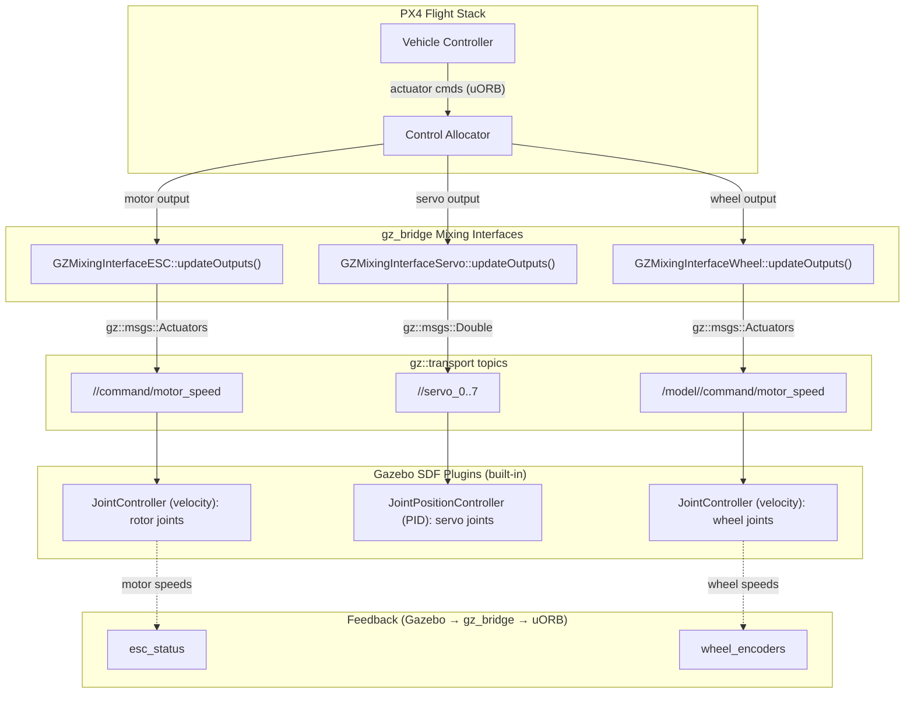
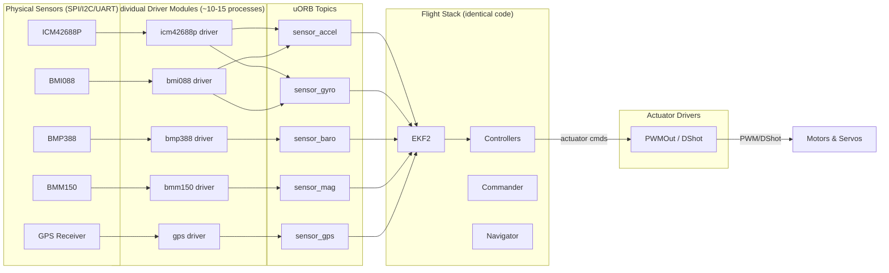
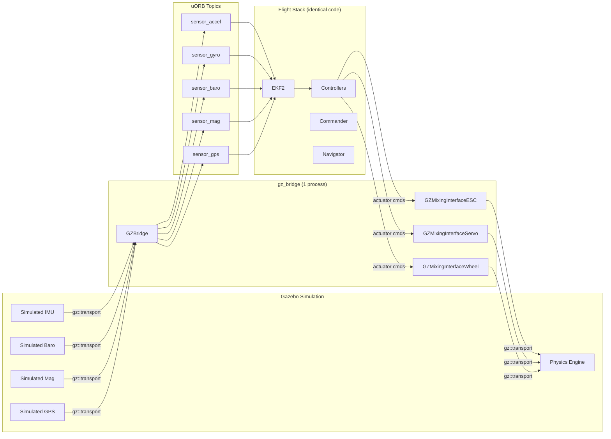
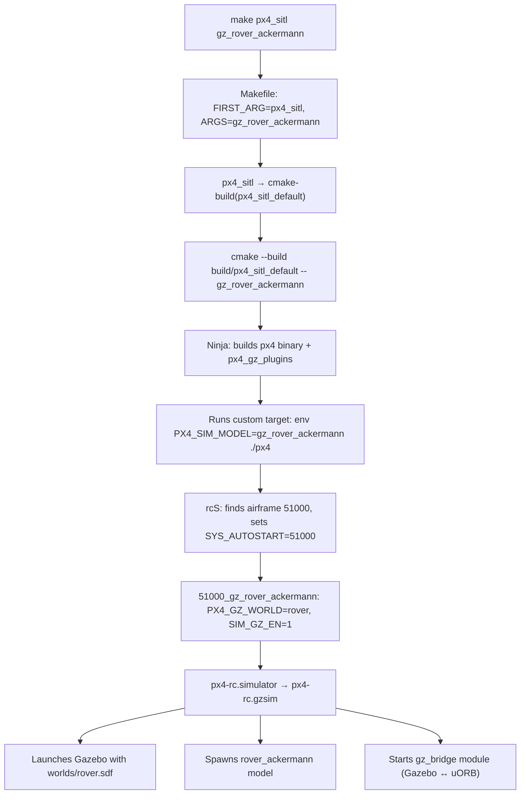
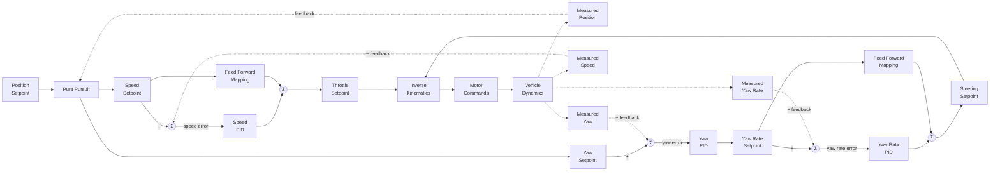
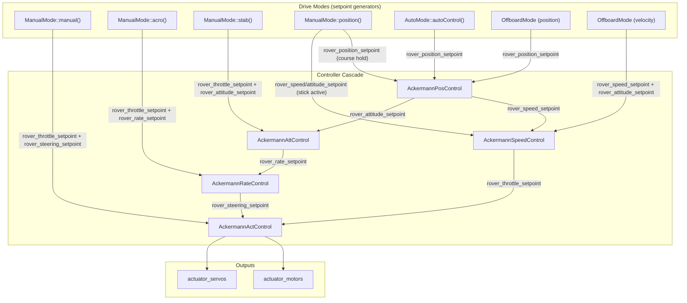

# PX4 Autopilot — Project Overview

## What is PX4?

PX4 is a professional-grade open-source autopilot flight stack for drones and other unmanned vehicles.
It runs on NuttX RTOS, Linux (POSIX), macOS, and QURT platforms.
Supported vehicle types include multirotors, fixed-wing, VTOL, rovers, helicopters, submarines, boats, and spacecraft.

- **License:** BSD 3-Clause
- **Governance:** Dronecode Foundation (Linux Foundation)
- **Core middleware:** uORB — a DDS-compatible publish/subscribe message bus
- **Communications:** MAVLink, DDS / ROS 2 (via Micro XRCE-DDS)
- **Build system:** CMake + Make (Ninja when available). Entry point is the top-level `Makefile`

## Repository Layout

| Path                             | Purpose                                                                          |
| -------------------------------- | -------------------------------------------------------------------------------- |
| `src/modules/`                   | Flight-stack modules (commander, EKF2, mc_att_control, navigator, mavlink, etc.) |
| `src/drivers/`                   | Hardware drivers (IMU, GPS, barometer, magnetometer, actuators, RC, etc.)        |
| `src/lib/`                       | Shared libraries (mathlib, matrix, geo, parameters, perf, pid, etc.)             |
| `src/systemcmds/`                | System commands (param, reboot, top, perf, etc.)                                 |
| `src/examples/`                  | Example modules                                                                  |
| `src/templates/template_module/` | **Canonical module template — use this as the pattern for new modules**          |
| `msg/`                           | uORB message definitions (`.msg` files, ROS 2 IDL-compatible)                    |
| `boards/`                        | Board configurations (`.px4board` Kconfig files)                                 |
| `platforms/`                     | Platform abstraction layer (NuttX, POSIX, QURT)                                  |
| `ROMFS/`                         | ROM filesystem with init scripts (`rcS`, `rc.sensors`)                           |
| `Tools/`                         | Build helpers, simulation, code-style, analysis scripts                          |
| `cmake/`                         | CMake modules (`px4_add_module`, `px4_add_library`, etc.)                        |
| `docs/`                          | Documentation                                                                    |

## Build Targets

```bash
make px4_sitl_default          # SITL simulation build (default target)
make px4_fmu-v6x_default       # Hardware build for Pixhawk 6X
make px4_sitl_default gazebo   # SITL with Gazebo
make tests                     # Unit tests
make list_config_targets       # List all board/configuration targets
make help                      # List non-config make targets
```

Build artefacts go into `build/<target>/`. Never commit build outputs.

## Coding Standards

- **Primary language:** C/C++ (C++14 standard, C11 for pure C)
- **Style:** Linux kernel style enforced by Astyle (`Tools/astyle/astylerc`)
- **Indentation:** Hard tabs (width 8) for C/C++/CMake/Kconfig; 2-space for YAML/shell
- **Max line length:** 120 characters (C/C++), 140 (Astyle hard limit)
- **Braces:** Linux style — opening on same line, closing on its own line

### Naming Conventions

| Element             | Convention                           | Example                      |
| ------------------- | ------------------------------------ | ---------------------------- |
| Files & directories | `snake_case`                         | `mc_att_control.cpp`         |
| Classes             | `PascalCase`                         | `MulticopterAttitudeControl` |
| Functions / methods | `camelCase` or `snake_case`          | `updateParams()`             |
| Constants / enums   | `UPPER_SNAKE_CASE`                   | `NAVIGATION_STATE_MANUAL`    |
| Member variables    | `_leading_underscore`                | `_parameter_update_sub`      |
| Parameters          | `UPPER_SNAKE_CASE` with group prefix | `MC_ROLL_P`                  |
| uORB topics         | `snake_case`                         | `vehicle_attitude`           |

## Module Architecture

PX4 modules follow a strict pattern (see `src/templates/template_module/`):

1. Inherit from `ModuleBase<T>` and `ModuleParams`
2. Implement `task_spawn()`, `instantiate()`, `custom_command()`, `print_usage()`
3. Override `run()` for the main loop and `print_status()` for diagnostics
4. Use `DEFINE_PARAMETERS(...)` macro for typed parameter declarations
5. Use uORB subscriptions/publications for inter-module communication
6. Export a C entry point: `extern "C" __EXPORT int <module_name>_main(...)`

Each module has a `CMakeLists.txt` using `px4_add_module(...)`.

## uORB Messages

- Defined in `msg/*.msg` using ROS 2-compatible IDL syntax
- Every message must have `uint64 timestamp` as the first field
- Versioned messages include `uint32 MESSAGE_VERSION = <N>`
- Messages are auto-generated into C++ headers during build

## Board Configuration

- Board configs live in `boards/<vendor>/<model>/<variant>.px4board`
- Format is Kconfig key-value: `CONFIG_MODULES_COMMANDER=y`
- New modules must be explicitly enabled per-board

## Testing

- Unit tests: `make tests`
- SITL simulation: `make px4_sitl_default` then run with a simulator
- Test files live in `test/` and `src/**/tests/`

---

# Build System Deep Dive: `make px4_sitl gz_rover_ackermann`

This section traces the full build and launch chain for the command:

```bash
make px4_sitl gz_rover_ackermann
```

---

## Phase 1: Makefile Argument Parsing

In the top-level `Makefile`, the command is split into two parts:

```makefile
FIRST_ARG := $(firstword $(MAKECMDGOALS))   # → "px4_sitl"
ARGS := $(wordlist 2,...,$(MAKECMDGOALS))    # → "gz_rover_ackermann"
```

## Phase 2: Target Resolution — `px4_sitl` → `px4_sitl_default`

All board configurations are discovered by scanning `boards/*/*.px4board`:

```makefile
ALL_CONFIG_TARGETS := $(shell find boards -maxdepth 3 -mindepth 3 -name '*.px4board' ...)
```

A convenience rule strips the `_default` suffix so you can type `px4_sitl` instead of `px4_sitl_default`:

```makefile
CONFIG_TARGETS_DEFAULT := $(patsubst %_default,%,$(filter %_default,$(ALL_CONFIG_TARGETS)))
$(CONFIG_TARGETS_DEFAULT):
    @$(call cmake-build,$@_default$(BUILD_DIR_SUFFIX))
```

So `px4_sitl` resolves to `cmake-build(px4_sitl_default)`.

## Phase 3: `cmake-build` — CMake + Ninja

The `cmake-build` function does the following:

1. Sets `-DCONFIG=px4_sitl_default` and `BUILD_DIR=build/px4_sitl_default`
2. Runs CMake configuration (if no cache exists):
   ```bash
   cmake <SRC_DIR> -GNinja -DCONFIG=px4_sitl_default
   ```
3. Runs the build, passing `ARGS` through as a **Ninja target**:
   ```bash
   cmake --build build/px4_sitl_default -- gz_rover_ackermann
   ```

This means `gz_rover_ackermann` is a custom CMake/Ninja target.

## Phase 4: How the `gz_rover_ackermann` Target is Defined

Inside the `gz_bridge` module's `CMakeLists.txt`, CMake auto-generates simulation targets:

1. **Globs airframe files** matching `ROMFS/px4fmu_common/init.d-posix/airframes/*_gz_*`
2. **Globs world files** from `Tools/simulation/gz/worlds/*.sdf`
3. **Generates a custom target** for each airframe/world combination. For airframe `51000_gz_rover_ackermann` with the default world:

```cmake
add_custom_target(gz_rover_ackermann
    COMMAND ${CMAKE_COMMAND} -E env
        PX4_SIM_MODEL=gz_rover_ackermann
        GZ_IP=127.0.0.1
        $<TARGET_FILE:px4>
    WORKING_DIRECTORY ${SITL_WORKING_DIR}
    DEPENDS px4 px4_gz_plugins
)
```

This target first builds the `px4` binary and Gazebo plugins, then launches PX4.

## Phase 5: PX4 Runtime — Init Script Chain

Once the `px4` binary starts with `PX4_SIM_MODEL=gz_rover_ackermann` set in the environment, the init scripts take over:

| Step | Script                     | What Happens                                                                                                                 |
| ---- | -------------------------- | ---------------------------------------------------------------------------------------------------------------------------- |
| 1    | `rcS`                      | Matches `PX4_SIM_MODEL` to airframe file `51000_gz_rover_ackermann`, sets `SYS_AUTOSTART=51000`                              |
| 2    | `51000_gz_rover_ackermann` | Sets `PX4_GZ_WORLD=rover`, `SIM_GZ_EN=1`, and rover-specific parameters (wheel base, steering, PID gains, actuator mappings) |
| 3    | `px4-rc.simulator`         | Detects `PX4_SIMULATOR=gz`, sources `px4-rc.gzsim`                                                                           |
| 4    | `px4-rc.gzsim`             | Launches Gazebo with `worlds/rover.sdf`, spawns the `rover_ackermann` model, starts the `gz_bridge` module                   |

### Key init scripts

- `ROMFS/px4fmu_common/init.d-posix/rcS` — main startup script
- `ROMFS/px4fmu_common/init.d-posix/airframes/51000_gz_rover_ackermann` — airframe config
- `ROMFS/px4fmu_common/init.d-posix/px4-rc.simulator` — simulator dispatcher
- `ROMFS/px4fmu_common/init.d-posix/px4-rc.gzsim` — Gazebo-specific launch logic

## Phase 6: Gazebo Launch Details (`px4-rc.gzsim`)

The Gazebo startup script performs these steps:

1. **Validates Gazebo version** (requires ≥ 8.0.0 / Harmonic)
2. **Sources `gz_env.sh`** — sets `GZ_SIM_RESOURCE_PATH` to include model and world directories
3. **Starts Gazebo server**: `gz sim --verbose=1 -r -s worlds/rover.sdf &`
4. **Starts Gazebo GUI** (unless `HEADLESS=1`): `gz sim -g &`
5. **Waits for the world** to be ready (polls for up to 30 seconds)
6. **Spawns the model** via `gz service` into the running world as `rover_ackermann_0`
7. **Starts `gz_bridge`** module — bridges Gazebo topics ↔ uORB topics (IMU, GPS, actuators, etc.)

## Phase 7: Model & World Files

| File                                                      | Description                                                         |
| --------------------------------------------------------- | ------------------------------------------------------------------- |
| `Tools/simulation/gz/worlds/rover.sdf`                    | Ground plane with physics (500 Hz step), gravity, magnetic field    |
| `Tools/simulation/gz/models/rover_ackermann/model.sdf`    | Vehicle SDF: chassis, wheels, steering joints, Ackermann kinematics |
| `Tools/simulation/gz/models/rover_ackermann/model.config` | Model metadata                                                      |
| `Tools/simulation/gz/models/rover_ackermann/meshes/`      | 3D mesh files for visualization                                     |

### Sensors defined in the model

- IMU (250 Hz)
- Magnetometer (100 Hz)
- Air pressure / barometer (50 Hz)
- NavSat / GPS

---

# Real Hardware vs. Simulation Architecture

On real hardware there is no single bridge module — PX4 uses **many individual driver modules** in `src/drivers/`, one per sensor chip or actuator bus. In simulation, `gz_bridge` replaces all of them. Both sides publish to the **exact same uORB topics**, so the flight stack code is identical.

## Real Hardware Drivers

| Sensor Type      | Example Drivers in `src/drivers/`                                             | uORB Topic                      |
| ---------------- | ----------------------------------------------------------------------------- | ------------------------------- |
| **IMU**          | `imu/invensense/icm42688p`, `imu/bosch/bmi088`, `imu/invensense/icm45686`, …  | `sensor_accel`, `sensor_gyro`   |
| **Barometer**    | `barometer/bmp388`, `barometer/ms5611`, `barometer/dps310`, …                 | `sensor_baro`                   |
| **Magnetometer** | `magnetometer/bosch/bmm150`, `magnetometer/rm3100`, `magnetometer/lis3mdl`, … | `sensor_mag`                    |
| **GPS**          | `gps/` (single driver, multiple protocols: u-blox, NMEA, Septentrio, …)       | `sensor_gps`                    |
| **Actuators**    | `pwm_out`, `dshot`, `px4io`, `pca9685_pwm_out`                                | Subscribes to actuator commands |

## `gz_bridge` Module (`src/modules/simulation/gz_bridge/`)

| File                                  | Purpose                                                               |
| ------------------------------------- | --------------------------------------------------------------------- |
| `GZBridge.cpp` / `.hpp`               | Main module — subscribes to Gazebo topics, publishes uORB sensor data |
| `GZMixingInterfaceESC.cpp` / `.hpp`   | Sends motor (ESC) commands to Gazebo                                  |
| `GZMixingInterfaceServo.cpp` / `.hpp` | Sends servo commands to Gazebo                                        |
| `GZMixingInterfaceWheel.cpp` / `.hpp` | Sends wheel commands to Gazebo (rovers)                               |
| `GZGimbal.cpp` / `.hpp`               | Gimbal control interface                                              |
| `CMakeLists.txt`                      | Build config + auto-generates all `gz_*` simulation targets           |
| `gz_env.sh.in`                        | Template for Gazebo environment variables                             |
| `module.yaml`                         | Parameter metadata                                                    |

### Gazebo → uORB (sensor data)

| Gazebo Topic | uORB Publication                                    |
| ------------ | --------------------------------------------------- |
| Clock        | Simulation time sync (lockstep)                     |
| IMU          | `sensor_accel`, `sensor_gyro`                       |
| Magnetometer | `sensor_mag`                                        |
| Barometer    | `sensor_baro`                                       |
| NavSat (GPS) | `sensor_gps`                                        |
| Airspeed     | `differential_pressure`                             |
| LaserScan    | `obstacle_distance`                                 |
| Pose         | Ground truth (`vehicle_attitude_groundtruth`, etc.) |
| Odometry     | `vehicle_visual_odometry`                           |
| Optical Flow | `sensor_optical_flow`                               |

### uORB → Gazebo (actuator commands)

| Mixing Interface         | Function                                    |
| ------------------------ | ------------------------------------------- |
| `GZMixingInterfaceESC`   | Motor/propeller commands                    |
| `GZMixingInterfaceServo` | Servo commands (control surfaces, steering) |
| `GZMixingInterfaceWheel` | Wheel speed commands (rovers)               |
| `GZGimbal`               | Gimbal angle commands                       |

## Gazebo Simulation Control Strategy

There is **no custom PX4 Gazebo plugin** for actuator control — `gz_bridge` publishes commands over `gz::transport`, and **standard Gazebo system plugins** (configured in the model SDF) receive them.

### Three Mixing Interfaces

All three implement `OutputModuleInterface` and use `MixingOutput` — the same base pattern as real hardware drivers like `PWMOut` / `DShot`.

#### 1. `GZMixingInterfaceESC` — Motors / Propellers

- **Purpose:** Drives rotors/propellers at a commanded RPM
- **Used by:** Multirotors (x500), fixed-wing (rc_cessna), VTOL, helicopters
- **Gazebo topic:** `/<model>/command/motor_speed`
- **Message type:** `gz::msgs::Actuators` — velocity array, one entry per motor
- **Output mapping:** Direct RPM — `outputs[i]` → `velocity(i)`
- **Feedback:** Subscribes to the same topic to read back motor speeds and publishes `esc_status` uORB (for ESC health monitoring and failure detection)
- **Parameters:** `SIM_GZ_EC_FUNC1..N`, `SIM_GZ_EC_MIN1..N`, `SIM_GZ_EC_MAX1..N`
- **Gazebo SDF plugin:**
  ```xml
  <plugin filename="gz-sim-joint-controller-system" name="gz::sim::systems::JointController">
      <joint_name>rotor_0_joint</joint_name>
      <sub_topic>command/motor_speed</sub_topic>
      <control_type>velocity</control_type>
      <use_actuator_msg>true</use_actuator_msg>
      <actuator_number>0</actuator_number>
  </plugin>
  ```

#### 2. `GZMixingInterfaceServo` — Angular Position Actuators

- **Purpose:** Drives joints to a specific angle (in radians) — control surfaces, steering
- **Used by:** Fixed-wing (ailerons, elevator, rudder), rover ackermann (steering), VTOL (tilt-rotors)
- **Gazebo topic:** `/<model>/servo_0` through `servo_7` — one topic per servo
- **Message type:** `gz::msgs::Double` — angle in radians
- **Output mapping:** Converts normalized output to radians using per-servo min/max angle params:
  ```
  output = angle_min + angular_range × (output_value - min_value) / output_range
  ```
- **Feedback:** None — publish only
- **Parameters:** `SIM_GZ_SV_FUNC1..8`, `SIM_GZ_SV_MAXA1..8`, `SIM_GZ_SV_MINA1..8`, `SIM_GZ_SV_REV`
- **Gazebo SDF plugin:**
  ```xml
  <plugin filename="gz-sim-joint-position-controller-system" name="gz::sim::systems::JointPositionController">
      <joint_name>wheel_front_steering_joint</joint_name>
      <sub_topic>servo_0</sub_topic>
      <p_gain>100</p_gain>
      <i_gain>10</i_gain>
      <d_gain>0</d_gain>
  </plugin>
  ```

#### 3. `GZMixingInterfaceWheel` — Bidirectional Wheel Drive

- **Purpose:** Drives wheel joints at a commanded velocity with bidirectional support
- **Used by:** Rovers (differential drive, ackermann)
- **Gazebo topic:** `/model/<name>/command/motor_speed`
- **Message type:** `gz::msgs::Actuators` — velocity array (same as ESC)
- **Output mapping:** Applies an offset for bidirectional control:
  ```
  scaled_output = (double)outputs[i] - 100.0   // allows negative values for reverse
  ```
- **Feedback:** Subscribes to the same topic and publishes `wheel_encoders` uORB
- **Parameters:** `SIM_GZ_WH_FUNC1..N`, `SIM_GZ_WH_MIN1..N`, `SIM_GZ_WH_MAX1..N`, `SIM_GZ_WH_DIS1..N`
- **Gazebo SDF plugin:** Same `JointController` as ESC (velocity mode)

### Comparison Table

|                      | ESC                           | Servo                            | Wheel                         |
| -------------------- | ----------------------------- | -------------------------------- | ----------------------------- |
| **Controls**         | Motor/rotor speed             | Joint angle                      | Wheel speed (bidirectional)   |
| **Command type**     | Velocity (RPM)                | Position (radians)               | Velocity (with offset)        |
| **Message type**     | `gz::msgs::Actuators` (array) | `gz::msgs::Double` (per joint)   | `gz::msgs::Actuators` (array) |
| **Gazebo plugin**    | `JointController` (velocity)  | `JointPositionController` (PID)  | `JointController` (velocity)  |
| **Feedback**         | Yes → `esc_status`            | No                               | Yes → `wheel_encoders`        |
| **Bidirectional**    | No (0 to max RPM)             | Yes (min to max angle)           | Yes (offset-based)            |
| **Typical vehicles** | Multirotors, fixed-wing       | Fixed-wing, VTOL, rover steering | Rovers                        |

### Rover Ackermann Example

The airframe config (`ROMFS/px4fmu_common/init.d-posix/airframes/51000_gz_rover_ackermann`) uses **Wheel + Servo** (not ESC):

```bash
# Wheels (drive)
SIM_GZ_WH_FUNC1 = 101   # Motor 1 function (throttle)
SIM_GZ_WH_MIN1  = 70    # Min output
SIM_GZ_WH_MAX1  = 130   # Max output
SIM_GZ_WH_DIS1  = 100   # Disarmed value (zero speed)

# Steering (servo)
SIM_GZ_SV_FUNC1 = 201   # Servo 1 function (steering)
SIM_GZ_SV_MAXA1 = 30    # Max angle (degrees)
SIM_GZ_SV_MINA1 = -30   # Min angle (degrees)
SIM_GZ_SV_REV   = 1     # Reverse direction
```

In the model SDF:
- All 4 wheel joints use `JointController` subscribing to `command/motor_speed` (actuator 0, velocity mode)
- All 3 front steering joints use `JointPositionController` subscribing to `servo_0` (position PID)

### Coordinate Frame Conversions

Gazebo uses **ENU** (East-North-Up) / **FLU** (Forward-Left-Up) frames while PX4 uses **NED** (North-East-Down) / **FRD** (Forward-Right-Down). The `GZBridge` module converts between them:

| Conversion                             | Method                        | Quaternion                                                    |
| -------------------------------------- | ----------------------------- | ------------------------------------------------------------- |
| FLU → FRD (body frame)                 | 180° rotation about X         | `q_FLU_to_FRD = (0, 1, 0, 0)`                                 |
| ENU → NED (world frame)                | 90° about Z then 180° about X | `q_ENU_to_NED = (0, 0.70711, 0.70711, 0)`                     |
| Full attitude: FLU-to-ENU → FRD-to-NED | Composition                   | `q_FRD_to_NED = q_ENU_to_NED * q_FLU_to_ENU * q_FLU_to_FRD⁻¹` |

Applied in sensor callbacks:
- **IMU**: accel/gyro vectors rotated by `q_FLU_to_FRD` before publishing to uORB
- **Pose/attitude**: full quaternion conversion via `rotateQuaternion()`
- **Position**: `ENU(x,y,z)` → `NED(y,x,-z)`
- **Velocity (odometry)**: body FLU `(x,y,z)` → body FRD `(x,-y,-z)`
- **Magnetometer**: axes swapped due to Gazebo's left-handed mag plugin convention

### Full Actuator Data Flow



> **Key takeaway:** PX4 does not need custom Gazebo plugins for actuator control. The `gz_bridge` mixing interfaces publish standard `gz::transport` messages, and Gazebo's built-in `JointController` (velocity) and `JointPositionController` (position PID) system plugins — configured in the model SDF — drive the joints.

## Board Config Differences

A **real board** (e.g. `boards/px4/fmu-v6x/default.px4board`) enables individual drivers:
```
CONFIG_DRIVERS_IMU_INVENSENSE_ICM42688P=y
CONFIG_DRIVERS_IMU_BOSCH_BMI088=y
CONFIG_DRIVERS_BAROMETER_BMP388=y
CONFIG_DRIVERS_MAGNETOMETER_BOSCH_BMM150=y
CONFIG_DRIVERS_GPS=y
CONFIG_DRIVERS_PWM_OUT=y
CONFIG_DRIVERS_DSHOT=y
```

**SITL** (`boards/px4/sitl/default.px4board`) replaces all of them with one module:
```
CONFIG_MODULES_SIMULATION_GZ_BRIDGE=y
```

## Architecture Diagrams

### Real Hardware



### SITL Simulation (gz_bridge)



> **Key insight:** The uORB topic layer is the abstraction boundary. Everything above it — EKF2, controllers, commander, navigator — runs identical code whether on real hardware or in simulation.

---

## Summary Flow



---

# Rover Ackermann Module Deep Dive

## Location

`src/modules/rover_ackermann/`

## Directory Structure

| Path                                         | Purpose                                                               |
| -------------------------------------------- | --------------------------------------------------------------------- |
| `RoverAckermann.cpp/.hpp`                    | Top-level module — dispatches drive modes and runs controller cascade |
| `AckermannPosControl/`                       | Position controller (Pure Pursuit + speed profiling)                  |
| `AckermannSpeedControl/`                     | Speed controller (PI + slew-rate)                                     |
| `AckermannAttControl/`                       | Attitude/heading controller (P + yaw slew)                            |
| `AckermannRateControl/`                      | Yaw rate controller (Ackermann kinematic feedforward + PI)            |
| `AckermannActControl/`                       | Actuator allocation (slew-rate limiting → motor/servo outputs)        |
| `AckermannDriveModes/AckermannManualMode/`   | Manual, Acro, Stabilized, Position sub-modes                          |
| `AckermannDriveModes/AckermannAutoMode/`     | Mission, Loiter, RTL                                                  |
| `AckermannDriveModes/AckermannOffboardMode/` | Offboard position/velocity control                                    |

## Cascaded Controller Architecture

The module uses a cascaded closed-loop control architecture with two parallel paths (speed and steering), four feedback loops, and feed-forward mappings. The following block diagram shows the full control flow:



**Block-to-module mapping:**

| Block Diagram Block         | PX4 Module                           | Algorithm                                                                                             |
| --------------------------- | ------------------------------------ | ----------------------------------------------------------------------------------------------------- |
| Pure Pursuit                | `AckermannPosControl`                | Pure Pursuit path following + S-curve speed profiling                                                 |
| Speed PID + Feed Forward    | `AckermannSpeedControl`              | PI controller with speed-to-throttle feedforward mapping                                              |
| Yaw PID                     | `AckermannAttControl`                | P controller with SlewRate-limited heading                                                            |
| Yaw Rate PID + Feed Forward | `AckermannRateControl`               | PI controller with Ackermann kinematic feedforward: $\text{steering} = \arctan(\dot\psi \cdot L / v)$ |
| Inverse Kinematics          | `AckermannActControl`                | Slew-rate limiting on throttle and steering outputs                                                   |
| Vehicle Dynamics            | Physical vehicle / Gazebo simulation | Real sensors or `gz_bridge` simulation feedback                                                       |

**Feedback signals:**

| Signal            | Source (real HW)                          | Source (SITL) | uORB Topic                 |
| ----------------- | ----------------------------------------- | ------------- | -------------------------- |
| Measured Position | GPS + EKF2                                | gz_bridge     | `vehicle_local_position`   |
| Measured Speed    | EKF2 (NED velocity → body frame rotation) | gz_bridge     | `vehicle_local_position`   |
| Measured Yaw      | EKF2 (quaternion → Euler)                 | gz_bridge     | `vehicle_attitude`         |
| Measured Yaw Rate | Gyroscope                                 | gz_bridge     | `vehicle_angular_velocity` |

The `updateControllers()` method runs the cascade conditionally based on `vehicle_control_mode` flags:

```cpp
if (flag_control_position_enabled)   → PosControl
if (flag_control_velocity_enabled)   → SpeedControl
if (flag_control_attitude_enabled)   → AttControl
if (flag_control_rates_enabled)      → RateControl
if (flag_control_allocation_enabled) → ActControl
```

## Controller Details

### 1. AckermannPosControl — Position Controller

- **Algorithm:** **Pure Pursuit** path following + **S-curve speed profiling** (jerk/decel limited)
- **Subscribes:** `rover_position_setpoint`, `vehicle_local_position`, `vehicle_attitude`, `rover_throttle_setpoint`
- **Publishes:** `rover_speed_setpoint`, `rover_attitude_setpoint`
- **Key logic:**
  - Uses Pure Pursuit to compute bearing toward target waypoint with configurable lookahead distance
  - Computes speed setpoint with jerk/decel-limited S-curve to decelerate into waypoints
  - Applies **course-error-based speed reduction** — slows down when heading error is large
  - If driving backwards (negative speed), flips heading by π
  - At target arrival (within acceptance radius with zero arrival speed), commands speed=0 and holds heading
- **Key params:** `PP_LOOKAHD_GAIN/MIN/MAX`, `RA_ACC_RAD_GAIN/MAX`, `RO_SPEED_LIM`, `RO_ACCEL_LIM`, `RO_DECEL_LIM`, `RO_JERK_LIM`

### 2. AckermannSpeedControl — Speed Controller

- **Algorithm:** **PI controller** (feedforward + feedback) with **slew-rate limited** setpoint
- **Subscribes:** `rover_speed_setpoint`, `vehicle_local_position`, `vehicle_attitude`
- **Publishes:** `rover_throttle_setpoint`
- **Key logic:**
  - Measures actual speed by rotating NED velocity into body frame
  - Applies slew-rate limiting with separate accel/decel rates
  - Feedforward + PI → normalized throttle ∈ [-1, 1]
- **Key params:** `RO_SPEED_P/I`, `RO_SPEED_LIM`, `RO_MAX_THR_SPEED`, `RO_ACCEL_LIM`, `RO_DECEL_LIM`

### 3. AckermannAttControl — Heading Controller

- **Algorithm:** **P controller** with **yaw SlewRate** limiter
- **Subscribes:** `rover_attitude_setpoint`, `vehicle_attitude`, `rover_throttle_setpoint`
- **Publishes:** `rover_rate_setpoint`
- **Key logic:**
  - Computes max feasible yaw rate at current speed from Ackermann geometry
  - Applies SlewRate to heading setpoint for smooth transitions
  - P-controller: `yaw_rate = P × wrap_pi(adjusted_yaw - actual_yaw)`
  - Constrains output to max feasible yaw rate
- **Key params:** `RO_YAW_P`, `RA_MAX_STR_ANG`, `RA_WHEEL_BASE`, `RO_MAX_THR_SPEED`, `RO_YAW_RATE_LIM`

### 4. AckermannRateControl — Yaw Rate Controller

- **Algorithm:** **Ackermann kinematic feedforward + PI feedback**
- **Subscribes:** `rover_rate_setpoint`, `vehicle_angular_velocity`, `rover_throttle_setpoint`
- **Publishes:** `rover_steering_setpoint`
- **Key logic:**
  - **Feedforward (inverse Ackermann kinematics):**
    $\text{steering} = \arctan\left(\frac{\dot\psi \cdot L}{v}\right) \times \text{correction}$
    where $L$ = wheel base, $v$ = estimated speed
  - **PI feedback:** Added only during forward driving (disabled in reverse because the system is non-minimum-phase)
  - Normalizes steering angle from physical range to [-1, 1]
  - If estimated speed ≈ 0, outputs 0 steering and resets PI integral
- **Key params:** `RO_YAW_RATE_P/I`, `RA_WHEEL_BASE`, `RA_MAX_STR_ANG`, `RO_YAW_RATE_LIM`, `RO_YAW_RATE_CORR`

### 5. AckermannActControl — Actuator Allocation

- **Algorithm:** **Slew-rate limiting** on both motor and servo outputs
- **Subscribes:** `rover_throttle_setpoint`, `rover_steering_setpoint`, `vehicle_control_mode`
- **Publishes:** `actuator_motors`, `actuator_servos`
- **Key logic:**
  - Motor: slew-rate limited throttle with separate accel/decel rates
  - Servo: slew-rate limited steering with configurable rate limit
  - `stopVehicle()`: sends 0 to both outputs on disarm
- **Key params:** `RA_STR_RATE_LIM`, `RO_ACCEL_LIM`, `RO_DECEL_LIM`, `RO_MAX_THR_SPEED`

## Drive Modes

### Drive Mode → Cascade Entry Diagram



### Mode Summary Table

| Mode                          | nav_state                   | Cascade Entry                                                      | Controllers Used               |
| ----------------------------- | --------------------------- | ------------------------------------------------------------------ | ------------------------------ |
| **Manual**                    | `NAVIGATION_STATE_MANUAL`   | ActControl (direct)                                                | Act only                       |
| **Acro**                      | `NAVIGATION_STATE_ACRO`     | RateControl                                                        | Rate → Act                     |
| **Stabilized**                | `NAVIGATION_STATE_STAB`     | AttControl                                                         | Att → Rate → Act               |
| **Position**                  | `NAVIGATION_STATE_POSCTL`   | PosControl (course hold) or SpeedControl+AttControl (stick active) | Full or Speed+Att → Rate → Act |
| **Auto** (Mission/Loiter/RTL) | `NAVIGATION_STATE_AUTO_*`   | PosControl                                                         | Full cascade                   |
| **Offboard (position)**       | `NAVIGATION_STATE_OFFBOARD` | PosControl                                                         | Full cascade                   |
| **Offboard (velocity)**       | `NAVIGATION_STATE_OFFBOARD` | SpeedControl + AttControl                                          | Speed + Att → Rate → Act       |

### Manual Mode Sub-modes

- **Manual:** Stick → throttle + steering directly → `actuator_motors` + `actuator_servos`. No closed-loop control.
- **Acro:** Stick → throttle + yaw rate (with expo curve) → Rate controller computes steering via Ackermann kinematics.
- **Stabilized:** Stick → throttle + heading setpoint (heading hold when stick centered) → Att → Rate → Act.
- **Position:** Stick → speed + heading when stick active; when stick centered, constructs a **synthetic waypoint** along current course for straight-line course-hold via Pure Pursuit → full cascade.

### Auto Mode (Mission)

- Reads `position_setpoint_triplet` (prev/curr/next waypoints) from Navigator
- Computes **corner angle** between segments → dynamically calculates acceptance radius from Ackermann geometry:
  $r_{acc} = \text{gain} \times \frac{r_{min}}{\tan(\theta/2)}$ where $r_{min} = \frac{L}{\sin(\alpha_{max})}$
- Sets **arrival speed** based on corner sharpness (sharper → slower, stops at LAND/IDLE)
- Publishes `rover_position_setpoint` → triggers full cascade

### Offboard Mode

- **Position mode:** Publishes `rover_position_setpoint` with NED position from `trajectory_setpoint` → full cascade
- **Velocity mode:** Computes speed = norm of NED velocity, heading = atan2 of velocity vector → publishes `rover_speed_setpoint` + `rover_attitude_setpoint` → enters cascade at speed+attitude level

## uORB Topic Flow

| Topic                     | Published by                                               | Consumed by        |
| ------------------------- | ---------------------------------------------------------- | ------------------ |
| `rover_position_setpoint` | AutoMode, ManualMode (position), OffboardMode              | PosControl         |
| `rover_speed_setpoint`    | PosControl, ManualMode (position), OffboardMode (vel)      | SpeedControl       |
| `rover_attitude_setpoint` | PosControl, ManualMode (stab/position), OffboardMode (vel) | AttControl         |
| `rover_throttle_setpoint` | SpeedControl, ManualMode (manual/acro/stab)                | ActControl         |
| `rover_rate_setpoint`     | AttControl, ManualMode (acro)                              | RateControl        |
| `rover_steering_setpoint` | RateControl, ManualMode (manual)                           | ActControl         |
| `actuator_motors`         | ActControl                                                 | gz_bridge / PWMOut |
| `actuator_servos`         | ActControl                                                 | gz_bridge / PWMOut |

## Control Algorithm Summary

| Controller       | Algorithm                                | Key Feature                                                                  |
| ---------------- | ---------------------------------------- | ---------------------------------------------------------------------------- |
| **PosControl**   | **Pure Pursuit** + S-curve speed profile | Bearing-based path following with lookahead distance                         |
| **SpeedControl** | **PI** (feedforward + feedback)          | Slew-rate limited setpoint, asymmetric accel/decel                           |
| **AttControl**   | **P** (proportional heading error)       | SlewRate for smooth heading transitions                                      |
| **RateControl**  | **Ackermann kinematic feedforward + PI** | Inverse kinematics: `atan(ω·L/v)` for steering angle; PI disabled in reverse |
| **ActControl**   | **Slew-rate limiting**                   | Separate motor throttle and servo steering rate limits                       |

---

## Useful Commands

```bash
make list_config_targets     # List all board/configuration targets
make help                    # List non-config make targets (tests, clean, etc.)
make px4_sitl help           # List all SITL simulation targets (gz_*, etc.)
```

---

# ROS 2 Integration & Operations Guide

This section covers the operational aspects of running PX4 with ROS 2 in this project's WSL2-based development environment.

## Running the Stack

### 1. Start PX4 SITL + Gazebo

Launch the full simulation (see `robot_bringup` or run PX4 SITL directly).

### 2. Start MicroXRCEAgent

```bash
MicroXRCEAgent udp4 -p 8888
```

### 3. Run a Custom Mode (e.g. Manual Mode Example)

```bash
ros2 run example_mode_manual_cpp example_mode_manual
```

This registers "My Manual Mode" with PX4 via the PX4 ROS 2 interface library.

---

## QGC Connection from Windows Host (WSL2 Networking)

PX4 SITL inside WSL2 sends MAVLink to `127.0.0.1` by default, which stays inside the WSL VM. QGC on Windows never sees it.

### Fix: Point MAVLink at the Windows Host IP

1. **Get the Windows host IP from WSL:**

   ```bash
   ip route | grep default
   ```

   The IP after `via` is the Windows host (e.g. `172.22.240.1`).

2. **Stop the default MAVLink instance in the PX4 console (`pxh>`):**

   First, find the local port of instance #0 via `mavlink status` (e.g. `18570`), then:

   ```
   mavlink stop -u 18570
   ```

3. **Start a new MAVLink instance targeting the Windows host:**

   ```
   mavlink start -m onboard -r 4000000 -x -u 14550 -o 14550 -t <WIN_IP>
   ```

   Replace `<WIN_IP>` with the IP from step 1 (e.g. `172.22.240.1`).

   > **Note:** The mode must be a valid PX4 mode string. Use `onboard`, `custom`, `minimal`, etc. `normal` is **not** a valid mode and will fail with `ERROR [mavlink] invalid mode`.

4. **Configure QGC on Windows:**

   - Application Settings → Comm Links → Add
   - Type: **UDP**, Port: **14550**
   - Enable "Listen on all interfaces"
   - Ensure Windows Firewall allows QGC on private networks

5. **Verify** with `mavlink status` in the PX4 console — the new instance should show the Windows host IP as the target.

---

## Joystick / RC in QGC (Windows)

QGC only sees joysticks that Windows exposes as a game controller via HID.

- Verify in Windows: `Win+R` → `joy.cpl` → confirm the RC appears and axes respond.
- In QGC: Settings → Joystick → "Enable joystick input".
- Close other apps that may grab the device (Steam, vendor calibration tools).
- Restart QGC after plugging in the RC (some versions only scan at startup).

---

## Custom Mode Arming: `preventArming` Flag

### Problem

When selecting a PX4 ROS 2 custom mode (e.g. "My Manual Mode") and attempting to arm, PX4 denies arming:

```
WARN  [commander] Arming denied: Resolve system health failures first
```

### Cause

All PX4 ROS 2 example modes are created with `preventArming(true)` as a safety guard:

```cpp
// src/px4-ros2-interface-lib/examples/cpp/modes/manual/include/mode.hpp
explicit FlightModeTest(rclcpp::Node& node)
    : ModeBase(node, Settings{kName}.preventArming(true))
```

This flag tells PX4: **do not allow arming while this mode is selected**.

### Solution A: Arm First, Then Switch (Recommended / Safe)

1. Select a standard PX4 mode in QGC (e.g. **Manual** or **Position**).
2. Arm the vehicle.
3. Switch to "My Manual Mode" in the QGC mode selector.

### Solution B: Allow Direct Arming (Development Only)

Change `preventArming(true)` → `preventArming(false)` in the mode header:

```cpp
explicit FlightModeTest(rclcpp::Node& node)
    : ModeBase(node, Settings{kName}.preventArming(false))
```

Then rebuild:

```bash
colcon build --packages-select example_mode_manual_cpp --symlink-install
```

> **Warning:** Only do this in simulation. For real hardware, keep `preventArming(true)` on experimental modes.

---

## PX4 ROS 2 Interface Library — Key Concepts

| Concept                      | Description                                                                                                           |
| ---------------------------- | --------------------------------------------------------------------------------------------------------------------- |
| `ModeBase`                   | Base class for custom PX4 flight modes registered via ROS 2                                                           |
| `Settings`                   | Builder for mode config: name, `preventArming`, `activateEvenWhileDisarmed`, `replaceInternalMode`                    |
| `ManualControlInput`         | Reads RC stick inputs (roll, pitch, yaw, throttle)                                                                    |
| `RatesSetpointType`          | Sends angular rate + thrust commands (experimental)                                                                   |
| `AttitudeSetpointType`       | Sends quaternion attitude + thrust commands (experimental)                                                            |
| `PeripheralActuatorControls` | Sends servo/actuator passthrough commands                                                                             |
| `healthAndArmingChecks()`    | Virtual method to report custom arming requirements (default: no-op)                                                  |
| Mode requirements            | Automatically inferred from which setpoint types are constructed (e.g. needs attitude estimate, needs local position) |

---

## MAVLink Mode Reference

Valid `-m` values for `mavlink start`:

```
custom | camera | onboard | osd | magic | config | iridium | minimal | extvision | extvisionmin | gimbal | onboard_l
```

`normal` is **not** valid and will produce `ERROR [mavlink] invalid mode`.

---

## PX4 Parameter Management

### How PX4 Parameters Work

PX4 stores all configuration as **named parameters** (key-value pairs). Every parameter has:

- **Default value** — compiled into the firmware for the selected airframe
- **Runtime value** — stored in EEPROM / `dataman` (SITL uses `eeprom/parameters` file on disk)
- **Type** — `INT32` or `FLOAT`

### Parameter Precedence (highest → lowest)

| Priority | Source                                                         | When Applied                         |
| -------- | -------------------------------------------------------------- | ------------------------------------ |
| 1        | `param set NAME VALUE` in `pxh>` console                       | Immediate; persists across reboots   |
| 2        | QGC → Parameters panel → edit value                            | Immediate; persists across reboots   |
| 3        | Airframe init script (`ROMFS/px4fmu_common/init.d/airframes/`) | At boot, only for newly-set defaults |
| 4        | Compile-time defaults in source (`PARAM_DEFINE_*` macros)      | Fallback if never overridden         |

### Important Parameter Commands (`pxh>` Console)

```bash
# Show current value
param show EKF2_EV_CTRL

# Set a parameter (persists across reboots)
param set EKF2_EV_CTRL 15

# Reset a single parameter to default
param reset EKF2_EV_CTRL

# Reset ALL parameters to defaults
param reset_all

# Save current parameters to file (backup)
param save /fs/microsd/params_backup.bms

# Load parameters from file
param load /fs/microsd/params_backup.bms

# List all parameters matching a pattern
param show EKF2_*
```

### Per-Airframe Custom Defaults

To persistently override parameters for SITL without typing `param set` every time:

1. **Startup script method** — create/edit `build/px4_sitl_default/etc/init.d-posix/airframes/<ID>_<name>` to include `param set-default` lines.

2. **QGC method** — change values in QGC → Parameters, they persist in the SITL EEPROM file.

3. **Environment variable method** — set `PX4_SIM_MODEL` or pass `-o` flags to `make px4_sitl`.

### Current State in This Workspace

**No PX4 parameter files exist in this repo.** All PX4 parameters use firmware defaults. This means:

- EKF2 external vision fusion is **disabled by default**
- The rover airframe defaults are whatever PX4 ships
- Any parameter changes must be done manually via `pxh>` or QGC after boot

---

## Feeding Odometry into PX4 EKF2

### Overview

PX4's EKF2 can fuse **external vision (EV)** data — odometry from Gazebo ground truth, VIO (T265), or SLAM (RTAB-Map). This gives PX4 a position/velocity/heading estimate without relying on GPS.

### Current Odometry Pipeline

```
┌──────────────────────────────────────────────────────────────────────┐
│ Gazebo                                                               │
│  OdometryPublisher plugin → /ackermann/odom (gz topic)               │
│                          → ros_gz_bridge → /ackermann/odom (ROS 2)   │
└──────────────┬───────────────────────────────────────────────────────┘
               │
               ▼
┌──────────────────────────────────────────────────────────────────────┐
│ RTAB-Map (optional)                                                  │
│  rgbd_odometry → /vo_odom (visual odometry)                          │
│  robot_localization EKF → /odometry/filtered (fused odom + IMU)      │
└──────────────┬───────────────────────────────────────────────────────┘
               │
               ▼
┌──────────────────────────────────────────────────────────────────────┐
│ PX4 Bridge Nodes (choose one)                                        │
│                                                                      │
│  px4_vision_odom.py (recommended)                                    │
│    /odom → TF2 lookup → ENU→NED + FLU→FRD                           │
│         → /fmu/in/vehicle_visual_odometry (at 50 Hz, quality=100)    │
│                                                                      │
│  (px4_odometry_node.py has been removed — see px4_vision_odom.py)    │
│    /odom → TF2 lookup → ENU→NED + FLU→FRD                           │
│         → /fmu/in/vehicle_visual_odometry (at 50 Hz, quality=100)    │
└──────────────┬───────────────────────────────────────────────────────┘
               │
               ▼
┌──────────────────────────────────────────────────────────────────────┐
│ PX4 EKF2                                                             │
│  Fuses vehicle_visual_odometry into state estimate                   │
│  (only if EKF2_EV_CTRL is configured — see below)                    │
└──────────────────────────────────────────────────────────────────────┘
```

### What Changes Are Needed

#### 1. SDF / URDF — Gazebo Odometry Source

The Gazebo `OdometryPublisher` plugin is already present in the main robot URDF:

```xml
<!-- src/description_robot/urdf/donkey_sensors.urdf (line ~440) -->
<plugin filename="ignition-gazebo-odometry-publisher-system"
        name="ignition::gazebo::systems::OdometryPublisher">
  <dimensions>3</dimensions>
  <odom_frame>$odom</odom_frame>
  <robot_base_frame>ackermann/base_link</robot_base_frame>
  <odom_topic>ackermann/odom</odom_topic>
  <publish_tf>false</publish_tf>
</plugin>
```

**Issue:** `<odom_frame>$odom</odom_frame>` — the literal `$odom` is likely a bug (should be `odom` or `ackermann/odom`). This should be fixed:

```xml
<odom_frame>odom</odom_frame>
```

**For real hardware (SLAM instead of Gazebo):** Replace the Gazebo odometry source with RTAB-Map's `/odometry/filtered` output. The bridge node input topic must be remapped accordingly:

```bash
# In px4_bringup.launch.py, pass odom_topic argument:
ros2 launch px4_bringup px4_bringup.launch.py enable_vo_bridge:=true odom_topic:=/odometry/filtered
```

#### 2. PX4 Parameters — Enable EKF2 External Vision Fusion

These parameters **must** be set in the PX4 console (`pxh>`) or QGC to make EKF2 actually use the incoming odometry:

##### Essential EKF2 Parameters

```bash
# ── Enable external vision fusion ─────────────────────────────────

# EKF2_EV_CTRL: bitmask controlling which EV measurements to fuse
#   bit 0 (1)  = horizontal position
#   bit 1 (2)  = vertical position
#   bit 2 (4)  = 3D velocity
#   bit 3 (8)  = yaw angle
#   15 = all four (1+2+4+8)
param set EKF2_EV_CTRL 15

# EKF2_HGT_REF: primary height reference source
#   0 = barometer
#   1 = GPS
#   2 = range finder
#   3 = vision (external vision)
param set EKF2_HGT_REF 3

# ── Noise / quality tuning ────────────────────────────────────────

# Position noise (meters) — how much you trust the EV position
# Gazebo ground truth: very low (0.01)
# VIO / SLAM: higher (0.05–0.1)
param set EKF2_EVP_NOISE 0.01

# Velocity noise (m/s) — how much you trust the EV velocity
param set EKF2_EVV_NOISE 0.01

# Yaw noise (radians)
param set EKF2_EVA_NOISE 0.01

# ── Frame configuration ───────────────────────────────────────────

# EKF2_EV_ODOM_FRM: reference frame of EV data
#   0 = NED (vision data is in local NED frame — our bridge converts to this)
param set EKF2_EV_ODOM_FRM 0

# ── Optional: disable GPS if not available ────────────────────────

# If running indoors / no GPS in Gazebo world:
param set EKF2_GPS_CTRL 0

# ── Optional: disable barometer fusion for height ────────────────
# (use vision height only)
param set EKF2_BARO_CTRL 0
```

##### Quick-Copy Block (All-in-One)

```bash
param set EKF2_EV_CTRL 15
param set EKF2_HGT_REF 3
param set EKF2_EVP_NOISE 0.01
param set EKF2_EVV_NOISE 0.01
param set EKF2_EVA_NOISE 0.01
param set EKF2_EV_ODOM_FRM 0
param set EKF2_GPS_CTRL 0
param set EKF2_BARO_CTRL 0
```

##### Parameter Reference Table

| Parameter          | Default        | Set To                       | Purpose                                                |
| ------------------ | -------------- | ---------------------------- | ------------------------------------------------------ |
| `EKF2_EV_CTRL`     | `0` (disabled) | `15` (all)                   | Enable EV position + velocity + yaw fusion             |
| `EKF2_HGT_REF`     | `0` (baro)     | `3` (vision)                 | Use vision as primary height source                    |
| `EKF2_EVP_NOISE`   | `0.1`          | `0.01` (sim) / `0.05` (real) | EV position measurement noise (m)                      |
| `EKF2_EVV_NOISE`   | `0.1`          | `0.01` (sim) / `0.05` (real) | EV velocity measurement noise (m/s)                    |
| `EKF2_EVA_NOISE`   | `0.05`         | `0.01` (sim) / `0.05` (real) | EV yaw measurement noise (rad)                         |
| `EKF2_EV_ODOM_FRM` | `0` (NED)      | `0`                          | Frame of incoming EV data (our bridges convert to NED) |
| `EKF2_GPS_CTRL`    | `7` (all)      | `0` (off)                    | Disable GPS if running indoor/no-GPS                   |
| `EKF2_BARO_CTRL`   | `1` (on)       | `0` (off)                    | Disable baro if using vision height only               |

##### EKF2_HGT_REF — Height Reference vs. Height Fusion

**Critical distinction:** `EKF2_HGT_REF` sets the **reference origin** for height, **not** which sources are fused. Multiple height sources can be fused simultaneously — the reference only determines which one defines "zero" altitude and is the authoritative absolute height.

**How EKF2 height fusion actually works:**

```
┌─────────────────────────────────────────────────────────────────────┐
│ EKF2 Height Fusion Architecture                                     │
│                                                                     │
│  ┌─────────────┐                                                    │
│  │ EKF2_HGT_REF│  = which source defines the height ORIGIN (z=0)   │
│  │ (one value)  │  = authoritative absolute altitude                │
│  └──────┬──────┘                                                    │
│         │                                                           │
│  ┌──────▼──────────────────────────────────────────────────────┐    │
│  │ Height sources ENABLED (each independently controlled):     │    │
│  │                                                             │    │
│  │  Barometer ──── EKF2_BARO_CTRL (0=off, 1=on)               │    │
│  │  GPS height ─── EKF2_GPS_CTRL  bit 1 (vertical pos)        │    │
│  │  Vision z ───── EKF2_EV_CTRL   bit 1 (vertical pos)        │    │
│  │  Range finder ─ EKF2_RNG_CTRL  (bitmask)                   │    │
│  │                                                             │    │
│  │  ALL enabled sources are fused simultaneously.              │    │
│  │  Each is weighted by its noise parameter.                   │    │
│  └─────────────────────────────────────────────────────────────┘    │
│                                                                     │
│  Innovation test: each source is checked for consistency.           │
│  If innovations exceed the threshold → that source is rejected      │
│  temporarily until it becomes consistent again.                     │
└─────────────────────────────────────────────────────────────────────┘
```

**Example: all three height sources enabled simultaneously**

```bash
# Enable all three height sources for fusion
param set EKF2_BARO_CTRL 1       # baro: fuse pressure altitude
param set EKF2_GPS_CTRL  7       # GPS: fuse hpos + vpos + vel (bit 1 = vpos)
param set EKF2_EV_CTRL   15      # EV: fuse hpos + vpos + vel + yaw (bit 1 = vpos)

# Set reference — only ONE can be the origin
param set EKF2_HGT_REF   0       # baro is the reference (z=0 at boot altitude)
```

In this configuration:
- **Baro** defines z=0 (reference) and is always fused
- **GPS height** is fused as a secondary measurement — helps correct baro drift
- **Vision z** is also fused as another secondary measurement
- EKF2 weights each source by its noise parameter (lower noise = more trust)

**What `EKF2_HGT_REF` values mean:**

| Value | Reference    | What it means                                                                                                             |
| ----- | ------------ | ------------------------------------------------------------------------------------------------------------------------- |
| `0`   | Barometer    | Height origin = pressure altitude at boot. Most stable reference — baro always available, no dropout risk.                |
| `1`   | GPS          | Height origin = GPS ellipsoid height. Good outdoors, but if GPS is lost, **reference is lost** → EKF2 falls back to baro. |
| `2`   | Range finder | Height origin = distance to ground. Only for low-altitude vehicles (drones < 10 m AGL).                                   |
| `3`   | Vision (EV)  | Height origin = EV z-position. If EV drops out, **reference is lost** → EKF2 falls back to baro.                          |

**Automatic fallback behavior:**

EKF2 has built-in **reference source fallback**. If the primary reference stops publishing or fails innovation checks:

1. EKF2 detects the reference source timeout (configurable, typically ~5 s)
2. It automatically switches the reference to **barometer** (always available as ultimate fallback)
3. A height reset occurs — there may be a small jump in the reported altitude
4. When the original reference comes back, EKF2 does **not** automatically switch back — baro remains the reference until reboot or manual `param set`

```
Timeline:
  ────────────────────────────────────────────────────────────►
  │  EKF2_HGT_REF=3 (vision)                                 │
  │                                                           │
  │  Vision OK     Vision lost     Vision back    Reboot      │
  │  ├──────────────┤──────────────┤──────────────┤           │
  │  │ ref=vision   │ ref=BARO     │ ref=BARO     │ ref=vision│
  │  │ fuse: all 3  │ fuse: baro+  │ fuse: all 3  │           │
  │  │              │ GPS (if on)  │ (but ref is   │           │
  │  │              │ height reset!│  still baro)  │           │
  │  └──────────────┴──────────────┴──────────────┘           │
```

**Recommended settings for our rover:**

| Environment           | `EKF2_HGT_REF` | Why                                                                                           |
| --------------------- | -------------- | --------------------------------------------------------------------------------------------- |
| Indoor only (2D SLAM) | `0` (baro)     | SLAM has no height; baro is always available                                                  |
| Indoor only (3D SLAM) | `3` (vision)   | Vision provides height; falls back to baro if SLAM fails                                      |
| Outdoor only (GPS)    | `1` (GPS)      | GPS height is absolute; falls back to baro if fix lost                                        |
| Mixed indoor/outdoor  | `0` (baro)     | **Safest** — baro never drops out; GPS and EV heights are fused as corrections on top of baro |

**Why baro is the safest reference for mixed environments:**
- Baro is always available (no dropouts)
- GPS height and vision height are fused as **relative corrections**, not absolute references
- No height reset jumps when transitioning indoors/outdoors
- The downside: baro drifts with temperature/pressure — but GPS and EV fusion corrects this drift when available

##### 2D SLAM Configuration

When using 2D SLAM (e.g. RTAB-Map in 2D mode, GMapping, Cartographer 2D), the odometry only provides **horizontal position (x, y) and yaw** — no reliable vertical position or z-velocity. The `EKF2_EV_CTRL` bitmask must reflect this:

```
EKF2_EV_CTRL bitmask:
  bit 0 (1) = horizontal position  ← YES (2D SLAM provides x, y)
  bit 1 (2) = vertical position    ← NO  (2D SLAM has no height info)
  bit 2 (4) = 3D velocity          ← DEPENDS (see below)
  bit 3 (8) = yaw angle            ← YES (2D SLAM provides yaw)
```

**Recommended values for 2D SLAM:**

| Scenario                   | `EKF2_EV_CTRL` | Bits          | Notes                                                           |
| -------------------------- | -------------- | ------------- | --------------------------------------------------------------- |
| Position + yaw only        | `9`            | 1 + 8         | Safest — only fuse what 2D SLAM reliably provides               |
| Position + velocity + yaw  | `13`           | 1 + 4 + 8     | If bridge sends velocity; z-velocity must be NaN in the message |
| Full 3D (Gazebo / 3D SLAM) | `15`           | 1 + 2 + 4 + 8 | Only for 3D odometry sources                                    |

**Height source with 2D SLAM:** Since 2D SLAM has no height, keep barometer as height reference:

```bash
# 2D SLAM quick-copy block
param set EKF2_EV_CTRL 9        # horizontal position + yaw only
param set EKF2_HGT_REF 0        # barometer for height (NOT vision)
param set EKF2_EVP_NOISE 0.05   # 2D SLAM is noisier than Gazebo
param set EKF2_EVA_NOISE 0.05
param set EKF2_EV_ODOM_FRM 0
```

**Bridge node requirement:** When using `EKF2_EV_CTRL = 9` (no velocity fusion), the bridge must still send position and orientation. Set the z-position and z-velocity fields to `NaN` in the `VehicleOdometry` message so EKF2 ignores them. The current `px4_vision_odom.py` sends all components — for strict 2D, modify it to set `position[2] = NaN` and `velocity[2] = NaN`.

##### GPS + EV Dual-Fusion (Automatic Switching)

PX4's EKF2 **does not have an explicit GPS ↔ EV switch**. Instead, it supports **concurrent fusion** — both GPS and EV can be enabled simultaneously, and EKF2 handles transitions automatically through its innovation consistency checks.

**How it works:**

```
┌─────────────────────────────────────────────────────────────┐
│ EKF2 Sensor Fusion                                          │
│                                                             │
│  GPS data ──→ innovation test ──→ accept/reject             │
│                                    ↓                        │
│  EV data  ──→ innovation test ──→ accept/reject ──→ state   │
│                                    ↓            estimate    │
│  Baro     ──→ innovation test ──→ accept/reject             │
│  IMU      ──→ always fused ────────────────────→            │
│                                                             │
│  Each source is independently tested every update.          │
│  Bad data (high innovation) is automatically rejected.      │
└─────────────────────────────────────────────────────────────┘
```

**To enable GPS + EV dual-fusion:**

```bash
# Enable both GPS and EV
param set EKF2_GPS_CTRL 7       # GPS: position + velocity + yaw (default)
param set EKF2_EV_CTRL 9        # EV: horizontal position + yaw (2D SLAM)

# Height: use GPS outdoors, baro as fallback
param set EKF2_HGT_REF 1        # GPS for height (outdoor)
# OR
param set EKF2_HGT_REF 0        # Barometer (safer for mixed indoor/outdoor)

# EV noise — set higher than GPS so EKF2 trusts GPS more when both are available
param set EKF2_EVP_NOISE 0.1
param set EKF2_EVA_NOISE 0.1

# Quality threshold — EV is rejected if quality < this value
param set EKF2_EV_QMIN 1        # 0 = accept all; 1–100 = minimum quality
```

**What happens in practice:**

| Scenario           | GPS Status            | EV Status            | EKF2 Behavior                                             |
| ------------------ | --------------------- | -------------------- | --------------------------------------------------------- |
| Outdoors, GPS good | ✅ good fix            | ✅ publishing         | Fuses both; GPS typically dominates (lower noise setting) |
| Moving indoors     | ❌ lost fix / high DOP | ✅ publishing         | GPS innovations fail → GPS rejected, EV continues         |
| Back outdoors      | ✅ fix recovered       | ✅ publishing         | GPS innovations pass again → GPS re-accepted alongside EV |
| EV failure         | ✅ good fix            | ❌ stopped publishing | EV timeout → GPS only                                     |
| Both lost          | ❌ no fix              | ❌ stopped            | IMU dead-reckoning only (drifts)                          |

**Key parameters for dual-fusion tuning:**

| Parameter          | Purpose                | Dual-Fusion Setting                                       |
| ------------------ | ---------------------- | --------------------------------------------------------- |
| `EKF2_GPS_CTRL`    | GPS fusion bitmask     | `7` (all)                                                 |
| `EKF2_EV_CTRL`     | EV fusion bitmask      | `9` (2D) or `15` (3D)                                     |
| `EKF2_EVP_NOISE`   | EV position noise      | Higher than GPS noise → GPS preferred when both available |
| `EKF2_GPS_P_NOISE` | GPS position noise     | Default `0.5` m                                           |
| `EKF2_EV_QMIN`     | Min EV quality to fuse | `1` (reject quality=0)                                    |
| `EKF2_GPS_CHECK`   | GPS pre-flight checks  | Keep default for safety                                   |
| `EKF2_HGT_REF`     | Primary height source  | `0` (baro) for mixed; `1` (GPS) for outdoor-only          |

**Important limitations:**
- There is **no parameter to say "prefer EV indoors, prefer GPS outdoors"** — EKF2 does this implicitly via innovation checks and noise settings.
- GPS and EV position estimates must be in the **same local frame origin**. EKF2 handles this via its internal origin alignment, but large jumps when GPS re-acquires can cause transient position errors.
- For a rover that operates **only indoors**, simply set `EKF2_GPS_CTRL 0` and rely on EV alone.
- For a rover that operates **only outdoors with GPS**, set `EKF2_EV_CTRL 0` and rely on GPS.
- Dual-fusion is best for vehicles that **transition between indoor and outdoor** environments.

#### 3. Bridge Node Selection

The VO bridge node in `src/px4_bringup/scripts/`:

| Node                 | Subscribes             | Publishes                         | Notes                                                           |
| -------------------- | ---------------------- | --------------------------------- | --------------------------------------------------------------- |
| `px4_vision_odom.py` | `/odom` (configurable) | `/fmu/in/vehicle_visual_odometry` | TF2 lookup, 50 Hz output timer, `quality=100`, proper variances |

> **Note:** `px4_odometry_node.py` has been removed. Use `px4_vision_odom.py` exclusively — it publishes to `vehicle_visual_odometry` (the standard EV input), uses TF2 for accurate transforms, publishes at a fixed 50 Hz rate, and sets proper variance values.

#### 4. Launch Configuration

Use `px4_bringup.launch.py` to launch the mode node and optionally the VO bridge:

```bash
# Mode node only (no VO bridge)
ros2 launch px4_bringup px4_bringup.launch.py

# Mode node + VO bridge feeding /odometry/filtered into PX4 EKF2
ros2 launch px4_bringup px4_bringup.launch.py enable_vo_bridge:=true odom_topic:=/odometry/filtered
```

The VO bridge is configured via launch arguments:

```bash
ros2 launch px4_bringup px4_bringup.launch.py \
    enable_vo_bridge:=true \
    odom_topic:=/odometry/filtered \
    odom_frame:=odom \
    base_frame:=ackermann/base_link
```

#### 5. Verification

After setting parameters and launching the bridge:

```bash
# 1. Check PX4 is receiving EV data (in pxh>)
listener vehicle_visual_odometry

# 2. Check EKF2 is fusing it (in pxh>)
listener estimator_status_flags
# Look for: ev_hpos = true, ev_vpos = true, ev_hvel = true, ev_yaw = true

# 3. Check local position output (in pxh>)
listener vehicle_local_position
# Position should track the odometry input

# 4. From ROS 2, check the bridge is publishing
ros2 topic hz /fmu/in/vehicle_visual_odometry
# Should show ~50 Hz
```

### Validating EKF2 Dual-Fusion (GPS + External Vision)

Once the odometry bridge is running and `EKF2_EV_CTRL` is configured, use the
PX4 shell commands below to confirm the EKF2 is actually fusing both GPS and
external vision concurrently.

#### Step 1: `listener estimator_status_flags`

Check the **control status** (`cs_*`) flags.  A healthy dual-fusion setup
shows:

```
pxh> listener estimator_status_flags
```

| Flag            | Expected                        | Meaning                            |
| --------------- | ------------------------------- | ---------------------------------- |
| `cs_ev_pos`     | `True`                          | EV horizontal position fused       |
| `cs_ev_vel`     | `True`                          | EV velocity fused                  |
| `cs_ev_yaw`     | `True`                          | EV yaw fused                       |
| `cs_ev_hgt`     | `False` (2D SLAM) / `True` (3D) | EV height fusion — off for 2D SLAM |
| `cs_gnss_pos`   | `True`                          | GPS horizontal position fused      |
| `cs_gnss_vel`   | `True`                          | GPS velocity fused                 |
| `cs_gps_hgt`    | `True`                          | GPS height fused                   |
| `cs_baro_hgt`   | `True`                          | Barometer height fused             |
| `cs_tilt_align` | `True`                          | IMU tilt aligned                   |
| `cs_yaw_align`  | `True`                          | Yaw aligned                        |
| `cs_mag_dec`    | `True`                          | Magnetic declination fused         |

**Fault flags** (`fs_*`) should **all** be `False`.  Any `True` fault flag
(e.g., `fs_bad_mag_x`, `fs_bad_acc_vertical`) indicates a sensor problem.

Example of a verified-healthy SITL session (Gazebo + GPS + EV, `EKF2_EV_CTRL = 13`):

```
cs_tilt_align: True      cs_yaw_align: True
cs_gnss_pos: True         cs_gnss_vel: True       cs_gps_hgt: True
cs_ev_pos: True           cs_ev_vel: True          cs_ev_yaw: True        cs_ev_hgt: False
cs_baro_hgt: True         cs_mag_dec: True         cs_mag: True
cs_vehicle_at_rest: True  cs_mag_heading_consistent: True

fs_bad_mag_x: False   fs_bad_mag_y: False   fs_bad_mag_z: False
fs_bad_hdg: False     fs_bad_acc_vertical: False   fs_bad_acc_clipping: False
```

> **Tip:** `cs_ev_hgt: False` is correct for 2D SLAM (`EKF2_EV_CTRL = 9` or `13`)
> since bit 1 (vertical position) is not set.  Height comes from baro/GPS instead.

#### Step 2: `listener estimator_innovations`

Innovations are the prediction errors — the difference between what the EKF
predicted and what the sensor actually measured.  Small innovations mean GPS
and EV agree with the EKF state.

```
pxh> listener estimator_innovations
```

Key fields to check:

| Innovation  | Healthy Range | What it means                                   |
| ----------- | ------------- | ----------------------------------------------- |
| `ev_hpos`   | < 0.05 m      | EV horizontal position agrees with EKF          |
| `ev_hvel`   | < 0.05 m/s    | EV velocity agrees with EKF                     |
| `ev_vpos`   | < 0.05 m      | EV vertical position (if fusing height)         |
| `gps_hpos`  | < 0.5 m       | GPS horizontal position agrees (~1–5 cm in sim) |
| `gps_vpos`  | < 0.5 m       | GPS vertical position agrees                    |
| `gps_hvel`  | < 0.5 m/s     | GPS velocity agrees                             |
| `heading`   | < 0.01 rad    | Yaw estimate consistent                         |
| `baro_vpos` | < 0.5 m       | Barometer height agrees (can drift over time)   |

Example of verified-healthy innovations (robot stationary in SITL):

```
ev_hvel:  [-0.00024, -0.00023]      # sub-mm/s — essentially perfect
ev_hpos:  [ 0.00003, -0.00024]      # sub-mm — Gazebo ground truth
ev_vpos:  -0.01131                   # ~1 cm — normal
gps_hpos: [ 0.01421,  0.00453]      # ~1.5 cm — normal for simulated GPS
gps_vpos:  0.02578                   # ~2.5 cm — normal
gps_hvel: [-0.01674,  0.01031]      # ~1.7 cm/s — normal GPS noise
heading:   0.00023                   # 0.013° — rock solid
baro_vpos: 0.17049                   # ~17 cm — baro drifts, expected
```

> **Key insight:** When GPS degrades (e.g., indoor or urban canyon), innovations
> for `gps_hpos` / `gps_hvel` will grow large.  The EKF2 will automatically
> increase the innovation gate rejection rate, effectively down-weighting GPS
> while EV keeps the state estimate stable.

#### Step 3: Quick Checklist

```
✅  All cs_ev_* flags = True (matching your EKF2_EV_CTRL bitmask)
✅  All cs_gnss_* flags = True (if GPS is enabled)
✅  All fs_* fault flags = False
✅  ev_hpos innovations < 0.05 m
✅  gps_hpos innovations < 0.5 m
✅  heading innovation < 0.01 rad
✅  No error logs in PX4 console
```

If any of these fail, see the **Troubleshooting** table below.

### Summary: Sim vs Real Hardware

| Component          | Simulation (Gazebo)                            | Real Hardware (2D SLAM)                                   | Real Hardware (3D SLAM)                                   |
| ------------------ | ---------------------------------------------- | --------------------------------------------------------- | --------------------------------------------------------- |
| Odometry source    | Gazebo `OdometryPublisher` → `/ackermann/odom` | RTAB-Map 2D → `robot_localization` → `/odometry/filtered` | RTAB-Map 3D → `robot_localization` → `/odometry/filtered` |
| Bridge input topic | `/odom` or `/ackermann/odom`                   | `/odometry/filtered`                                      | `/odometry/filtered`                                      |
| Bridge node        | `px4_vision_odom.py`                           | `px4_vision_odom.py`                                      | `px4_vision_odom.py`                                      |
| `EKF2_EV_CTRL`     | `15` (all)                                     | `9` (hpos + yaw)                                          | `15` (all)                                                |
| `EKF2_HGT_REF`     | `3` (vision)                                   | `0` (baro) or `1` (GPS)                                   | `3` (vision)                                              |
| PX4 EV noise       | Low (`0.01`) — Gazebo is ground truth          | Higher (`0.05–0.1`) — real sensors have noise             | Higher (`0.05–0.1`)                                       |
| GPS                | Disabled (`EKF2_GPS_CTRL 0`) for indoor        | `0` indoor-only; `7` for GPS+EV dual-fusion               | `0` indoor; `7` dual                                      |

---

## Troubleshooting

| Symptom                                | Cause                                          | Fix                                                             |
| -------------------------------------- | ---------------------------------------------- | --------------------------------------------------------------- |
| QGC not connecting                     | MAVLink going to WSL loopback                  | Redirect MAVLink to Windows host IP                             |
| `invalid mode` on `mavlink start`      | Used `normal` instead of valid mode            | Use `onboard`, `custom`, etc.                                   |
| `mavlink stop` returns -1              | Wrong argument syntax                          | Use `-u <local_port>`, not `instance N`                         |
| Arming denied in custom mode           | `preventArming(true)` on the mode              | Arm in standard mode first, then switch; or set flag to `false` |
| Joystick not in QGC                    | Windows doesn't see the controller             | Check `joy.cpl`, install driver, restart QGC                    |
| Hidden modes in QGC                    | QGC filters unsupported modes per vehicle type | Normal behavior; modes entered programmatically still work      |
| EKF2 not fusing EV data                | `EKF2_EV_CTRL` is `0` (default)                | Set `EKF2_EV_CTRL 15` and other EV params                       |
| `vehicle_visual_odometry` not arriving | Bridge node not running or wrong topic         | Launch `px4_bringup.launch.py enable_vo_bridge:=true`, check remappings |

---

## URDF / SDF Model Comparison

Comparison between the PX4 upstream Ackermann rover SDF (`PX4-Autopilot/Tools/simulation/gz/models/rover_ackermann/model.sdf`) and the project URDF (`description_robot/urdf/donkey_sensors.urdf`).

### Links

| PX4 model.sdf                             | donkey_sensors.urdf                         | Role                                 |
| ----------------------------------------- | ------------------------------------------- | ------------------------------------ |
| `base_link`                               | `ackermann/base_link`                       | Chassis body                         |
| *(none)*                                  | `ackermann/base_footprint`                  | Ground-plane frame (URDF convention) |
| `rover_ackermann/FrontLeftWheelSteering`  | `ackermann/front_left_wheel_steering_link`  | Front-left steering knuckle          |
| `rover_ackermann/FrontRightWheelSteering` | `ackermann/front_right_wheel_steering_link` | Front-right steering knuckle         |
| `rover_ackermann/FrontLeftWheel`          | `ackermann/front_left_wheel_link`           | Front-left wheel                     |
| `rover_ackermann/FrontRightWheel`         | `ackermann/front_right_wheel_link`          | Front-right wheel                    |
| `rover_ackermann/RearLeftWheel`           | `ackermann/rear_left_wheel_link`            | Rear-left wheel                      |
| `rover_ackermann/RearRightWheel`          | `ackermann/rear_right_wheel_link`           | Rear-right wheel                     |

### Joints

| PX4 model.sdf          | donkey_sensors.urdf                | Type                    | Parent → Child                                                                 | Axis |
| ---------------------- | ---------------------------------- | ----------------------- | ------------------------------------------------------------------------------ | ---- |
| `servo_0`              | `front_left_wheel_steering_joint`  | revolute (Z)            | `base_link` → `FrontLeftWheelSteering` / `steering_link`                       | Z    |
| `servo_1`              | `front_right_wheel_steering_joint` | revolute (Z)            | `base_link` → `FrontRightWheelSteering` / `steering_link`                      | Z    |
| `FrontLeftWheelJoint`  | `front_left_wheel_joint`           | revolute/continuous (Y) | `FrontLeftWheelSteering` → `FrontLeftWheel` / `steering_link` → `wheel_link`   | Y    |
| `FrontRightWheelJoint` | `front_right_wheel_joint`          | revolute/continuous (Y) | `FrontRightWheelSteering` → `FrontRightWheel` / `steering_link` → `wheel_link` | Y    |
| `RearLeftWheelJoint`   | `rear_left_wheel_joint`            | revolute/continuous (Y) | `base_link` → `RearLeftWheel` / `rear_left_wheel_link`                         | Y    |
| `RearRightWheelJoint`  | `rear_right_wheel_joint`           | revolute/continuous (Y) | `base_link` → `RearRightWheel` / `rear_right_wheel_link`                       | Y    |

### Kinematic Chain (identical structure)

Both use the same Ackermann topology:

```
base_link
├── steering_joint (revolute Z) → steering_link → wheel_joint (continuous Y) → FrontLeftWheel
├── steering_joint (revolute Z) → steering_link → wheel_joint (continuous Y) → FrontRightWheel
├── wheel_joint (continuous Y) → RearLeftWheel
└── wheel_joint (continuous Y) → RearRightWheel
```

### Key Differences

| Property                    | PX4 model.sdf                                             | donkey_sensors.urdf                                     |
| --------------------------- | --------------------------------------------------------- | ------------------------------------------------------- |
| **Steering limit**          | ±0.5236 rad (±30°)                                        | ±0.6 rad (±34°)                                         |
| **Steering joint position** | x=0.120, y=±0.1                                           | x=0.174 (`wheel_base`), y=±0.087 (`wheel_separation/2`) |
| **Rear wheel position**     | x=-0.192, y=±0.1                                          | x=0, y=±0.087                                           |
| **Wheel radius**            | 0.06                                                      | 0.0365                                                  |
| **base_link origin**        | Between axles (front +0.12, rear -0.192)                  | At rear axle (front at `wheel_base`, rear at 0)         |
| **Wheel drive**             | All 4 wheels driven (JointController on all)              | Rear 2 only (velocity command); front wheels passive    |
| **Control**                 | Gz plugins (`JointController`, `JointPositionController`) | ros2_control (`gz_ros2_control/GazeboSimSystem`)        |
| **Namespace**               | `rover_ackermann/`                                        | `ackermann/` (via `$(arg ns)`)                          |
| **Sensors**                 | IMU, barometer, magnetometer, NavSat (on `base_link`)     | d435i, l515, t265, rplidar, cubepilot (separate links)  |
