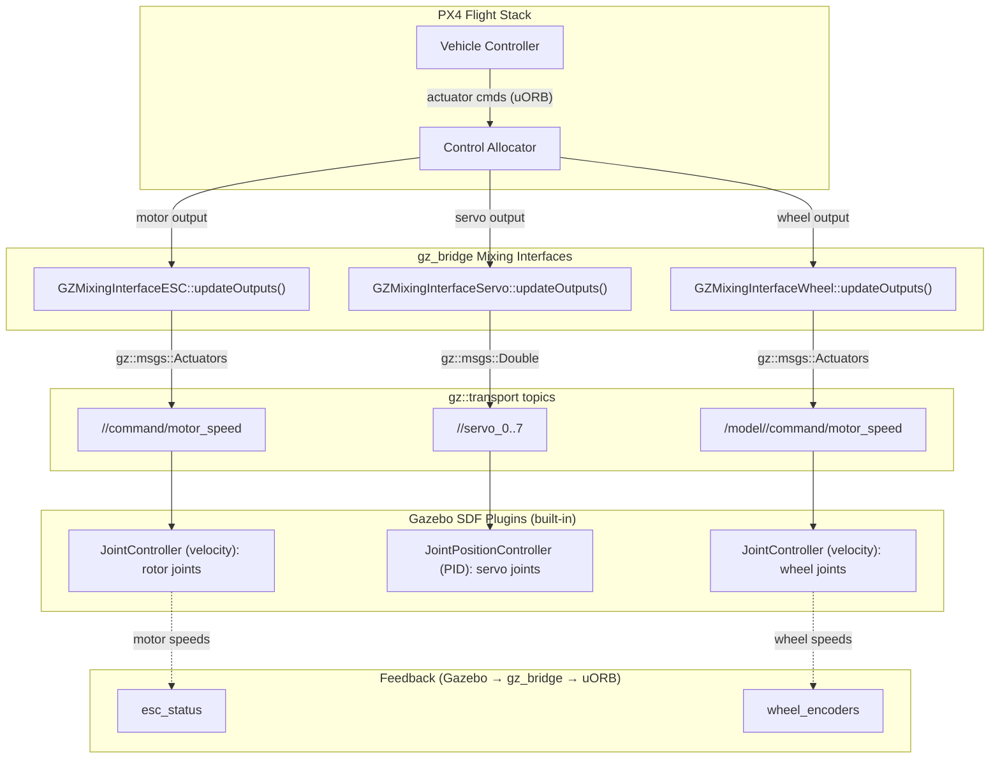
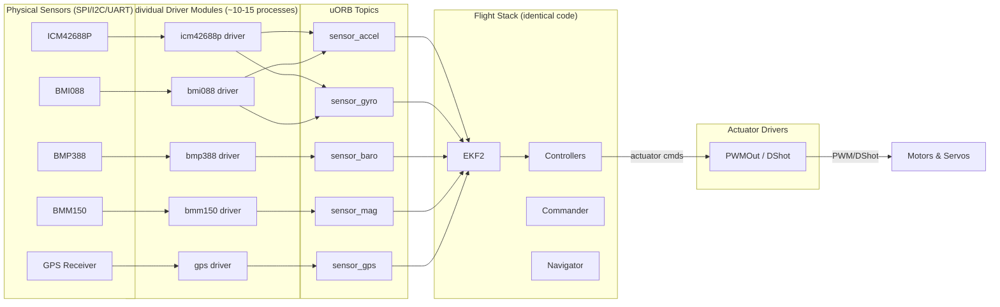
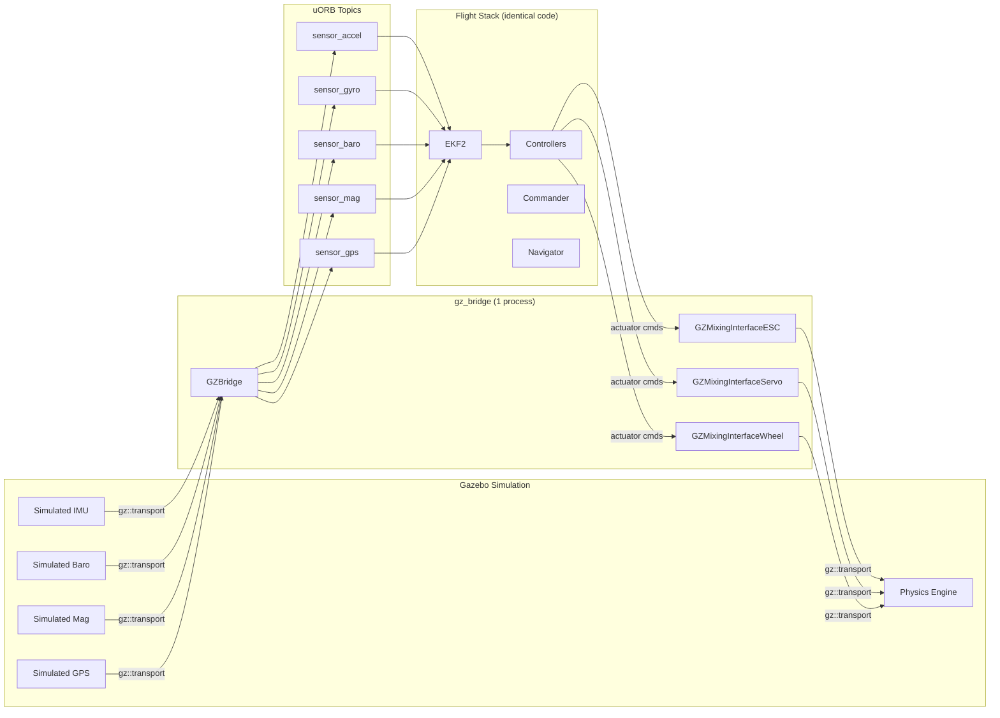
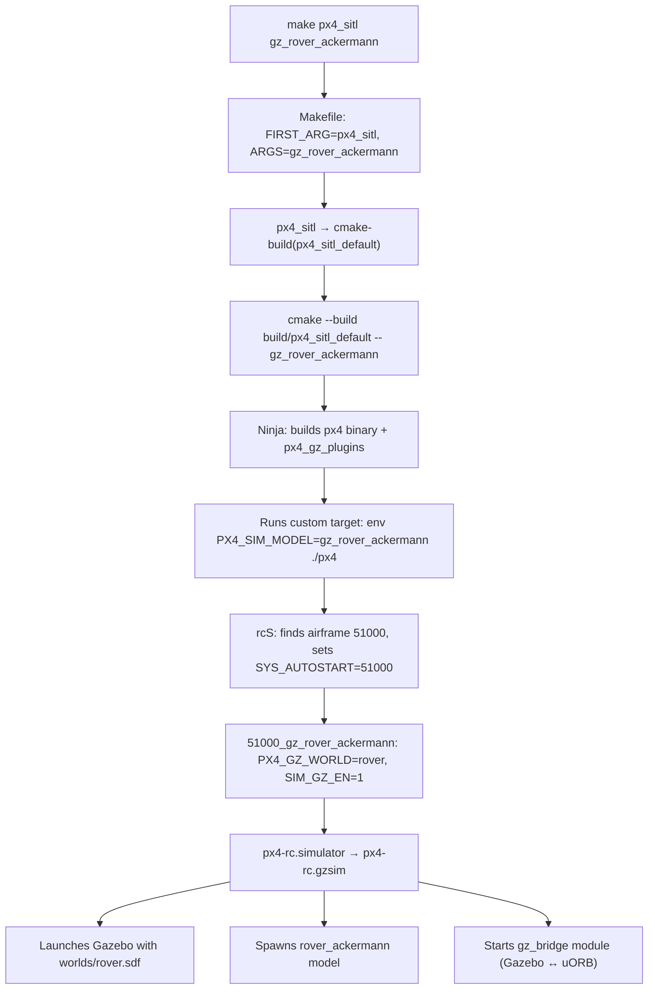
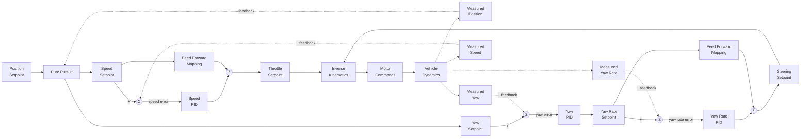
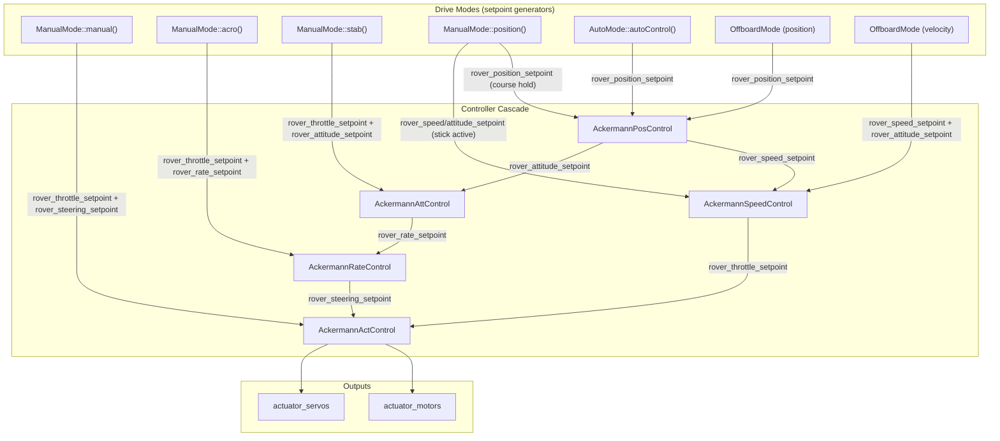

# PX4 Autopilot — Project Overview

## What is PX4?

PX4 is a professional-grade open-source autopilot flight stack for drones and other unmanned vehicles.
It runs on NuttX RTOS, Linux (POSIX), macOS, and QURT platforms.
Supported vehicle types include multirotors, fixed-wing, VTOL, rovers, helicopters, submarines, boats, and spacecraft.

- **License:** BSD 3-Clause
- **Governance:** Dronecode Foundation (Linux Foundation)
- **Core middleware:** uORB — a DDS-compatible publish/subscribe message bus
- **Communications:** MAVLink, DDS / ROS 2 (via Micro XRCE-DDS)
- **Build system:** CMake + Make (Ninja when available). Entry point is the top-level `Makefile`

## Repository Layout

| Path | Purpose |
|------|---------|
| `src/modules/` | Flight-stack modules (commander, EKF2, mc_att_control, navigator, mavlink, etc.) |
| `src/drivers/` | Hardware drivers (IMU, GPS, barometer, magnetometer, actuators, RC, etc.) |
| `src/lib/` | Shared libraries (mathlib, matrix, geo, parameters, perf, pid, etc.) |
| `src/systemcmds/` | System commands (param, reboot, top, perf, etc.) |
| `src/examples/` | Example modules |
| `src/templates/template_module/` | **Canonical module template — use this as the pattern for new modules** |
| `msg/` | uORB message definitions (`.msg` files, ROS 2 IDL-compatible) |
| `boards/` | Board configurations (`.px4board` Kconfig files) |
| `platforms/` | Platform abstraction layer (NuttX, POSIX, QURT) |
| `ROMFS/` | ROM filesystem with init scripts (`rcS`, `rc.sensors`) |
| `Tools/` | Build helpers, simulation, code-style, analysis scripts |
| `cmake/` | CMake modules (`px4_add_module`, `px4_add_library`, etc.) |
| `docs/` | Documentation |

## Build Targets

```bash
make px4_sitl_default          # SITL simulation build (default target)
make px4_fmu-v6x_default       # Hardware build for Pixhawk 6X
make px4_sitl_default gazebo   # SITL with Gazebo
make tests                     # Unit tests
make list_config_targets       # List all board/configuration targets
make help                      # List non-config make targets
```

Build artefacts go into `build/<target>/`. Never commit build outputs.

## Coding Standards

- **Primary language:** C/C++ (C++14 standard, C11 for pure C)
- **Style:** Linux kernel style enforced by Astyle (`Tools/astyle/astylerc`)
- **Indentation:** Hard tabs (width 8) for C/C++/CMake/Kconfig; 2-space for YAML/shell
- **Max line length:** 120 characters (C/C++), 140 (Astyle hard limit)
- **Braces:** Linux style — opening on same line, closing on its own line

### Naming Conventions

| Element | Convention | Example |
|---------|------------|---------|
| Files & directories | `snake_case` | `mc_att_control.cpp` |
| Classes | `PascalCase` | `MulticopterAttitudeControl` |
| Functions / methods | `camelCase` or `snake_case` | `updateParams()` |
| Constants / enums | `UPPER_SNAKE_CASE` | `NAVIGATION_STATE_MANUAL` |
| Member variables | `_leading_underscore` | `_parameter_update_sub` |
| Parameters | `UPPER_SNAKE_CASE` with group prefix | `MC_ROLL_P` |
| uORB topics | `snake_case` | `vehicle_attitude` |

## Module Architecture

PX4 modules follow a strict pattern (see `src/templates/template_module/`):

1. Inherit from `ModuleBase<T>` and `ModuleParams`
2. Implement `task_spawn()`, `instantiate()`, `custom_command()`, `print_usage()`
3. Override `run()` for the main loop and `print_status()` for diagnostics
4. Use `DEFINE_PARAMETERS(...)` macro for typed parameter declarations
5. Use uORB subscriptions/publications for inter-module communication
6. Export a C entry point: `extern "C" __EXPORT int <module_name>_main(...)`

Each module has a `CMakeLists.txt` using `px4_add_module(...)`.

## uORB Messages

- Defined in `msg/*.msg` using ROS 2-compatible IDL syntax
- Every message must have `uint64 timestamp` as the first field
- Versioned messages include `uint32 MESSAGE_VERSION = <N>`
- Messages are auto-generated into C++ headers during build

## Board Configuration

- Board configs live in `boards/<vendor>/<model>/<variant>.px4board`
- Format is Kconfig key-value: `CONFIG_MODULES_COMMANDER=y`
- New modules must be explicitly enabled per-board

## Testing

- Unit tests: `make tests`
- SITL simulation: `make px4_sitl_default` then run with a simulator
- Test files live in `test/` and `src/**/tests/`

---

# Build System Deep Dive: `make px4_sitl gz_rover_ackermann`

This section traces the full build and launch chain for the command:

```bash
make px4_sitl gz_rover_ackermann
```

---

## Phase 1: Makefile Argument Parsing

In the top-level `Makefile`, the command is split into two parts:

```makefile
FIRST_ARG := $(firstword $(MAKECMDGOALS))   # → "px4_sitl"
ARGS := $(wordlist 2,...,$(MAKECMDGOALS))    # → "gz_rover_ackermann"
```

## Phase 2: Target Resolution — `px4_sitl` → `px4_sitl_default`

All board configurations are discovered by scanning `boards/*/*.px4board`:

```makefile
ALL_CONFIG_TARGETS := $(shell find boards -maxdepth 3 -mindepth 3 -name '*.px4board' ...)
```

A convenience rule strips the `_default` suffix so you can type `px4_sitl` instead of `px4_sitl_default`:

```makefile
CONFIG_TARGETS_DEFAULT := $(patsubst %_default,%,$(filter %_default,$(ALL_CONFIG_TARGETS)))
$(CONFIG_TARGETS_DEFAULT):
    @$(call cmake-build,$@_default$(BUILD_DIR_SUFFIX))
```

So `px4_sitl` resolves to `cmake-build(px4_sitl_default)`.

## Phase 3: `cmake-build` — CMake + Ninja

The `cmake-build` function does the following:

1. Sets `-DCONFIG=px4_sitl_default` and `BUILD_DIR=build/px4_sitl_default`
2. Runs CMake configuration (if no cache exists):
   ```bash
   cmake <SRC_DIR> -GNinja -DCONFIG=px4_sitl_default
   ```
3. Runs the build, passing `ARGS` through as a **Ninja target**:
   ```bash
   cmake --build build/px4_sitl_default -- gz_rover_ackermann
   ```

This means `gz_rover_ackermann` is a custom CMake/Ninja target.

## Phase 4: How the `gz_rover_ackermann` Target is Defined

Inside the `gz_bridge` module's `CMakeLists.txt`, CMake auto-generates simulation targets:

1. **Globs airframe files** matching `ROMFS/px4fmu_common/init.d-posix/airframes/*_gz_*`
2. **Globs world files** from `Tools/simulation/gz/worlds/*.sdf`
3. **Generates a custom target** for each airframe/world combination. For airframe `51000_gz_rover_ackermann` with the default world:

```cmake
add_custom_target(gz_rover_ackermann
    COMMAND ${CMAKE_COMMAND} -E env
        PX4_SIM_MODEL=gz_rover_ackermann
        GZ_IP=127.0.0.1
        $<TARGET_FILE:px4>
    WORKING_DIRECTORY ${SITL_WORKING_DIR}
    DEPENDS px4 px4_gz_plugins
)
```

This target first builds the `px4` binary and Gazebo plugins, then launches PX4.

## Phase 5: PX4 Runtime — Init Script Chain

Once the `px4` binary starts with `PX4_SIM_MODEL=gz_rover_ackermann` set in the environment, the init scripts take over:

| Step | Script | What Happens |
|------|--------|--------------|
| 1 | `rcS` | Matches `PX4_SIM_MODEL` to airframe file `51000_gz_rover_ackermann`, sets `SYS_AUTOSTART=51000` |
| 2 | `51000_gz_rover_ackermann` | Sets `PX4_GZ_WORLD=rover`, `SIM_GZ_EN=1`, and rover-specific parameters (wheel base, steering, PID gains, actuator mappings) |
| 3 | `px4-rc.simulator` | Detects `PX4_SIMULATOR=gz`, sources `px4-rc.gzsim` |
| 4 | `px4-rc.gzsim` | Launches Gazebo with `worlds/rover.sdf`, spawns the `rover_ackermann` model, starts the `gz_bridge` module |

### Key init scripts

- `ROMFS/px4fmu_common/init.d-posix/rcS` — main startup script
- `ROMFS/px4fmu_common/init.d-posix/airframes/51000_gz_rover_ackermann` — airframe config
- `ROMFS/px4fmu_common/init.d-posix/px4-rc.simulator` — simulator dispatcher
- `ROMFS/px4fmu_common/init.d-posix/px4-rc.gzsim` — Gazebo-specific launch logic

## Phase 6: Gazebo Launch Details (`px4-rc.gzsim`)

The Gazebo startup script performs these steps:

1. **Validates Gazebo version** (requires ≥ 8.0.0 / Harmonic)
2. **Sources `gz_env.sh`** — sets `GZ_SIM_RESOURCE_PATH` to include model and world directories
3. **Starts Gazebo server**: `gz sim --verbose=1 -r -s worlds/rover.sdf &`
4. **Starts Gazebo GUI** (unless `HEADLESS=1`): `gz sim -g &`
5. **Waits for the world** to be ready (polls for up to 30 seconds)
6. **Spawns the model** via `gz service` into the running world as `rover_ackermann_0`
7. **Starts `gz_bridge`** module — bridges Gazebo topics ↔ uORB topics (IMU, GPS, actuators, etc.)

## Phase 7: Model & World Files

| File | Description |
|------|-------------|
| `Tools/simulation/gz/worlds/rover.sdf` | Ground plane with physics (500 Hz step), gravity, magnetic field |
| `Tools/simulation/gz/models/rover_ackermann/model.sdf` | Vehicle SDF: chassis, wheels, steering joints, Ackermann kinematics |
| `Tools/simulation/gz/models/rover_ackermann/model.config` | Model metadata |
| `Tools/simulation/gz/models/rover_ackermann/meshes/` | 3D mesh files for visualization |

### Sensors defined in the model

- IMU (250 Hz)
- Magnetometer (100 Hz)
- Air pressure / barometer (50 Hz)
- NavSat / GPS

---

# Real Hardware vs. Simulation Architecture

On real hardware there is no single bridge module — PX4 uses **many individual driver modules** in `src/drivers/`, one per sensor chip or actuator bus. In simulation, `gz_bridge` replaces all of them. Both sides publish to the **exact same uORB topics**, so the flight stack code is identical.

## Real Hardware Drivers

| Sensor Type | Example Drivers in `src/drivers/` | uORB Topic |
|---|---|---|
| **IMU** | `imu/invensense/icm42688p`, `imu/bosch/bmi088`, `imu/invensense/icm45686`, … | `sensor_accel`, `sensor_gyro` |
| **Barometer** | `barometer/bmp388`, `barometer/ms5611`, `barometer/dps310`, … | `sensor_baro` |
| **Magnetometer** | `magnetometer/bosch/bmm150`, `magnetometer/rm3100`, `magnetometer/lis3mdl`, … | `sensor_mag` |
| **GPS** | `gps/` (single driver, multiple protocols: u-blox, NMEA, Septentrio, …) | `sensor_gps` |
| **Actuators** | `pwm_out`, `dshot`, `px4io`, `pca9685_pwm_out` | Subscribes to actuator commands |

## `gz_bridge` Module (`src/modules/simulation/gz_bridge/`)

| File | Purpose |
|------|----------|
| `GZBridge.cpp` / `.hpp` | Main module — subscribes to Gazebo topics, publishes uORB sensor data |
| `GZMixingInterfaceESC.cpp` / `.hpp` | Sends motor (ESC) commands to Gazebo |
| `GZMixingInterfaceServo.cpp` / `.hpp` | Sends servo commands to Gazebo |
| `GZMixingInterfaceWheel.cpp` / `.hpp` | Sends wheel commands to Gazebo (rovers) |
| `GZGimbal.cpp` / `.hpp` | Gimbal control interface |
| `CMakeLists.txt` | Build config + auto-generates all `gz_*` simulation targets |
| `gz_env.sh.in` | Template for Gazebo environment variables |
| `module.yaml` | Parameter metadata |

### Gazebo → uORB (sensor data)

| Gazebo Topic | uORB Publication |
|---|---|
| Clock | Simulation time sync (lockstep) |
| IMU | `sensor_accel`, `sensor_gyro` |
| Magnetometer | `sensor_mag` |
| Barometer | `sensor_baro` |
| NavSat (GPS) | `sensor_gps` |
| Airspeed | `differential_pressure` |
| LaserScan | `obstacle_distance` |
| Pose | Ground truth (`vehicle_attitude_groundtruth`, etc.) |
| Odometry | `vehicle_visual_odometry` |
| Optical Flow | `sensor_optical_flow` |

### uORB → Gazebo (actuator commands)

| Mixing Interface | Function |
|---|---|
| `GZMixingInterfaceESC` | Motor/propeller commands |
| `GZMixingInterfaceServo` | Servo commands (control surfaces, steering) |
| `GZMixingInterfaceWheel` | Wheel speed commands (rovers) |
| `GZGimbal` | Gimbal angle commands |

## Gazebo Simulation Control Strategy

There is **no custom PX4 Gazebo plugin** for actuator control — `gz_bridge` publishes commands over `gz::transport`, and **standard Gazebo system plugins** (configured in the model SDF) receive them.

### Three Mixing Interfaces

All three implement `OutputModuleInterface` and use `MixingOutput` — the same base pattern as real hardware drivers like `PWMOut` / `DShot`.

#### 1. `GZMixingInterfaceESC` — Motors / Propellers

- **Purpose:** Drives rotors/propellers at a commanded RPM
- **Used by:** Multirotors (x500), fixed-wing (rc_cessna), VTOL, helicopters
- **Gazebo topic:** `/<model>/command/motor_speed`
- **Message type:** `gz::msgs::Actuators` — velocity array, one entry per motor
- **Output mapping:** Direct RPM — `outputs[i]` → `velocity(i)`
- **Feedback:** Subscribes to the same topic to read back motor speeds and publishes `esc_status` uORB (for ESC health monitoring and failure detection)
- **Parameters:** `SIM_GZ_EC_FUNC1..N`, `SIM_GZ_EC_MIN1..N`, `SIM_GZ_EC_MAX1..N`
- **Gazebo SDF plugin:**
  ```xml
  <plugin filename="gz-sim-joint-controller-system" name="gz::sim::systems::JointController">
      <joint_name>rotor_0_joint</joint_name>
      <sub_topic>command/motor_speed</sub_topic>
      <control_type>velocity</control_type>
      <use_actuator_msg>true</use_actuator_msg>
      <actuator_number>0</actuator_number>
  </plugin>
  ```

#### 2. `GZMixingInterfaceServo` — Angular Position Actuators

- **Purpose:** Drives joints to a specific angle (in radians) — control surfaces, steering
- **Used by:** Fixed-wing (ailerons, elevator, rudder), rover ackermann (steering), VTOL (tilt-rotors)
- **Gazebo topic:** `/<model>/servo_0` through `servo_7` — one topic per servo
- **Message type:** `gz::msgs::Double` — angle in radians
- **Output mapping:** Converts normalized output to radians using per-servo min/max angle params:
  ```
  output = angle_min + angular_range × (output_value - min_value) / output_range
  ```
- **Feedback:** None — publish only
- **Parameters:** `SIM_GZ_SV_FUNC1..8`, `SIM_GZ_SV_MAXA1..8`, `SIM_GZ_SV_MINA1..8`, `SIM_GZ_SV_REV`
- **Gazebo SDF plugin:**
  ```xml
  <plugin filename="gz-sim-joint-position-controller-system" name="gz::sim::systems::JointPositionController">
      <joint_name>wheel_front_steering_joint</joint_name>
      <sub_topic>servo_0</sub_topic>
      <p_gain>100</p_gain>
      <i_gain>10</i_gain>
      <d_gain>0</d_gain>
  </plugin>
  ```

#### 3. `GZMixingInterfaceWheel` — Bidirectional Wheel Drive

- **Purpose:** Drives wheel joints at a commanded velocity with bidirectional support
- **Used by:** Rovers (differential drive, ackermann)
- **Gazebo topic:** `/model/<name>/command/motor_speed`
- **Message type:** `gz::msgs::Actuators` — velocity array (same as ESC)
- **Output mapping:** Applies an offset for bidirectional control:
  ```
  scaled_output = (double)outputs[i] - 100.0   // allows negative values for reverse
  ```
- **Feedback:** Subscribes to the same topic and publishes `wheel_encoders` uORB
- **Parameters:** `SIM_GZ_WH_FUNC1..N`, `SIM_GZ_WH_MIN1..N`, `SIM_GZ_WH_MAX1..N`, `SIM_GZ_WH_DIS1..N`
- **Gazebo SDF plugin:** Same `JointController` as ESC (velocity mode)

### Comparison Table

| | ESC | Servo | Wheel |
|---|---|---|---|
| **Controls** | Motor/rotor speed | Joint angle | Wheel speed (bidirectional) |
| **Command type** | Velocity (RPM) | Position (radians) | Velocity (with offset) |
| **Message type** | `gz::msgs::Actuators` (array) | `gz::msgs::Double` (per joint) | `gz::msgs::Actuators` (array) |
| **Gazebo plugin** | `JointController` (velocity) | `JointPositionController` (PID) | `JointController` (velocity) |
| **Feedback** | Yes → `esc_status` | No | Yes → `wheel_encoders` |
| **Bidirectional** | No (0 to max RPM) | Yes (min to max angle) | Yes (offset-based) |
| **Typical vehicles** | Multirotors, fixed-wing | Fixed-wing, VTOL, rover steering | Rovers |

### Rover Ackermann Example

The airframe config (`ROMFS/px4fmu_common/init.d-posix/airframes/51000_gz_rover_ackermann`) uses **Wheel + Servo** (not ESC):

```bash
# Wheels (drive)
SIM_GZ_WH_FUNC1 = 101   # Motor 1 function (throttle)
SIM_GZ_WH_MIN1  = 70    # Min output
SIM_GZ_WH_MAX1  = 130   # Max output
SIM_GZ_WH_DIS1  = 100   # Disarmed value (zero speed)

# Steering (servo)
SIM_GZ_SV_FUNC1 = 201   # Servo 1 function (steering)
SIM_GZ_SV_MAXA1 = 30    # Max angle (degrees)
SIM_GZ_SV_MINA1 = -30   # Min angle (degrees)
SIM_GZ_SV_REV   = 1     # Reverse direction
```

In the model SDF:
- All 4 wheel joints use `JointController` subscribing to `command/motor_speed` (actuator 0, velocity mode)
- All 3 front steering joints use `JointPositionController` subscribing to `servo_0` (position PID)

### Coordinate Frame Conversions

Gazebo uses **ENU** (East-North-Up) / **FLU** (Forward-Left-Up) frames while PX4 uses **NED** (North-East-Down) / **FRD** (Forward-Right-Down). The `GZBridge` module converts between them:

| Conversion | Method | Quaternion |
|---|---|---|
| FLU → FRD (body frame) | 180° rotation about X | `q_FLU_to_FRD = (0, 1, 0, 0)` |
| ENU → NED (world frame) | 90° about Z then 180° about X | `q_ENU_to_NED = (0, 0.70711, 0.70711, 0)` |
| Full attitude: FLU-to-ENU → FRD-to-NED | Composition | `q_FRD_to_NED = q_ENU_to_NED * q_FLU_to_ENU * q_FLU_to_FRD⁻¹` |

Applied in sensor callbacks:
- **IMU**: accel/gyro vectors rotated by `q_FLU_to_FRD` before publishing to uORB
- **Pose/attitude**: full quaternion conversion via `rotateQuaternion()`
- **Position**: `ENU(x,y,z)` → `NED(y,x,-z)`
- **Velocity (odometry)**: body FLU `(x,y,z)` → body FRD `(x,-y,-z)`
- **Magnetometer**: axes swapped due to Gazebo's left-handed mag plugin convention

### Full Actuator Data Flow



> **Key takeaway:** PX4 does not need custom Gazebo plugins for actuator control. The `gz_bridge` mixing interfaces publish standard `gz::transport` messages, and Gazebo's built-in `JointController` (velocity) and `JointPositionController` (position PID) system plugins — configured in the model SDF — drive the joints.

## Board Config Differences

A **real board** (e.g. `boards/px4/fmu-v6x/default.px4board`) enables individual drivers:
```
CONFIG_DRIVERS_IMU_INVENSENSE_ICM42688P=y
CONFIG_DRIVERS_IMU_BOSCH_BMI088=y
CONFIG_DRIVERS_BAROMETER_BMP388=y
CONFIG_DRIVERS_MAGNETOMETER_BOSCH_BMM150=y
CONFIG_DRIVERS_GPS=y
CONFIG_DRIVERS_PWM_OUT=y
CONFIG_DRIVERS_DSHOT=y
```

**SITL** (`boards/px4/sitl/default.px4board`) replaces all of them with one module:
```
CONFIG_MODULES_SIMULATION_GZ_BRIDGE=y
```

## Architecture Diagrams

### Real Hardware



### SITL Simulation (gz_bridge)



> **Key insight:** The uORB topic layer is the abstraction boundary. Everything above it — EKF2, controllers, commander, navigator — runs identical code whether on real hardware or in simulation.

---

## Summary Flow



---

# Rover Ackermann Module Deep Dive

## Location

`src/modules/rover_ackermann/`

## Directory Structure

| Path | Purpose |
|------|---------|
| `RoverAckermann.cpp/.hpp` | Top-level module — dispatches drive modes and runs controller cascade |
| `AckermannPosControl/` | Position controller (Pure Pursuit + speed profiling) |
| `AckermannSpeedControl/` | Speed controller (PI + slew-rate) |
| `AckermannAttControl/` | Attitude/heading controller (P + yaw slew) |
| `AckermannRateControl/` | Yaw rate controller (Ackermann kinematic feedforward + PI) |
| `AckermannActControl/` | Actuator allocation (slew-rate limiting → motor/servo outputs) |
| `AckermannDriveModes/AckermannManualMode/` | Manual, Acro, Stabilized, Position sub-modes |
| `AckermannDriveModes/AckermannAutoMode/` | Mission, Loiter, RTL |
| `AckermannDriveModes/AckermannOffboardMode/` | Offboard position/velocity control |

## Cascaded Controller Architecture

The module uses a cascaded closed-loop control architecture with two parallel paths (speed and steering), four feedback loops, and feed-forward mappings. The following block diagram shows the full control flow:



**Block-to-module mapping:**

| Block Diagram Block | PX4 Module | Algorithm |
|---------------------|-----------|-----------|
| Pure Pursuit | `AckermannPosControl` | Pure Pursuit path following + S-curve speed profiling |
| Speed PID + Feed Forward | `AckermannSpeedControl` | PI controller with speed-to-throttle feedforward mapping |
| Yaw PID | `AckermannAttControl` | P controller with SlewRate-limited heading |
| Yaw Rate PID + Feed Forward | `AckermannRateControl` | PI controller with Ackermann kinematic feedforward: $\text{steering} = \arctan(\dot\psi \cdot L / v)$ |
| Inverse Kinematics | `AckermannActControl` | Slew-rate limiting on throttle and steering outputs |
| Vehicle Dynamics | Physical vehicle / Gazebo simulation | Real sensors or `gz_bridge` simulation feedback |

**Feedback signals:**

| Signal | Source (real HW) | Source (SITL) | uORB Topic |
|--------|-----------------|---------------|------------|
| Measured Position | GPS + EKF2 | gz_bridge | `vehicle_local_position` |
| Measured Speed | EKF2 (NED velocity → body frame rotation) | gz_bridge | `vehicle_local_position` |
| Measured Yaw | EKF2 (quaternion → Euler) | gz_bridge | `vehicle_attitude` |
| Measured Yaw Rate | Gyroscope | gz_bridge | `vehicle_angular_velocity` |

The `updateControllers()` method runs the cascade conditionally based on `vehicle_control_mode` flags:

```cpp
if (flag_control_position_enabled)   → PosControl
if (flag_control_velocity_enabled)   → SpeedControl
if (flag_control_attitude_enabled)   → AttControl
if (flag_control_rates_enabled)      → RateControl
if (flag_control_allocation_enabled) → ActControl
```

## Controller Details

### 1. AckermannPosControl — Position Controller

- **Algorithm:** **Pure Pursuit** path following + **S-curve speed profiling** (jerk/decel limited)
- **Subscribes:** `rover_position_setpoint`, `vehicle_local_position`, `vehicle_attitude`, `rover_throttle_setpoint`
- **Publishes:** `rover_speed_setpoint`, `rover_attitude_setpoint`
- **Key logic:**
  - Uses Pure Pursuit to compute bearing toward target waypoint with configurable lookahead distance
  - Computes speed setpoint with jerk/decel-limited S-curve to decelerate into waypoints
  - Applies **course-error-based speed reduction** — slows down when heading error is large
  - If driving backwards (negative speed), flips heading by π
  - At target arrival (within acceptance radius with zero arrival speed), commands speed=0 and holds heading
- **Key params:** `PP_LOOKAHD_GAIN/MIN/MAX`, `RA_ACC_RAD_GAIN/MAX`, `RO_SPEED_LIM`, `RO_ACCEL_LIM`, `RO_DECEL_LIM`, `RO_JERK_LIM`

### 2. AckermannSpeedControl — Speed Controller

- **Algorithm:** **PI controller** (feedforward + feedback) with **slew-rate limited** setpoint
- **Subscribes:** `rover_speed_setpoint`, `vehicle_local_position`, `vehicle_attitude`
- **Publishes:** `rover_throttle_setpoint`
- **Key logic:**
  - Measures actual speed by rotating NED velocity into body frame
  - Applies slew-rate limiting with separate accel/decel rates
  - Feedforward + PI → normalized throttle ∈ [-1, 1]
- **Key params:** `RO_SPEED_P/I`, `RO_SPEED_LIM`, `RO_MAX_THR_SPEED`, `RO_ACCEL_LIM`, `RO_DECEL_LIM`

### 3. AckermannAttControl — Heading Controller

- **Algorithm:** **P controller** with **yaw SlewRate** limiter
- **Subscribes:** `rover_attitude_setpoint`, `vehicle_attitude`, `rover_throttle_setpoint`
- **Publishes:** `rover_rate_setpoint`
- **Key logic:**
  - Computes max feasible yaw rate at current speed from Ackermann geometry
  - Applies SlewRate to heading setpoint for smooth transitions
  - P-controller: `yaw_rate = P × wrap_pi(adjusted_yaw - actual_yaw)`
  - Constrains output to max feasible yaw rate
- **Key params:** `RO_YAW_P`, `RA_MAX_STR_ANG`, `RA_WHEEL_BASE`, `RO_MAX_THR_SPEED`, `RO_YAW_RATE_LIM`

### 4. AckermannRateControl — Yaw Rate Controller

- **Algorithm:** **Ackermann kinematic feedforward + PI feedback**
- **Subscribes:** `rover_rate_setpoint`, `vehicle_angular_velocity`, `rover_throttle_setpoint`
- **Publishes:** `rover_steering_setpoint`
- **Key logic:**
  - **Feedforward (inverse Ackermann kinematics):**
    $\text{steering} = \arctan\left(\frac{\dot\psi \cdot L}{v}\right) \times \text{correction}$
    where $L$ = wheel base, $v$ = estimated speed
  - **PI feedback:** Added only during forward driving (disabled in reverse because the system is non-minimum-phase)
  - Normalizes steering angle from physical range to [-1, 1]
  - If estimated speed ≈ 0, outputs 0 steering and resets PI integral
- **Key params:** `RO_YAW_RATE_P/I`, `RA_WHEEL_BASE`, `RA_MAX_STR_ANG`, `RO_YAW_RATE_LIM`, `RO_YAW_RATE_CORR`

### 5. AckermannActControl — Actuator Allocation

- **Algorithm:** **Slew-rate limiting** on both motor and servo outputs
- **Subscribes:** `rover_throttle_setpoint`, `rover_steering_setpoint`, `vehicle_control_mode`
- **Publishes:** `actuator_motors`, `actuator_servos`
- **Key logic:**
  - Motor: slew-rate limited throttle with separate accel/decel rates
  - Servo: slew-rate limited steering with configurable rate limit
  - `stopVehicle()`: sends 0 to both outputs on disarm
- **Key params:** `RA_STR_RATE_LIM`, `RO_ACCEL_LIM`, `RO_DECEL_LIM`, `RO_MAX_THR_SPEED`

## Drive Modes

### Drive Mode → Cascade Entry Diagram



### Mode Summary Table

| Mode | nav_state | Cascade Entry | Controllers Used |
|------|-----------|--------------|-----------------|
| **Manual** | `NAVIGATION_STATE_MANUAL` | ActControl (direct) | Act only |
| **Acro** | `NAVIGATION_STATE_ACRO` | RateControl | Rate → Act |
| **Stabilized** | `NAVIGATION_STATE_STAB` | AttControl | Att → Rate → Act |
| **Position** | `NAVIGATION_STATE_POSCTL` | PosControl (course hold) or SpeedControl+AttControl (stick active) | Full or Speed+Att → Rate → Act |
| **Auto** (Mission/Loiter/RTL) | `NAVIGATION_STATE_AUTO_*` | PosControl | Full cascade |
| **Offboard (position)** | `NAVIGATION_STATE_OFFBOARD` | PosControl | Full cascade |
| **Offboard (velocity)** | `NAVIGATION_STATE_OFFBOARD` | SpeedControl + AttControl | Speed + Att → Rate → Act |

### Manual Mode Sub-modes

- **Manual:** Stick → throttle + steering directly → `actuator_motors` + `actuator_servos`. No closed-loop control.
- **Acro:** Stick → throttle + yaw rate (with expo curve) → Rate controller computes steering via Ackermann kinematics.
- **Stabilized:** Stick → throttle + heading setpoint (heading hold when stick centered) → Att → Rate → Act.
- **Position:** Stick → speed + heading when stick active; when stick centered, constructs a **synthetic waypoint** along current course for straight-line course-hold via Pure Pursuit → full cascade.

### Auto Mode (Mission)

- Reads `position_setpoint_triplet` (prev/curr/next waypoints) from Navigator
- Computes **corner angle** between segments → dynamically calculates acceptance radius from Ackermann geometry:
  $r_{acc} = \text{gain} \times \frac{r_{min}}{\tan(\theta/2)}$ where $r_{min} = \frac{L}{\sin(\alpha_{max})}$
- Sets **arrival speed** based on corner sharpness (sharper → slower, stops at LAND/IDLE)
- Publishes `rover_position_setpoint` → triggers full cascade

### Offboard Mode

- **Position mode:** Publishes `rover_position_setpoint` with NED position from `trajectory_setpoint` → full cascade
- **Velocity mode:** Computes speed = norm of NED velocity, heading = atan2 of velocity vector → publishes `rover_speed_setpoint` + `rover_attitude_setpoint` → enters cascade at speed+attitude level

## uORB Topic Flow

| Topic | Published by | Consumed by |
|-------|-------------|-------------|
| `rover_position_setpoint` | AutoMode, ManualMode (position), OffboardMode | PosControl |
| `rover_speed_setpoint` | PosControl, ManualMode (position), OffboardMode (vel) | SpeedControl |
| `rover_attitude_setpoint` | PosControl, ManualMode (stab/position), OffboardMode (vel) | AttControl |
| `rover_throttle_setpoint` | SpeedControl, ManualMode (manual/acro/stab) | ActControl |
| `rover_rate_setpoint` | AttControl, ManualMode (acro) | RateControl |
| `rover_steering_setpoint` | RateControl, ManualMode (manual) | ActControl |
| `actuator_motors` | ActControl | gz_bridge / PWMOut |
| `actuator_servos` | ActControl | gz_bridge / PWMOut |

## Control Algorithm Summary

| Controller | Algorithm | Key Feature |
|-----------|-----------|-------------|
| **PosControl** | **Pure Pursuit** + S-curve speed profile | Bearing-based path following with lookahead distance |
| **SpeedControl** | **PI** (feedforward + feedback) | Slew-rate limited setpoint, asymmetric accel/decel |
| **AttControl** | **P** (proportional heading error) | SlewRate for smooth heading transitions |
| **RateControl** | **Ackermann kinematic feedforward + PI** | Inverse kinematics: `atan(ω·L/v)` for steering angle; PI disabled in reverse |
| **ActControl** | **Slew-rate limiting** | Separate motor throttle and servo steering rate limits |

---

## Useful Commands

```bash
make list_config_targets     # List all board/configuration targets
make help                    # List non-config make targets (tests, clean, etc.)
make px4_sitl help           # List all SITL simulation targets (gz_*, etc.)
```
